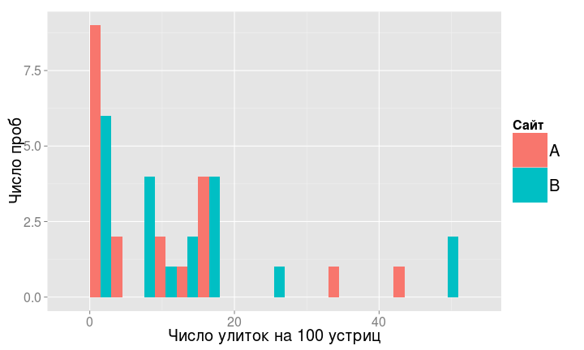
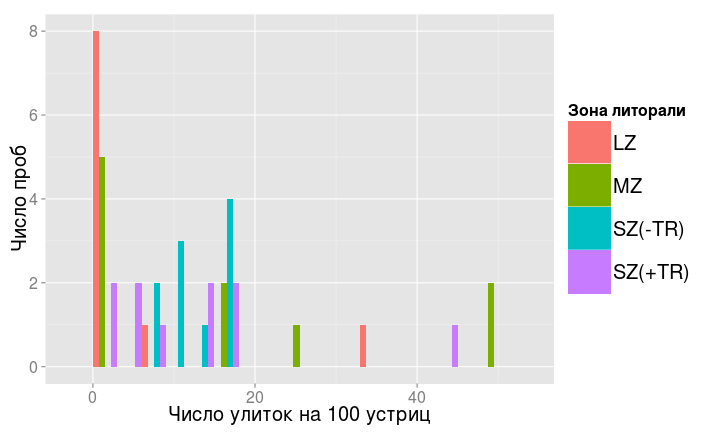
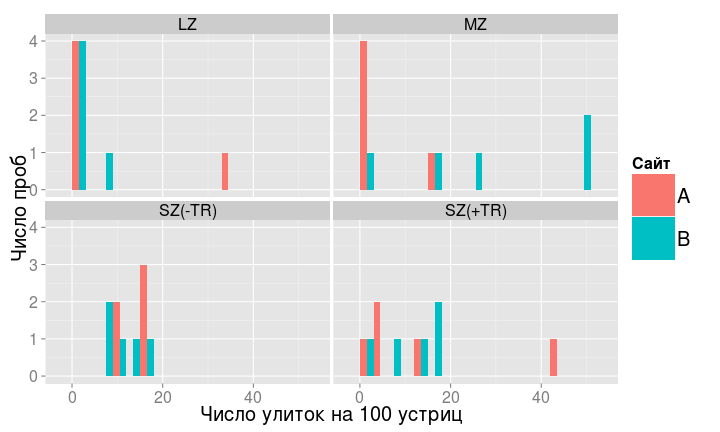
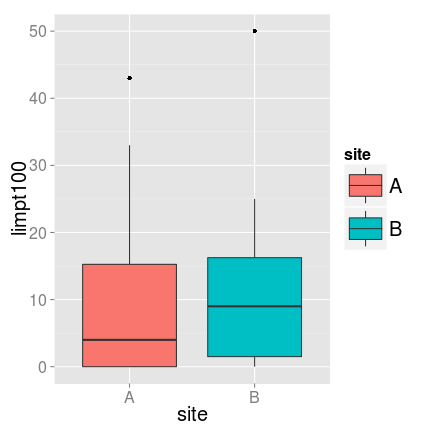
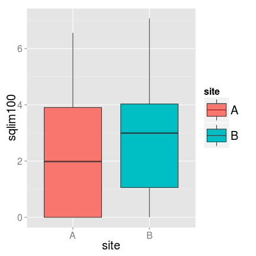
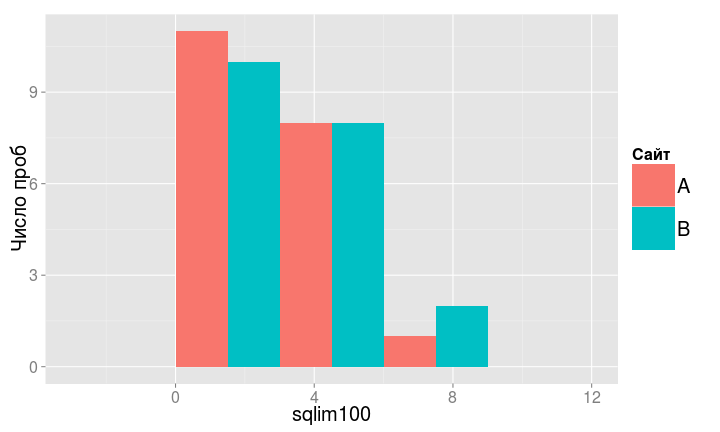
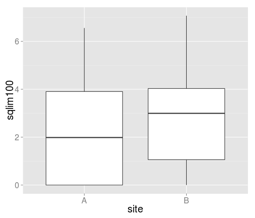
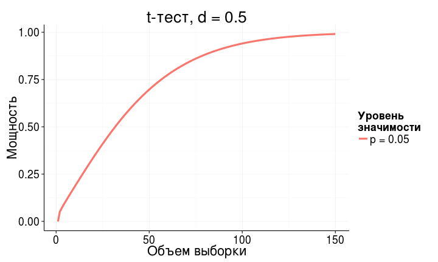
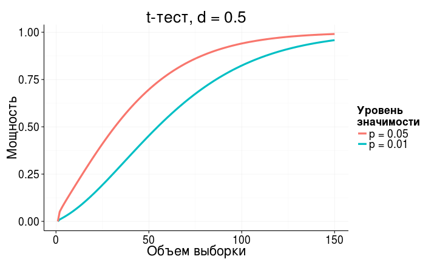
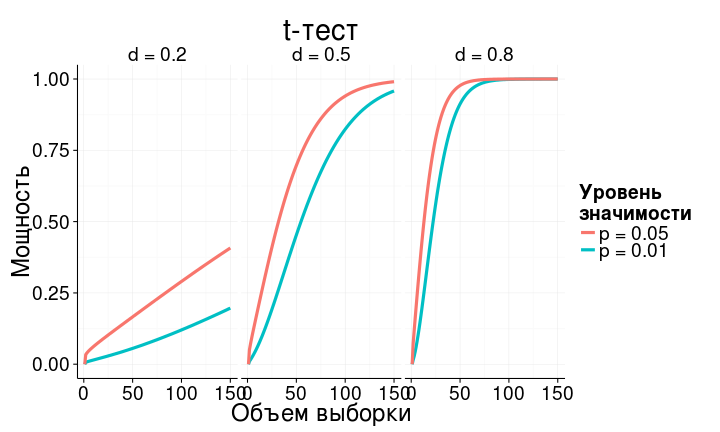

Экономим силы с помощью анализа мощности
========================================================
- Статистические ошибки при проверке гипотез
- Мощность статистического теста
- *A priori* анализ мощности
- Оценка величины эффекта
- *Post hoc* анализ мощности


--- .learning

Вы сможете
========================================================
- дать определение ошибок I и II рода, и графически изобразить их отношение к мощности теста
- оценивать величину эффекта и необходимый объем выборки по данным пилотного исследования
- загружать данные из .xls в R
- строить гистограммы и боксплоты с помощью `ggplot2`
- сравнивать средние значения при помощи t-критерия, интерпретировать и описывать результаты
- расчитывать фактическую мощность теста

--- .segue

Статистические ошибки при проверке гипотез
==================================

---

Типы ошибок при проверке гипотез
==================================

<table>
<col width = "16%">
</col>
<col width = "26%">
</col>
<col width = "26%">
</col>
<tbody>
<tr class = "odd">
<td class = "vheaver">
</td>
<td class = "vheaver">
H0 == TRUE
</td>
<td class = "vheaver">
H0 == FALSE
</td>
</tr>
<tr class = "even">
<td class = "hheader">
Отклонить<br />H0
</td>
<td>
Ошибка I рода<br />Ложно-положительный результат
</p>
</td>
<td>
Верно<br />Положительный результат
</td>
</tr>
<tr class = "odd">
<td class = "hheader">
Сохранить<br />H0
</td>
<td>
Верно<br />Отрицательный результат
</td>
<td>
Ошибка II рода<br />Ложно-отрицательный результат
</td>
</tr>
</tbody>
</table>


---

Вероятности гипотез
========================================================
<br />


---

Ошибки I рода
========================================================
$H _0$ верна, но отвергнута, найдены различия - ложно-положительный результат


---

Ошибки II рода
========================================================
$H _0$ не верна и сохранена, не найдены различия - ложно-отрицательный результат


---

Мощность теста
========================================================
способность выявлять различия 


$$Power = 1 – \beta$$


--- &twocol w1:40% w2:60%

Анализ мощности
========================================================

*** left

<center>*A priori*</center>

- какой нужен объем выборки, чтобы найти различия с разумной долей уверенности?
- различия какой величины мы можем найти, если известен объем выборки?

*** right

<center>*Post hoc*</center>

- смогли бы мы найти различия при помощи нашего эксперимента ($\alpha$, $n$), если бы величина эффекта была $X$?

--- .segue

A priory анализ мощности 
========================================================

---

Для a priori анализа нужно знать
========================================================

- тест
- уровень значимости
- желаемая мощность теста—80%
- ожидаемая величина эффекта

--- .sub-section

Пример: Заповедник спасает халиотисов *
========================================================
Лов халиотисов (коммерческий и любительский) запретили, организовав заповедник.

Стало ли больше моллюсков через несколько лет? (Keough, King, 1991)

<div class = "footnote">* - Данные из Quinn, Keough, 2002, Box 9-5, Fig 9-7</div>

---

Что мы знаем для a priori анализа?
========================================================

- тест
- уровень значимости
- желаемая мощность теста
- ожидаемая величина эффекта

---

Что мы знаем для a priori анализа?
========================================================
- тест — $t$-критерий
- уровень значимости — $alpha = 0.05$
- желаемая мощность теста — 80%
- ожидаемая величина эффекта — ?

--- .segue

Величина эффекта
========================================================

---

Величина эффекта
========================================================

$d$ Коэна (Cohen's d)

<br />
$$d = \frac{\bar \mu_1 - \bar \mu_2}{\sigma}$$

---
Как оценить стандартное отклонение для расчета величины эффекта?
========================================================
$$d = \frac{\bar \mu_1 - \bar \mu_2}{\sigma}$$

- как среднеквадратичное стандартное отклонение  
($d$ Коэна)
$$d={{|\bar x _1 - \bar x _2  |} \over {\sqrt{{s_1^2 + s_2^2 } \over {2} }}}$$

- как обобщенное стандартное отклонение  
($g$ Хеджа)
$$g={
{|\bar x _1 - \bar x _2|} \over {\sqrt{{(n _1 - 1)s_1^{2} + (n _2 - 1)s_2^{2} } \over {n _1 + n _2 - 2} } }}$$

---

Как оценить ожидаемую величину эффекта?
========================================================

>- Пилотные исследования
- Литература
- Общебиологические знания
- Технические требования

---

Величина эффекта из общих соображений
========================================================
Яков Коэн (1982)

сильные, умеренные и слабые эффекты

```r
library(pwr)
cohen.ES(test = "t", size = "large")
```

```
## 
##      Conventional effect size from Cohen (1982) 
## 
##            test = t
##            size = large
##     effect.size = 0.8
```


--- .prompt

Рассчитайте 
========================================================

величину умеренных и слабых эффектов для t-критерия


```r
    library()
    cohen.ES()
```


<small>Подсказка: обозначения можно посмотреть в файлах справки</small>


```r
    help(cohen.ES)
    ?cohen.ES
    cohen.ES # курсор на слове, нажать F1
```


---

Величина эффекта из пилотных данных
========================================================
${\sigma}$ - cтандартное отклонение плотности халиотисов:

Плотность крупных халиотисов на $50 м^2$

$$\bar x = 47.5$$
$$SD = 27.7$$

---

Величина эффекта из пилотных данных
========================================================
${\bar \mu_1 - \bar \mu_2}$ - cредний вылов халиотисов в год:

- Масса выловленных -> размер -> численность -> плотность
- Коммерческий лов ~ любительский лов

Коммерческий лов  = 11.6 экз. $м^{-2}$

Коммерческий + любительский лов = 23.2 экз. $м^{-2}$

---

Данные для анализа мощности собраны
========================================================


```r
alpha <- 0.05
power <- 0.80
sigma <- 27.7 # варьирование плотности халиотисов
diff <- 23.2 # ожидаемые различия плотности халиотисов
effect <- diff/sigma # величина эффекта
effect
```

```
## [1] 0.838
```


---

Считаем объем выборки
========================================================

```r
pwr.t.test(n = NULL, d = effect, power = power, sig.level = alpha, 
           type = "two.sample", alternative = "two.sided")
```

```
## 
##      Two-sample t test power calculation 
## 
##               n = 23.4
##               d = 0.838
##       sig.level = 0.05
##           power = 0.8
##     alternative = two.sided
## 
## NOTE: n is number in *each* group
```


>- Чтобы с вероятностью 0.8 выявить различия плотности халиотисов в местах, где лов разрешен и запрещен, нужно обследовать __по 24 места каждого типа__, если мы верно оценили величину эффекта.

--- .prompt

Рассчитайте
========================================================

сколько нужно обследовать мест, чтобы обнаружить слабый эффект  
с вероятностью 0.8, при уровне значимости 0.01


```r
    cohen.ES()
    pwr.t.test()
```


---


========================================================

```r
cohen.ES(test = "t", size = "small")
```

```
## 
##      Conventional effect size from Cohen (1982) 
## 
##            test = t
##            size = small
##     effect.size = 0.2
```


---


========================================================

```r
pwr.t.test(n = NULL, d = 0.2, power = 0.8, sig.level = 0.01, 
           type = "two.sample", alternative = "two.sided")
```

```
## 
##      Two-sample t test power calculation 
## 
##               n = 586
##               d = 0.2
##       sig.level = 0.01
##           power = 0.8
##     alternative = two.sided
## 
## NOTE: n is number in *each* group
```


--- .sub-section

Пример: Улитки на устрицах в мангровых зарослях *
========================================================

В каких зонах мангровых зарослей на устрицах предпочитают обитать улитки?

Minchinton, Ross, 1999

<br />
>- Зона зарослей - 4 (по 5 проб - число улиток на раковинах устриц)
  - LZ - ближе к земле,
  - MZ - средняя часть, с деревьями,
  - SZ(-TR) - ближе к морю, с деревьями
  - SZ(+TR) - ближе к морю, без деревьев
  
>- Сайт - 2
  - A
  - B

<div class = "footnote">* - Данные из Quinn, Keough, 2002, Box 9-5, Fig 9-7</div>

---

Читаем данные из файла
========================================================
Не забудте войти в вашу директорию для матметодов,
например, так


```r
# setwd("C:\\Мои\ документы\\mathmethR\\) # в Windows
# setwd(/home/yourusername/mathmethR/) # в Linux

library(gdata)
minch <- read.xls(xls = "./data/minch.xls", sheet = 1)
```


```r
# можете попробовать, что получится
minch
head(minch)
```


---

Структура данных
========================================================

```r
str(minch) 
```

```
## 'data.frame':	40 obs. of  6 variables:
##  $ X       : int  1 2 3 4 5 6 7 8 9 10 ...
##  $ site    : Factor w/ 2 levels "A","B": 1 1 1 1 1 1 1 1 1 1 ...
##  $ zone    : Factor w/ 4 levels "LZ","MZ","SZ(-TR)",..: 3 3 3 3 3 4 4 4 4 4 ...
##  $ limpt   : num  0.16 0.11 0.1 0.16 0.15 0.12 0 0.03 0.05 0.43 ...
##  $ limpt100: int  16 11 10 16 15 12 0 3 5 43 ...
##  $ sqlim100: num  4 3.32 3.16 4 3.87 ...
```


---

Гистограмма числа улиток
========================================================

```r
library(ggplot2)
ggplot(data = minch, aes(x = limpt100)) + geom_histogram(stat = "bin", binwidth = 3)
```


---

Раскрашиваем гистограмму
========================================================

```r
hp <- ggplot(data = minch, aes(x = limpt100, fill = site)) + 
  geom_histogram(stat = "bin", binwidth = 3, position = "dodge")
hp
```


---

Называем оси, если нужно
========================================================

```r
hp <- hp + 
  labs(x = "Число улиток на 100 устриц", y = "Число проб", fill = "Сайт")
hp
```




---

Чтобы не переписывать все
========================================================

```r
# меняем только эстетику
hp + aes(fill = zone) + 
  labs(fill = "Зона литорали")
```




---

График с панелями
========================================================

```r
hp + facet_wrap(~ zone)
```




--- .prompt

Поэкспериментируйте
========================================================

с панелями

Что происходит, если мы выбираем другие переменные? Почему?

Какие еще бывают варианты разбивки на панели?<br />
<small>Подсказка: напишите `facet` и нажмите `Ctrl+Space`</small>

Что будет если менять `fill` и `facet` одновременно?


```r
    ggplot()
    aes()
    geom_histogram()
    facet_wrap()
```


---


========================================================

```r
# hp + aes(fill = limpt100) # ошибка, т.к. непрерывная шкала, вместо дискретной
# у эстетики должна быть дискретная шкала

# одновременно панели и раскрашивание
hp + facet_grid(site~zone) + aes(fill = zone) 
```


---

Боксплоты числа улиток
========================================================

```r
bp <- ggplot(data = minch, aes(x = site, y = limpt100)) + 
  geom_boxplot()
bp
```


--- .prompt

Поэкспериментируйте
========================================================

с панелями `facet` и с эстетиками `fill` и `colour`

Что будет, если мы выберем другие переменные?

Опишите форму и разброс распределения улиток в двух сайтах  
Симметрично? Похоже ли на нормальное?


```r
    ggplot()
    aes()
    geom_boxplot()
    facet_wrap()
```


--- 


========================================================


```r
    bp + aes(colour = zone)
    bp + aes(fill = site)
    bp + aes(fill = site) + facet_wrap(~zone)
    bp + facet_grid(site~zone)
```


--- .prompt

Постройте
========================================================

боксплот и гистограмму переменной __sqlim100__ (квадратный корень из численности улиток) для двух сайтов<br />

<small>Подсказка: `x` и `y` это тоже эстетики, поэтому можно использовать предыдущие графики</small>

Стало ли распределение больше походить на нормальное?


```r
    ggplot()
    geom_histogram()
    geom_boxplot()
    aes()
```


---

========================================================

```r
bp + aes(fill = site)
```




---

========================================================

```r
bp + aes(y = sqlim100, fill = site)
```




---

========================================================

```r
hp + aes(fill = site) + labs(fill = "Сайт")
```


---

========================================================

```r
hp + aes(x = sqlim100, fill = site) + labs(fill = "Сайт")
```




---

A priory анализ мощности
========================================================
Представим, что было пилотное исследование:<br />
2 сайта, 4 зоны, по 2 пробы


```r
minch_smpl <- read.xls(xls = "./data/minch_smpl.xls", sheet = 1)
```


---


Мы хотим сравнить сайты
========================================================

```r
ggplot(data = minch_smpl, aes(x = site, y = sqlim100)) + 
  geom_boxplot(aes(fill = site))
```


---

Величина эффекта по исходным данным
========================================================


```r
library(effsize)
effect <- cohen.d(minch_smpl$sqlim100, minch_smpl$site)
effect
```

```
## 
## Cohen's d
## 
## d estimate: -0.159 (negligible)
## 95 percent confidence interval:
##     A     A 
## -1.31  0.99
```


>- дальше нам понадобится строка "d estimate: -0.159 (negligible)"  
как добыть из нее значение?

---

Величина эффекта по исходным данным
========================================================

```r
str(effect)
```

```
## List of 7
##  $ method    : chr "Cohen's d"
##  $ name      : chr "d"
##  $ estimate  : Named num -0.159
##   ..- attr(*, "names")= chr "A"
##  $ conf.int  : Named num [1:2] -1.31 0.99
##   ..- attr(*, "names")= chr [1:2] "A" "A"
##  $ var       : Named num 0.535
##   ..- attr(*, "names")= chr "A"
##  $ conf.level: num 0.95
##  $ magnitude : chr "negligible"
##  - attr(*, "class")= chr "effsize"
```


---

Величина эффекта по исходным данным
========================================================
`$` - для обращения к переменным по именам (для обращения к элементам сложного объекта)


```r
str(effect)
```

```
## List of 7
##  $ method    : chr "Cohen's d"
##  $ name      : chr "d"
##  $ estimate  : Named num -0.159
##   ..- attr(*, "names")= chr "A"
##  $ conf.int  : Named num [1:2] -1.31 0.99
##   ..- attr(*, "names")= chr [1:2] "A" "A"
##  $ var       : Named num 0.535
##   ..- attr(*, "names")= chr "A"
##  $ conf.level: num 0.95
##  $ magnitude : chr "negligible"
##  - attr(*, "class")= chr "effsize"
```

```r
effect$estimate
```

```
##      A 
## -0.159
```


---

Для pwr.t.test() эффект должен быть положительным
========================================================
Вычислим модуль, чтобы потом использовать `effect`

```r
effect <- abs(effect$estimate) # абсолютная величина (модуль)
effect
```

```
##     A 
## 0.159
```


>- Очень слабый эффект...

--- .prompt

Рассчитайте
========================================================

объем выборки, чтобы показать различия плотности улиток между сайтами с вероятностью 0.8?


```r
    pwr.t.test()
```


--- 

========================================================

```r
pwr.t.test(n = NULL, d = effect, power = 0.8, sig.level = 0.05, 
           type = "two.sample", alternative = "two.sided")
```

```
## 
##      Two-sample t test power calculation 
## 
##               n = 624
##               d = 0.159
##       sig.level = 0.05
##           power = 0.8
##     alternative = two.sided
## 
## NOTE: n is number in *each* group
```


>- Нужна выборка __624 площадки с каждого сайта__, чтобы с вероятностью 0.8 обнаружить различия плотности улиток между сайтами.

---

Что получилось на самом деле?
========================================================

```r
# bp <- ggplot(data = minch, aes(x = site, y = limpt100)) + geom_boxplot()
bp + aes(y = sqlim100)
```




---

t-критерий
========================================================
по умолчанию Модификация Велча - для неравных дисперсий


```r
t.test(sqlim100 ~ site, data = minch, var.equal = FALSE)
```

```
## 
## 	Welch Two Sample t-test
## 
## data:  sqlim100 by site
## t = -1.15, df = 38, p-value = 0.2556
## alternative hypothesis: true difference in means is not equal to 0
## 95 percent confidence interval:
##  -2.198  0.602
## sample estimates:
## mean in group A mean in group B 
##            2.11            2.91
```


>- Достоверных различий плотности улиток между локациями не обнаружено (t-критерий, p<0.01)

--- .segue

Post hoc анализ мощности 
========================================================

---

Для post hoc анализа нужно знать
========================================================

- тест ($H _0$ отвергнута!)
- уровень значимости
- фактический объем выборки
- фактическая величина эффекта

--- .sub-section

Пример: Улитки на устрицах в мангровых зарослях *
========================================================

Какова была реальная величина эффекта?

Хватило ли нам мощности, чтобы выявлять такие незначительные различия?

<div class = "footnote">* - Данные из Quinn, Keough, 2002, Box 7-1, Fig 7-4</div>

---

Что мы знаем для post hoc анализа?
========================================================
- тест
- уровень значимости
- фактический объем выборки
- фактическая величина эффекта

---

Что мы знаем для post hoc анализа?
========================================================
- тест — t-критерий
- уровень значимости — α = 0.05
- фактический объем выборки — 20
- фактическая величина эффекта — ?

--- .prompt

Рассчитайте
========================================================

- фактическую величину эффекта
- реальную мощность теста


```r
    $
    cohen.d()
    abs()
    pwr.t.test()
    help()
```


---

========================================================

```r
effect_real <- cohen.d(minch$sqlim100, minch$site)
effect_real <- abs(effect_real$estimate)
pwr.t.test(n = 20, d = effect_real, power = NULL, sig.level = 0.05, 
           type = "two.sample", alternative = "two.sided")
```

```
## 
##      Two-sample t test power calculation 
## 
##               n = 20
##               d = 0.365
##       sig.level = 0.05
##           power = 0.203
##     alternative = two.sided
## 
## NOTE: n is number in *each* group
```


---

Минимальные выявляемые различия
========================================================

$$d={{|\bar x _1 - \bar x _2  |} \over {\sqrt{{s_1^2 + s_2^2 } \over {2} }}}$$

$$MDES = {|\bar x _1 - \bar x _2  |} = d {\sqrt{{s_1^2 + s_2^2 } \over {2} }}$$

---

Найдем Коэновскую величину эффекта
========================================================

```r
d <- pwr.t.test(n = 20, d = NULL, power = 0.8, sig.level = 0.05, 
                type = "two.sample", alternative = "two.sided")
str(d)
```

```
## List of 7
##  $ n          : num 20
##  $ d          : num 0.909
##  $ sig.level  : num 0.05
##  $ power      : num 0.8
##  $ alternative: chr "two.sided"
##  $ note       : chr "n is number in *each* group"
##  $ method     : chr "Two-sample t test power calculation"
##  - attr(*, "class")= chr "power.htest"
```

```r
d$d
```

```
## [1] 0.909
```


---

Минимальные выявляемые различия
========================================================
$$MDES = d {\sqrt{{s_1^2 + s_2^2 } \over {2} }}$$


```r
library(plyr) # пакет, чтобы делать статистику по группам
(summary_by_site <- ddply(minch, ~ site, summarize, 
                         mean = mean(sqlim100), 
                         var = var(sqlim100)))
```

```
##   site mean  var
## 1    A 2.11 4.84
## 2    B 2.91 4.73
```

```r
(MDES <- d$d * sqrt(sum(summary_by_site$var)/2))
```

```
## [1] 1.99
```

```r
(diff <- summary_by_site$mean[2] - summary_by_site$mean[1])
```

```
## [1] 0.798
```


--- .segue

Мощность при разных объемах групп 
========================================================

--- .sub-section

А что если бы было не по 20 проб на каждом сайте?
========================================================
Улитки на устрицах в мангровых зарослях
- сайт A - 20 проб
- сайт B - 40 проб


```r
pwr.t2n.test()
```


---

Мощность при разных объемах групп
========================================================

```r
# effect_real <- cohen.d(minch$sqlim100, minch$site)
# effect_real <- abs(effect_real$estimate)
pwr.t2n.test(n1 = 20, n2 = 40, d = effect_real, power = NULL, 
             sig.level = .05, alternative = "two.sided")
```

```
## 
##      t test power calculation 
## 
##              n1 = 20
##              n2 = 40
##               d = 0.365
##       sig.level = 0.05
##           power = 0.259
##     alternative = two.sided
```


>- Все равно мощность маленькая! Важен ли такой эффект? Стоит ли за ним гоняться?

--- .prompt

Рассчитайте
========================================================

Выборка в первой группе $n = 200$

Какой объем выборки понадобится во второй группе, чтобы выявлять малые различия в плотности улиток между двумя сайтами (слабые эффекты) с вероятностью 0.8 при уровне значимости 0.05?


```r
    cohen.ES()
    pwr.t2n.test()
```


--- 
========================================================

```r
small_effect <- cohen.ES(test = "t", size = "small")
small_effect <- small_effect$effect.size
pwr.t2n.test(d = 0.2, n1 = 200, n2 = NULL, power = 0.8, sig.level = 0.05,
             alternative = "two.sided")
```

```
## 
##      t test power calculation 
## 
##              n1 = 200
##              n2 = 10486
##               d = 0.2
##       sig.level = 0.05
##           power = 0.8
##     alternative = two.sided
```


--- .segue

Как влиять на мощность теста?
========================================================

---

Мощность зависит 
========================================================

- от объема выборки
- от величины эффекта
- от уровня значимости

---

Чем больше объем выборки—тем больше мощность
========================================================



---

Чем больше уровень значимости—тем больше мощность
========================================================



---

Чем больше величина различий—тем больше мощность
========================================================



--- .prompt

Назовите,
========================================================

какие из факторов, влияющих на мощность теста,  
мы __не можем__ контролировать?

--- 

Мы не можем контролировать внешние факторы
========================================================

- величину эффекта ($ES$)
- фоновую изменчивость ($\sigma^2$)

--- .prompt

Скажите,
========================================================

каким образом можно повлиять на мощность теста?

--- 

Мощность теста можно регулировать, если
========================================================

- изменить число повторностей
- выбрать другой уровень значимости ($\alpha$)
- определиться, какие эффекты действительно важны ($ES$)

---

Take home messages
========================================================

>- Контролируем статистические ошибки:
  - чтобы не находить несуществующих эффектов, фиксируем уровень значимости
  - чтобы не пропустить значимое, рассчитываем величину эффекта, объем выборки и мощность теста
  - когда не обнаружили достоверных эффектов, оцениваем величину эффекта и мощность теста

>- Способность выявлять различия зависит 
  - от объема выборки, 
  - от уровня значимости
  - от величины эффекта

--- 

Дополнительные ресурсы
========================================================
- Quinn, Keough, 2002, pp. 164-170
- Open Intro to Statistics: [4.6 Sample Size and Power](http://www.openintro.org/stat/down/oiStat2_04.pdf), pp. 193-197  
- Sokal, Rohlf, 1995, pp. 167-169.  
- Zar, 1999, p. 83.
- [R Data Analysis Examples - Power Analysis for Two-group Independent sample t-test. UCLA: Statistical Consulting Group.](http://www.ats.ucla.edu/stat/r/dae/t_test_power2.htm)
- [R Data Analysis Examples - Power Analysis for One-sample t-test.  UCLA: Statistical Consulting Group.](http://www.ats.ucla.edu/stat/r/dae/t_test_power.htm) 
- [FAQ - How is effect size used in power analysis?  UCLA: Statistical Consulting Group.](http://www.ats.ucla.edu/stat/mult_pkg/faq/general/effect_size_power/effect_size_power.htm) 

