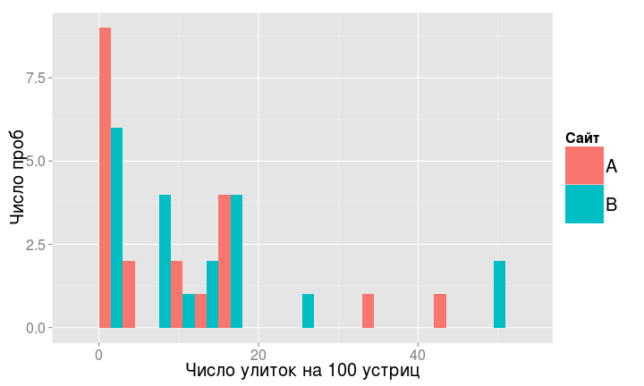
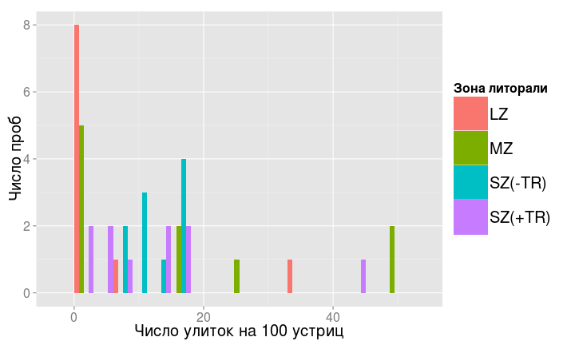
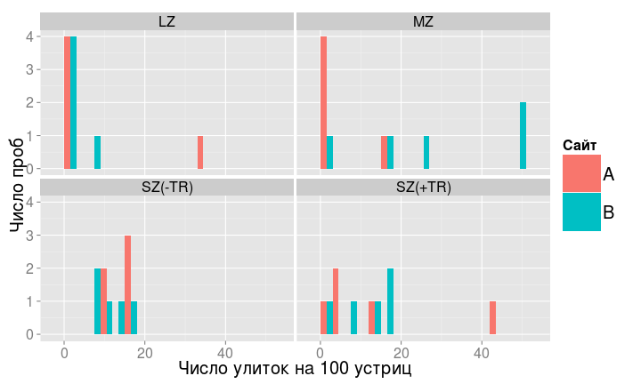

Экономим силы с помощью анализа мощности
========================================================
- Статистические ошибки при проверке гипотез
- Мощность статистического теста
- *A priori* анализ мощности
- Оценка величины эффекта
- *Post hoc* анализ мощности


--- .learning

Вы сможете
========================================================
- дать определение ошибок I и II рода, и графически изобразить их отношение к мощности теста
- оценивать величину эффекта и необходимый объем выборки по данным пилотного исследования
- загружать данные из .xls в R
- строить гистограммы и боксплоты с помощью `ggplot2`
- сравнивать средние значения при помощи t-критерия, интерпретировать и описывать результаты
- расчитывать фактическую мощность теста

--- .segue

Статистические ошибки при проверке гипотез
==================================

---

Типы ошибок при проверке гипотез
==================================

<table>
<col width = "16%">
</col>
<col width = "26%">
</col>
<col width = "26%">
</col>
<tbody>
<tr class = "odd">
<td class = "vheaver">
</td>
<td class = "vheaver">
H0 == TRUE
</td>
<td class = "vheaver">
H0 == FALSE
</td>
</tr>
<tr class = "even">
<td class = "hheader">
Отклонить<br />H0
</td>
<td>
Ошибка I рода<br />Ложно-положительный результат
</p>
</td>
<td>
Верно<br />Положительный результат
</td>
</tr>
<tr class = "odd">
<td class = "hheader">
Сохранить<br />H0
</td>
<td>
Верно<br />Отрицательный результат
</td>
<td>
Ошибка II рода<br />Ложно-отрицательный результат
</td>
</tr>
</tbody>
</table>


---

Вероятности гипотез
========================================================
<br />


---

Ошибки I рода
========================================================
$H _0$ верна, но отвергнута, найдены различия - ложно-положительный результат


---

Ошибки II рода
========================================================
$H _0$ не верна и сохранена, не найдены различия - ложно-отрицательный результат


---

Мощность теста
========================================================
способность выявлять различия 


$$Power = 1 – \beta$$


--- &twocol w1:40% w2:60%

Анализ мощности
========================================================

*** left

<center>*A priori*</center>

- какой нужен объем выборки, чтобы найти различия с разумной долей уверенности?
- различия какой величины мы можем найти, если известен объем выборки?

*** right

<center>*Post hoc*</center>

- смогли бы мы найти различия при помощи нашего эксперимента ($\alpha$, $n$), если бы величина эффекта была $X$?

--- .segue

A priory анализ мощности 
========================================================

---

Для a priori анализа нужно знать
========================================================

- тест
- уровень значимости
- желаемая мощность теста—80%
- ожидаемая величина эффекта

--- .sub-section

Пример: Заповедник спасает халиотисов *
========================================================
Лов халиотисов (коммерческий и любительский) запретили, организовав заповедник.

Стало ли больше моллюсков через несколько лет? (Keough, King, 1991)

<div class = "footnote">* - Данные из Quinn, Keough, 2002, Box 9-5, Fig 9-7</div>

---

Что мы знаем для a priori анализа?
========================================================

- тест
- уровень значимости
- желаемая мощность теста
- ожидаемая величина эффекта

---

Что мы знаем для a priori анализа?
========================================================
- тест — $t$-критерий
- уровень значимости — $alpha = 0.05$
- желаемая мощность теста — 80%
- ожидаемая величина эффекта — ?

--- .segue

Величина эффекта
========================================================

---

Величина эффекта
========================================================

$d$ Коэна (Cohen's d)

<br />
$$d = \frac{\bar \mu_1 - \bar \mu_2}{\sigma}$$

---
Как оценить стандартное отклонение для расчета величины эффекта?
========================================================
$$d = \frac{\bar \mu_1 - \bar \mu_2}{\sigma}$$

- как среднеквадратичное стандартное отклонение  
($d$ Коэна)
$$d={{|\bar x _1 - \bar x _2  |} \over {\sqrt{{s_1^2 + s_2^2 } \over {2} }}}$$

- как обобщенное стандартное отклонение  
($g$ Хеджа)
$$g={
{|\bar x _1 - \bar x _2|} \over {\sqrt{{(n _1 - 1)s_1^{2} + (n _2 - 1)s_2^{2} } \over {n _1 + n _2 - 2} } }}$$

---

Как оценить ожидаемую величину эффекта?
========================================================

>- Пилотные исследования
- Литература
- Общебиологические знания
- Технические требования

---

Величина эффекта из общих соображений
========================================================
Яков Коэн (1982)

сильные, умеренные и слабые эффекты

```r
library(pwr)
cohen.ES(test = "t", size = "large")
```

```
## 
##      Conventional effect size from Cohen (1982) 
## 
##            test = t
##            size = large
##     effect.size = 0.8
```


--- .prompt

Рассчитайте 
========================================================

величину умеренных и слабых эффектов для t-критерия


```r
    library()
    cohen.ES()
```


<small>Подсказка: обозначения можно посмотреть в файлах справки</small>


```r
    help(cohen.ES)
    ?cohen.ES
    cohen.ES # курсор на слове, нажать F1
```


---

Величина эффекта из пилотных данных
========================================================
${\sigma}$ - cтандартное отклонение плотности халиотисов:

Плотность крупных халиотисов на $50 м^2$

$$\bar x = 47.5$$
$$SD = 27.7$$

---

Величина эффекта из пилотных данных
========================================================
${\bar \mu_1 - \bar \mu_2}$ - cредний вылов халиотисов в год:

- Масса выловленных -> размер -> численность -> плотность
- Коммерческий лов ~ любительский лов

Коммерческий лов  = 11.6 экз. $м^{-2}$

Коммерческий + любительский лов = 23.2 экз. $м^{-2}$

---

Данные для анализа мощности собраны
========================================================


```r
alpha <- 0.05
power <- 0.80
sigma <- 27.7 # варьирование плотности халиотисов
diff <- 23.2 # ожидаемые различия плотности халиотисов
effect <- diff/sigma # величина эффекта
effect
```

```
## [1] 0.838
```


---

Считаем объем выборки
========================================================

```r
pwr.t.test(n = NULL, d = effect, power = power, sig.level = alpha, 
           type = "two.sample", alternative = "two.sided")
```

```
## 
##      Two-sample t test power calculation 
## 
##               n = 23.4
##               d = 0.838
##       sig.level = 0.05
##           power = 0.8
##     alternative = two.sided
## 
## NOTE: n is number in *each* group
```


>- Чтобы с вероятностью 0.8 выявить различия плотности халиотисов в местах, где лов разрешен и запрещен, нужно обследовать __по 24 места каждого типа__, если мы верно оценили величину эффекта.

--- .prompt

Рассчитайте
========================================================

сколько нужно обследовать мест, чтобы обнаружить слабый эффект  
с вероятностью 0.8, при уровне значимости 0.01


```r
    cohen.ES()
    pwr.t.test()
```


---


========================================================

```r
cohen.ES(test = "t", size = "small")
```

```
## 
##      Conventional effect size from Cohen (1982) 
## 
##            test = t
##            size = small
##     effect.size = 0.2
```


---


========================================================

```r
pwr.t.test(n = NULL, d = 0.2, power = 0.8, sig.level = 0.01, 
           type = "two.sample", alternative = "two.sided")
```

```
## 
##      Two-sample t test power calculation 
## 
##               n = 586
##               d = 0.2
##       sig.level = 0.01
##           power = 0.8
##     alternative = two.sided
## 
## NOTE: n is number in *each* group
```


--- .sub-section

Пример: Улитки на устрицах в мангровых зарослях *
========================================================

В каких зонах мангровых зарослей на устрицах предпочитают обитать улитки?

Minchinton, Ross, 1999

<br />
>- Зона зарослей - 4 (по 5 проб - число улиток на раковинах устриц)
  - LZ - ближе к земле,
  - MZ - средняя часть, с деревьями,
  - SZ(-TR) - ближе к морю, с деревьями
  - SZ(+TR) - ближе к морю, без деревьев
  
>- Сайт - 2
  - A
  - B

<div class = "footnote">* - Данные из Quinn, Keough, 2002, Box 9-5, Fig 9-7</div>

---

Читаем данные из файла
========================================================
Не забудте войти в вашу директорию для матметодов,
например, так


```r
# setwd("C:\\Мои\ документы\\mathmethR\\) # в Windows
# setwd(/home/yourusername/mathmethR/) # в Linux

library(XLConnect)
wb <- loadWorkbook("./data/minch.xls")
minch <- readWorksheet(wb, sheet = 1)
```


```r
# можете попробовать, что получится
minch
head(minch)
```


---

Структура данных
========================================================

```r
str(minch) 
```

```
## 'data.frame':	40 obs. of  6 variables:
##  $ Col1    : chr  "1" "2" "3" "4" ...
##  $ site    : chr  "A" "A" "A" "A" ...
##  $ zone    : chr  "SZ(-TR)" "SZ(-TR)" "SZ(-TR)" "SZ(-TR)" ...
##  $ limpt   : num  0.16 0.11 0.1 0.16 0.15 0.12 0 0.03 0.05 0.43 ...
##  $ limpt100: num  16 11 10 16 15 12 0 3 5 43 ...
##  $ sqlim100: num  4 3.32 3.16 4 3.87 ...
```


---

Гистограмма числа улиток
========================================================

```r
library(ggplot2)
ggplot(data = minch, aes(x = limpt100)) + geom_histogram(stat = "bin", binwidth = 3)
```


---

Раскрашиваем гистограмму
========================================================

```r
hp <- ggplot(data = minch, aes(x = limpt100, fill = site)) + 
  geom_histogram(stat = "bin", binwidth = 3, position = "dodge")
hp
```


---

Называем оси, если нужно
========================================================

```r
hp <- hp + 
  labs(x = "Число улиток на 100 устриц", y = "Число проб", fill = "Сайт")
hp
```




---

Чтобы не переписывать все
========================================================

```r
# меняем только эстетику
hp + aes(fill = zone) + 
  labs(fill = "Зона литорали")
```




---

График с панелями
========================================================

```r
hp + facet_wrap(~ zone)
```




--- .prompt

Поэкспериментируйте
========================================================

с панелями

Что происходит, если мы выбираем другие переменные? Почему?

Какие еще бывают варианты разбивки на панели?<br />
<small>Подсказка: напишите `facet` и нажмите `Ctrl+Space`</small>

Что будет если менять `fill` и `facet` одновременно?


```r
    ggplot()
    aes()
    geom_histogram()
    facet_wrap()
```


---


========================================================

```r
# hp + aes(fill = limpt100) # ошибка, т.к. непрерывная шкала, вместо дискретной
# у эстетики должна быть дискретная шкала

# одновременно панели и раскрашивание
hp + facet_grid(site~zone) + aes(fill = zone) 
```


---

Боксплоты числа улиток
========================================================

```r
bp <- ggplot(data = minch, aes(x = site, y = limpt100)) + 
  geom_boxplot()
bp
```


--- .prompt

Поэкспериментируйте
========================================================

с панелями `facet` и с эстетиками `fill` и `colour`

Что будет, если мы выберем другие переменные?

Опишите форму и разброс распределения улиток в двух сайтах  
Симметрично? Похоже ли на нормальное?


```r
    ggplot()
    aes()
    geom_boxplot()
    facet_wrap()
```


*** pnotes


```r
    bp + aes(colour = zone)
    bp + aes(fill = site)
    bp + aes(fill = site) + facet_wrap(~zone)
    bp + facet_grid(site~zone)
```


--- .prompt

Постройте
========================================================

боксплот и гистограмму переменной __sqlim100__ (квадратный корень из численности улиток) для двух сайтов<br />

<small>Подсказка: `x` и `y` это тоже эстетики, поэтому можно использовать предыдущие графики</small>

Стало ли распределение больше походить на нормальное?


```r
    ggplot()
    geom_histogram()
    geom_boxplot()
    aes()
```


*** pnotes


```r
bp + aes(fill = site)
bp + aes(y = sqlim100, fill = site)
hp + aes(fill = site) + labs(fill = "Сайт")
hp + aes(x = sqlim100, fill = site) + labs(fill = "Сайт")
```


---

Дополнительные ресурсы
========================================================
- Quinn, Keough, 2002, pp. 164-170
- Open Intro to Statistics: [4.6 Sample Size and Power](http://www.openintro.org/stat/down/oiStat2_04.pdf), pp. 193-197  
- Sokal, Rohlf, 1995, pp. 167-169.  
- Zar, 1999, p. 83.
- [R Data Analysis Examples - Power Analysis for Two-group Independent sample t-test. UCLA: Statistical Consulting Group.](http://www.ats.ucla.edu/stat/r/dae/t_test_power2.htm)
- [R Data Analysis Examples - Power Analysis for One-sample t-test.  UCLA: Statistical Consulting Group.](http://www.ats.ucla.edu/stat/r/dae/t_test_power.htm) 
- [FAQ - How is effect size used in power analysis?  UCLA: Statistical Consulting Group.](http://www.ats.ucla.edu/stat/mult_pkg/faq/general/effect_size_power/effect_size_power.htm) 

