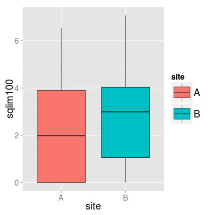
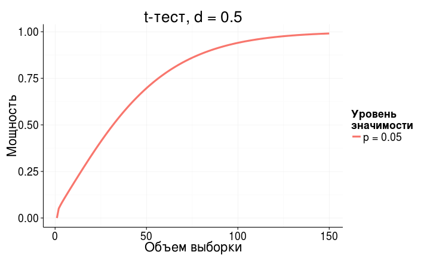
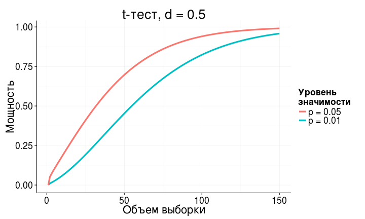

Экономим силы с помощью анализа мощности
========================================================
- *A priori* анализ мощности
- Оценка величины эффекта
- *Post hoc* анализ мощности


--- .learning

Вы сможете
========================================================
- оценивать величину эффекта и необходимый объем выборки по данным пилотного исследования
- загружать данные из .xls в R
- строить гистограммы и боксплоты с помощью `ggplot2`
- сравнивать средние значения при помощи t-критерия, интерпретировать и описывать результаты
- расчитывать фактическую мощность теста

--- .segue

На чем мы остановились?
========================================================

--- .sub-section

Пример: Улитки на устрицах в мангровых зарослях *
========================================================

В каких зонах мангровых зарослей на устрицах предпочитают обитать улитки?

Minchinton, Ross, 1999

<br />
>- Зона зарослей - 4 (по 5 проб - число улиток на раковинах устриц)
  - LZ - ближе к земле,
  - MZ - средняя часть, с деревьями,
  - SZ(-TR) - ближе к морю, с деревьями
  - SZ(+TR) - ближе к морю, без деревьев
  
>- Сайт - 2
  - A
  - B

<div class = "footnote">* - Данные из Quinn, Keough, 2002, Box 9-5, Fig 9-7</div>

---

Читаем данные из файла
========================================================
Не забудте войти в вашу директорию для матметодов,
например, так


```r
# setwd("C:\\Мои\ документы\\mathmethR\\) # в Windows
# setwd(/home/yourusername/mathmethR/) # в Linux

library(XLConnect)
wb <- loadWorkbook("./data/minch.xls")
minch <- readWorksheet(wb, sheet = 1)
```


---

Какой формы распределение численности улиток для двух сайтов?
========================================================


```r
library(ggplot2)
bp <- ggplot(data = minch, aes(x = site, y = limpt100, fill = site)) + 
  geom_boxplot()
bp
```


---

А если взять квадратный корень из численности?
========================================================
Стало ли распределение больше походить на нормальное?


```r
bp + aes(y = sqlim100)
```




--- .segue

A priory анализ мощности по данным пилотного исследования
========================================================

---

Представим, что было пилотное исследование:
========================================================
2 сайта, 4 зоны, по 2 пробы


```r
wb1 <- loadWorkbook("./data/minch_smpl.xls")
minch_smpl <- readWorksheet(wb1, sheet = 1)
```


---

Мы хотим сравнить сайты
========================================================

```r
ggplot(data = minch_smpl, aes(x = site, y = sqlim100)) + 
  geom_boxplot(aes(fill = site))
```


---

Величина эффекта по исходным данным
========================================================


```r
library(effsize)
effect <- cohen.d(minch_smpl$sqlim100, minch_smpl$site)
effect
```

```
## 
## Cohen's d
## 
## d estimate: -0.159 (negligible)
## 95 percent confidence interval:
##     A     A 
## -1.31  0.99
```


>- дальше нам понадобится строка "d estimate: -0.159 (negligible)"  
как добыть из нее значение?

---

Как называется в структуре объекта элемент, где записана величина эффекта?
========================================================

```r
str(effect)
```

```
## List of 7
##  $ method    : chr "Cohen's d"
##  $ name      : chr "d"
##  $ estimate  : Named num -0.159
##   ..- attr(*, "names")= chr "A"
##  $ conf.int  : Named num [1:2] -1.31 0.99
##   ..- attr(*, "names")= chr [1:2] "A" "A"
##  $ var       : Named num 0.535
##   ..- attr(*, "names")= chr "A"
##  $ conf.level: num 0.95
##  $ magnitude : chr "negligible"
##  - attr(*, "class")= chr "effsize"
```


---

Чтобы добыть величину эффекта, назовем его по имени с помощью оператора $
========================================================
`$` - для обращения к переменным по именам (для обращения к элементам сложного объекта)


```r
str(effect)
```

```
## List of 7
##  $ method    : chr "Cohen's d"
##  $ name      : chr "d"
##  $ estimate  : Named num -0.159
##   ..- attr(*, "names")= chr "A"
##  $ conf.int  : Named num [1:2] -1.31 0.99
##   ..- attr(*, "names")= chr [1:2] "A" "A"
##  $ var       : Named num 0.535
##   ..- attr(*, "names")= chr "A"
##  $ conf.level: num 0.95
##  $ magnitude : chr "negligible"
##  - attr(*, "class")= chr "effsize"
```

```r
effect$estimate
```

```
##      A 
## -0.159
```


---

Для pwr.t.test() эффект должен быть положительным
========================================================
Поэтому вычислим модуль, чтобы потом использовать `effect`

```r
effect <- abs(effect$estimate) # абсолютная величина (модуль)
effect
```

```
##     A 
## 0.159
```


>- Очень слабый эффект...

--- .prompt

Рассчитайте
========================================================

объем выборки, чтобы показать различия плотности улиток между сайтами с вероятностью 0.8?


```r
    pwr.t.test()
```


*** pnotes

========================================================

```r
library(pwr)
pwr.t.test(n = NULL, d = effect, power = 0.8, sig.level = 0.05, 
           type = "two.sample", alternative = "two.sided")
```

```
## 
##      Two-sample t test power calculation 
## 
##               n = 624
##               d = 0.159
##       sig.level = 0.05
##           power = 0.8
##     alternative = two.sided
## 
## NOTE: n is number in *each* group
```


>- Нужна выборка __624 площадки с каждого сайта__, чтобы с вероятностью 0.8 обнаружить различия плотности улиток между сайтами.

--- .segue

Post hoc анализ мощности 
========================================================

---

Что получилось бы на самом деле?
========================================================

```r
# bp <- ggplot(data = minch, aes(x = site, y = limpt100)) + geom_boxplot()
bp + aes(y = sqlim100)
```


---

Считаем t-критерий
========================================================
по умолчанию Модификация Велча - для неравных дисперсий


```r
t.test(sqlim100 ~ site, data = minch, var.equal = FALSE)
```

```
## 
## 	Welch Two Sample t-test
## 
## data:  sqlim100 by site
## t = -1.15, df = 38, p-value = 0.2556
## alternative hypothesis: true difference in means is not equal to 0
## 95 percent confidence interval:
##  -2.198  0.602
## sample estimates:
## mean in group A mean in group B 
##            2.11            2.91
```


>- Достоверных различий плотности улиток между локациями не обнаружено (t-критерий, p<0.01)

---

Для post hoc анализа нужно знать
========================================================

- тест ($H _0$ отвергнута!)
- уровень значимости
- фактический объем выборки
- фактическая величина эффекта

--- .sub-section

Пример: Улитки на устрицах в мангровых зарослях *
========================================================

Какова была реальная величина эффекта?

Хватило ли нам мощности, чтобы выявлять такие незначительные различия?

<div class = "footnote">* - Данные из Quinn, Keough, 2002, Box 7-1, Fig 7-4</div>

---

Что мы знаем для post hoc анализа?
========================================================
- тест
- уровень значимости
- фактический объем выборки
- фактическая величина эффекта

---

Что мы знаем для post hoc анализа?
========================================================
- тест — t-критерий
- уровень значимости — α = 0.05
- фактический объем выборки — 20
- фактическая величина эффекта — ?

--- .prompt

Рассчитайте
========================================================

- фактическую величину эффекта
- реальную мощность теста


```r
    $
    cohen.d()
    abs()
    pwr.t.test()
    help()
```


*** pnotes

========================================================

```r
effect_real <- cohen.d(minch$sqlim100, minch$site)
effect_real <- abs(effect_real$estimate)
library(pwr)
pwr.t.test(n = 20, d = effect_real, power = NULL, sig.level = 0.05, 
           type = "two.sample", alternative = "two.sided")
```

```
## 
##      Two-sample t test power calculation 
## 
##               n = 20
##               d = 0.365
##       sig.level = 0.05
##           power = 0.203
##     alternative = two.sided
## 
## NOTE: n is number in *each* group
```


---

Минимальные выявляемые различия
========================================================

$$d={{|\bar x _1 - \bar x _2  |} \over {\sqrt{{s_1^2 + s_2^2 } \over {2} }}}$$

$$MDES = {|\bar x _1 - \bar x _2  |} = d {\sqrt{{s_1^2 + s_2^2 } \over {2} }}$$

---

Найдем Коэновскую величину эффекта
========================================================

```r
d <- pwr.t.test(n = 20, d = NULL, power = 0.8, sig.level = 0.05, 
                type = "two.sample", alternative = "two.sided")
str(d)
```

```
## List of 7
##  $ n          : num 20
##  $ d          : num 0.909
##  $ sig.level  : num 0.05
##  $ power      : num 0.8
##  $ alternative: chr "two.sided"
##  $ note       : chr "n is number in *each* group"
##  $ method     : chr "Two-sample t test power calculation"
##  - attr(*, "class")= chr "power.htest"
```

```r
d$d
```

```
## [1] 0.909
```


---

Минимальные выявляемые различия
========================================================
$$MDES = d {\sqrt{{s_1^2 + s_2^2 } \over {2} }}$$


```r
library(plyr) # пакет, чтобы делать статистику по группам
(summary_by_site <- ddply(minch, ~ site, summarize, 
                         mean = mean(sqlim100), 
                         var = var(sqlim100)))
```

```
##   site mean  var
## 1    A 2.11 4.84
## 2    B 2.91 4.73
```

```r
(MDES <- d$d * sqrt(sum(summary_by_site$var)/2))
```

```
## [1] 1.99
```

```r
(diff <- summary_by_site$mean[2] - summary_by_site$mean[1])
```

```
## [1] 0.798
```


--- .segue

Мощность при разных объемах групп 
========================================================

--- .sub-section

А что если бы было не по 20 проб на каждом сайте?
========================================================
Улитки на устрицах в мангровых зарослях
- сайт A - 20 проб
- сайт B - 40 проб


```r
pwr.t2n.test()
```


---

Мощность при разных объемах групп
========================================================

```r
# effect_real <- cohen.d(minch$sqlim100, minch$site)
# effect_real <- abs(effect_real$estimate)
pwr.t2n.test(n1 = 20, n2 = 40, d = effect_real, power = NULL, 
             sig.level = .05, alternative = "two.sided")
```

```
## 
##      t test power calculation 
## 
##              n1 = 20
##              n2 = 40
##               d = 0.365
##       sig.level = 0.05
##           power = 0.259
##     alternative = two.sided
```


>- Все равно мощность маленькая! Важен ли такой эффект? Стоит ли за ним гоняться?

--- .prompt

Рассчитайте
========================================================

Выборка в первой группе $n = 200$

Какой объем выборки понадобится во второй группе, чтобы выявлять малые различия в плотности улиток между двумя сайтами (слабые эффекты) с вероятностью 0.8 при уровне значимости 0.05?


```r
    cohen.ES()
    pwr.t2n.test()
```


*** pnotes 

========================================================

```r
small_effect <- cohen.ES(test = "t", size = "small")
small_effect <- small_effect$effect.size
pwr.t2n.test(d = 0.2, n1 = 200, n2 = NULL, power = 0.8, sig.level = 0.05,
             alternative = "two.sided")
```

```
## 
##      t test power calculation 
## 
##              n1 = 200
##              n2 = 10486
##               d = 0.2
##       sig.level = 0.05
##           power = 0.8
##     alternative = two.sided
```


--- .segue

Как влиять на мощность теста?
========================================================

---

Мощность зависит 
========================================================

- от объема выборки
- от величины эффекта
- от уровня значимости

---

Чем больше объем выборки—тем больше мощность
========================================================



---

Чем больше уровень значимости—тем больше мощность
========================================================



---

Чем больше величина различий—тем больше мощность
========================================================


--- .prompt

Назовите,
========================================================

какие из факторов, влияющих на мощность теста,  
мы __не можем__ контролировать?

--- 

Мы не можем контролировать внешние факторы
========================================================

- величину эффекта ($ES$)
- фоновую изменчивость ($\sigma^2$)

--- .prompt

Скажите,
========================================================

каким образом можно повлиять на мощность теста?

--- 

Мощность теста можно регулировать, если
========================================================

- изменить число повторностей
- выбрать другой уровень значимости ($\alpha$)
- определиться, какие эффекты действительно важны ($ES$)

---

Take home messages
========================================================

>- Контролируем статистические ошибки:
  - чтобы не находить несуществующих эффектов, фиксируем уровень значимости
  - чтобы не пропустить значимое, рассчитываем величину эффекта, объем выборки и мощность теста
  - когда не обнаружили достоверных эффектов, оцениваем величину эффекта и мощность теста

>- Способность выявлять различия зависит 
  - от объема выборки, 
  - от уровня значимости
  - от величины эффекта

--- 

Дополнительные ресурсы
========================================================
- Quinn, Keough, 2002, pp. 164-170
- Open Intro to Statistics: [4.6 Sample Size and Power](http://www.openintro.org/stat/down/oiStat2_04.pdf), pp. 193-197  
- Sokal, Rohlf, 1995, pp. 167-169.  
- Zar, 1999, p. 83.
- [R Data Analysis Examples - Power Analysis for Two-group Independent sample t-test. UCLA: Statistical Consulting Group.](http://www.ats.ucla.edu/stat/r/dae/t_test_power2.htm)
- [R Data Analysis Examples - Power Analysis for One-sample t-test.  UCLA: Statistical Consulting Group.](http://www.ats.ucla.edu/stat/r/dae/t_test_power.htm) 
- [FAQ - How is effect size used in power analysis?  UCLA: Statistical Consulting Group.](http://www.ats.ucla.edu/stat/mult_pkg/faq/general/effect_size_power/effect_size_power.htm) 

