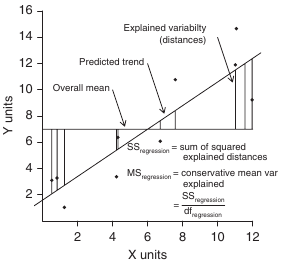
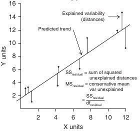
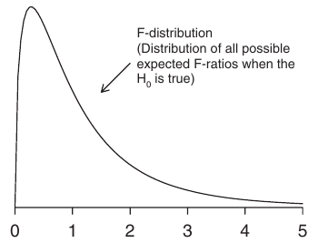

Знакомимся с линейными моделями
========================================================

- Модель простой линейной регрессии
- Проверка валидности модели
- Оценка качества подгонки модели

```{r setup, include = FALSE, cache = FALSE}
#----------------------------------------------------------------
# RUN THE FRAGMENT BETWEEN LINES BEFORE COMPILING MARKDOWN
# to configure markdown parsing
options(markdown.extensions = 
          c("no_intra_emphasis",# skip markdown embedded in words
            "tables",           # create HTML tables
            "fenced_code",      # treat text as verbatim when surrounded with begin and ending lines with three ~ or ' characters.
            "autolink",         # create HTML links from urls and email addresses.
            "strikethrough",    # create strikethroughs by surrounding text with ~~.
            "lax_spacing",      # allow HTML tags inside paragraphs without being surrounded by newlines.
            "space_headers",    # add a space between header hashes and the header itself.
            "latex_math"))      # transforms all math equations into syntactically correct MathJax equations.
#--------------------------------------------------------------
# output options
options(width = 80, # set the maximum number of columns on a line
        scipen = 6, # fixed notation of floating point numbers, unless it is more than scipen digits wider, else - exponential notation
        digits = 3) # the number of digits to print when printing numeric values

# to render cyrillics in plots use cairo pdf
options(device = function(file, width = 7, height = 7, ...) {
  cairo_pdf(tempfile(), width = width, height = height, ...)
  })

# chunk default options
opts_chunk$set(fig.align='center',  # default figure alignment
               tidy = FALSE,        # save manual code formatting
               fig.width = 10,      # default figure width
               fig.height = 6)      # default figure height

# this allows for code formatting inline
knit_hooks$set(inline = function(x) {
   if (is.numeric(x)) return(knitr:::format_sci(x, 'latex'))
   x = as.character(x)
   h = knitr:::hilight_source(x, 'latex', list(prompt = FALSE, 
                                               size='normalsize', 
                                               highlight = FALSE))
   h = gsub("([_#$%&])", "\\\\\\1", h)
   h = gsub('(["\'])', '\\1{}', h)
   gsub('^\\\\begin\\{alltt\\}\\s*|\\\\end\\{alltt\\}\\s*$', '', h)})
```

```{r themes, echo = FALSE, cache = FALSE}
library(ggplot2)
library(grid)
theme_grey_slide <- function (base_size = 20, base_family = "") 
{
  # theme larger legend
  require(ggplot2)
  require(grid)
  theme_grey(base_size = base_size, base_family = base_family) %+replace% 
    theme(legend.key.size = unit(2, "lines"), 
          legend.text = element_text(lineheight=.8, hjust = 0))
}

theme_bw_slide <- function (base_size = 20, base_family = "") 
{
  # theme with larger legend
  require(ggplot2)
  require(grid)
  theme_bw(base_size = base_size, base_family = base_family) %+replace% 
    theme(legend.key.size = unit(2, "lines"),
          legend.text = element_text(lineheight=.8, hjust = 0.5))
}

theme_classic_slide <- function (base_size = 20, base_family = "") 
{
  # theme with larger legend
  require(ggplot2)
  require(grid)
  theme_classic(base_size = base_size, base_family = base_family) %+replace% 
    theme(legend.key.size = unit(2, "lines"), 
          legend.text = element_text(lineheight=.8, hjust = 0.5))
}

theme_set(theme_grey_slide())
```

--- .learning

Вы сможете
========================================================

- подобрать модель линейной регрессии и записать ее в виде уравнения
- проверить валидность модели при помощи t- или F-теста
- оценить долю изменчивости, которую объясняет модель, при помощи $R^2$

--- .segue

Модель простой линейной регрессии
========================================================

---

Линейная регрессия
========================================================

- простая

$$Y _i = β _0 + βx _i + \epsilon _i$$

- множественная

$$Y _i = β _0 + βx _{1 i} + + βx _{2 i} + ... + \epsilon _i$$

---

Запись моделей в R
========================================================

```{r eval=FALSE}
зависимая_переменная ~ модель
```

<br \>
$\hat y _i = b _0 + bx _i$ (простая линейная регрессия со свободным членом (intercept))
  - Y ~ X
  - Y ~ 1 + X 
  - Y ~ X + 1

$\hat y _i = bx _i$ (простая линейная регрессия без свободного члена)
  - Y ~ X - 1
  - Y ~ -1 + X

$\hat y _i = b _0$ (уменьшенная модель, линейная регрессия y от свободного члена)
  - Y ~ 1
  - Y ~ 1 - X

--- .prompt

Запишите в нотации R
========================================================
эти модели линейных регрессий

- $\hat y _i = b _0 + bx _{1 i} + bx _{2 i} + bx _{3 i}$ (множественная линейная регрессия со свободным членом)

- $\hat y _i = b _0 + bx _{1 i} + bx _{3 i}$ (уменьшенная модель множественной линейной регрессии, без $X2$)

*** pnotes

$\hat y _i = b _0 + bx _{1 i} + bx _{2 i} + bx _{3 i}$ 
  - Y ~ X1 + X2 + X3
  - Y ~ 1 + X1 + X2 + X3

$\hat y _i = b _0 + bx _{1 i} + bx _{3 i}$ 
  - Y ~ X1 + X3
  - Y ~ 1 + X1 + X3

--- &twocol

Минимизируем остаточную изменчивость
========================================================

*** left

$Y _i = β _0 + βx _i + \epsilon _i$ - модель регрессии

$\hat y _i = b _0 + b _1 x _i$ - оценка модели

нужно оценить $\beta _0$, $\beta _1$ и $σ^2$


*** right

- Метод наименьших квадратов (Ordinary Least Squares, см. рис.)

<br />
<br />
Еще есть методы максимального правдоподобия (Maximum Likelihood, REstricted Maximum Likelihood)

<div class="footnote">Рисунок из кн. Quinn, Keough, 2002, стр. 85, рис. 5.6 a</div>

---

Оценки параметров линейной регрессии
========================================================

минимизируют $\sum{(y _i - \hat y _i)^2}$, т.е. остатки.

Параметры     | Оценки параметров | Стандартные ошибки оценок
------- | --------- | -----
$\beta _1$    | $$b _1 = \frac {\sum _{i=1}^{n} {[(x _i - \bar x)(y _i - \bar y)]}}{\sum _{i=1}^{n} {(x _i - \bar x)^2}}$$      | $$SE _{b _1} = \sqrt{\frac{MS _e}{\sum _{i=1}^{n} {(x _i - \bar x)^2}}}$$
$\beta _0$    | $$b _0 = \bar y - b _1 \bar x$$  | $$SE _{b _0} = \sqrt{MS _e [\frac{1}{n} + \frac{\bar x}{\sum _{i=1}^{n} {(x _i - \bar x)^2}}]}$$
$\epsilon _i$ | $$e _i = y _i - \hat y _i$$      | $$\approx \sqrt{MS _e}$$

>-  Стандартные ошибки коэффициентов нужны
  - для построения доверительных интервалов
  - для статистических тестов

<div class="footnote">Таблица из кн. Quinn, Keough, 2002, стр. 86, табл. 5.2</div>

---

Коэффициенты регрессии
========================================================


<div class="footnote">Рисунок из кн. Logan, 2010, стр. 170, рис. 8.2</div>


>- Если нужно сравнивать - лучше стандартизованные (= "бета коэффициенты") коэффициенты (на след.лекции про сравнение моделей)
  - $b^\ast _1 = {b _1  {\sigma _x} \over {\sigma _y}}$
  - не зависят от масштаба

--- .sub-section &twocol

Пример: усыхающие личинки мучных хрущаков
=========================================================

Как зависит потеря влаги личинками [малого мучного хрущака](http://ru.wikipedia.org/wiki/Хрущак_малый_мучной) _Tribolium confusum_ от влажности воздуха? (Nelson, 1964)

*** left

9 экспериментов, продолжительность 6 дней
- разная относительная влажность воздуха, % (`humidity`)
- измерена потеря влаги, мг (`weightloss`)

Данные в файлах `nelson.xlsx` и `nelson.csv`

*** right


<div class = "footnote">Данные из Sokal, Rohlf, 1997, табл. 14.1 по Logan, 2010. глава 8, пример 8c</div>

---

Читаем данные из файла и знакомимся с ними
=========================================================

```{r include = FALSE}
setwd("/media/data/ProjectsWork/lect-mathmethr-2013/w2-regression1")
library(XLConnect)
wb <- loadWorkbook("./data/nelson.xlsx")
nelson <- readWorksheet(wb, sheet = 1)
```

Внимание, установите рабочую директорию, или используйте полный путь к файлу

```{r eval = FALSE}
setwd("C:\\mathmethr\week2")
## из .xlsx
library(XLConnect)
wb <- loadWorkbook(".\data\nelson.xlsx")
nelson <- readWorksheet(wb, sheet = 1)
## или из .csv 
# nelson <- read.table(file=".\data\nelson.xlsx", header = TRUE, sep = "\t", dec = ".") 
```
```{r}
str(nelson)
head(nelson)
```

---
Как зависит потеря веса от влажности? График рассеяния.
========================================================
```{r}
library(ggplot2)
p_nelson <- ggplot(data=nelson, aes(x = humidity, y = weightloss)) + 
  geom_point() + 
  labs(x = "Относительная влажность, %", y = "Потеря веса, мг")
p_nelson
```

---
Внешний вид графиков можно менять при помощи тем
========================================================
```{r include = FALSE}
p1 <- p_nelson + theme_classic_slide(18)
p2 <- p_nelson + theme_bw_slide(18)
```

```{r eval = FALSE}
p_nelson + theme_classic()
p_nelson + theme_bw()
theme_set(theme_classic()) # устанавливаем понравившуюся тему до конца сессии
```

```{r echo=FALSE, fig.width=13}
library(gridExtra)
new_plot <- grid.arrange (p1, p2, ncol = 2)
theme_set(theme_classic_slide(18))
```

---
Подбираем параметры линейной модели
========================================================
```{r}
nelson_lm <- lm(weightloss ~ humidity, nelson)
summary(nelson_lm)
```

---

Добавим линию регрессии на график
========================================================
```{r}
p_nelson + geom_smooth(method = "lm")
```

--- .prompt

Как вы думаете,
========================================================
что это за серая область вокруг линии регрессии?

```{r}
p_nelson + geom_smooth(method = "lm")
```

*** pnotes

Это 95% доверительная зона регрессии.

В ней с 95% вероятностью лежит регрессионная прямая.   

Возникает из-за неопределенности оценок коэффициентов регрессии.


--- .segue

Неопределенность оценок коэффициентов и предсказанных значений
========================================================

---
Неопределенность оценок коэффициентов
========================================================

>- __Доверительный интервал коэффициента__
  - зона, в которой с $(1 - \alpha) \cdot 100\%$ вероятностью содержится среднее значение коэффициента<br />
  - <large>$b _1 \pm t _{\alpha, df = n - 2}SE _{b _1}$</large><br />
  - $\alpha = 0.05$ => $(1 - 0.05) \cdot 100\% = 95\%$ интервал
<br /><br /><br />
>- __Доверительная зона регрессии__
  - зона, в которой с $(1 - \alpha) \cdot 100$% вероятностью лежит регрессионная прямая

---
Находим доверительные интервалы коэффициентов
===================================================
```{r}
# Вспомните, в выдаче summary(nelson_lm) были только оценки коэффициентов 
# и стандартные ошибки

# оценки коэффициентов отдельно
coef(nelson_lm)

# доверительные интервалы коэффициентов
confint(nelson_lm)
```


--- &twocol w1:60% w2:40% 

Оценим, какова средняя потеря веса при заданной влажности 
===================================================
__Нельзя давать оценки вне интервала значений $X$!__

*** left

```{r fig.height = 7}
# новые данные для предсказания значений
newdata <- data.frame(humidity = c(50, 100)) 
predict(nelson_lm, newdata, 
        interval = "confidence", se = TRUE) 
# доверительный интервал к среднему значению
```

*** right

```{r echo = FALSE, fig.width = 5, fig.height = 4.5}
pr1 <- predict(nelson_lm, newdata, 
        interval = "confidence", se = TRUE) 
p_nelson + geom_smooth(method = "lm", se = FALSE)
```

>- При 50 и 100% относительной влажности ожидаемая средняя потеря веса жуков будет `r round(pr1$fit[1,1], 1)` $\pm$ `r round(pr1$fit[1,1] - pr1$fit[1,2], 1)` и `r round(pr1$fit[2,1], 1)` $\pm$ `r round(pr1$fit[2,1] - pr1$fit[2,2], 1)`, соответственно.

---

Строим доверительную зону регрессии
===================================================
```{r eval = FALSE}
p_nelson + geom_smooth(method = "lm") + 
  ggtitle ("95% доверительная зона регрессии")
p_nelson + geom_smooth(method = "lm", level = 0.99) + 
  ggtitle ("99% доверительная зона регрессии")
```
```{r echo=FALSE, fig.width=13}
p1 <- p_nelson + geom_smooth(method = "lm") + ggtitle ("95% доверительная зона регрессии")
p2 <- p_nelson + geom_smooth(method = "lm", level = 0.99) + ggtitle ("99% доверительная зона регрессии")
grid.arrange(p1, p2, ncol = 2)
```

---

Неопределенность оценок предсказанных значений
===================================================

>- __Доверительный интервал к предсказанному значению__
  - зона в которую попадают $(1 - \alpha) \cdot 100$% значений $\hat y _i$ при данном $x _i$<br />
  - <large>$\hat y _i \pm t _{0.05, n - 2}SE _{\hat y _i}$</large><br />
  - <large>$SE _{\hat y} = \sqrt{MS _{e} [1 + \frac{1}{n} + \frac{(x _{prediction} - \bar x)^2} {\sum _{i=1}^{n} {(x _{i} - \bar x)^2}}]}$</large>
<br /><br /><br />

>- __Доверительная область значений регрессии__
  - зона, в которую попадает $(1 - \alpha) \cdot 100$% всех предсказанных значений

--- &twocol w1:60% w2:40% 

Предсказываем для новых значений
===================================================
__Нельзя использовать для предсказаний вне интервала значений $X$!__

*** left

```{r fig.height = 7}
# новые данные для предсказания значений
newdata <- data.frame(humidity = c(50, 100)) 
predict(nelson_lm, newdata, 
        interval = "prediction", se = TRUE)
# зона, в которой будут лежать 95% всех значений
```

*** right

```{r echo = FALSE, fig.width = 5, fig.height = 4.5}
p_nelson + geom_smooth(method = "lm", se = FALSE)
pr2 <- predict(nelson_lm, newdata, 
        interval = "prediction", se = TRUE)
```

>- У 95% жуков при 50 и 100% относительной влажности будет потеря веса будет в пределах `r round(pr2$fit[1,1], 1)` $\pm$ `r round(pr2$fit[1,1] - pr2$fit[1,2], 1)` и `r round(pr2$fit[2,1], 1)` $\pm$ `r round(pr2$fit[2,1] - pr2$fit[2,2], 1)`, соответственно.

---
Данные для доверительной области значений
===================================================
```{r}
# предсказанные значения для исходных данных
predict(nelson_lm, interval = "prediction")
# объединим с исходными данными в новом датафрейме - для графиков
nelson_with_pred <- data.frame(nelson, predict(nelson_lm, interval = "prediction"))
```

---
Строим доверительную область значений и доверительный интервал
===================================================
```{r warning=FALSE, fig.height = 5, fig.width = 13}
p_nelson + geom_smooth(method = "lm", aes(fill = "Доверительный интервал"), alpha = 0.4) +
  geom_ribbon(data = nelson_with_pred, 
              aes(y = fit, ymin = lwr, ymax = upr, fill = "Доверительная область значений"), 
              alpha = 0.2) +
  scale_fill_manual('Интервалы', values = c('green', 'blue'))
```

--- .segue

Проверка валидности модели
========================================================
## $H _0: \beta _1 = 0$

## или t-, или F-тест

---

Проверка при помощи t-критерия
========================================================

$H _0 : b _1 = \theta$, $\theta = 0$
$$t = \frac{b _1 - \theta}{SE _{b _1}}$$
$df = n - 2$

---

Проверка коэффициентов с помощью t-критерия есть в сводке модели
========================================================
```{r}
summary(nelson_lm)
```

>- Увеличение относительной влажности привело к достоверному замедлению потери веса жуками ($b _1 = -0.053$, $t = - 16.35$, $p < 0.01$)

---

Проверка при помощи F-критерия
========================================================

$H _0: \beta _1 = 0$ 

- Та же самая нулевая гипотеза. Как так получается?

---

Общая изменчивость - отклонения от общего среднего значения
========================================================
$SS _{total}$
--------------------------------------------------------

<div style="line-height: 500px;">

</div>

<div class="footnote">
Рисунок из кн. Logan, 2010, стр. 172, рис. 8.3 a
</div>

--- &twocol

$SS _{total} = SS _{regression} + SS _{error}$
--------------------------------------------------------

*** left

<div style="line-height: 500px;">

</div>

<div class="footnote">
Рисунок из кн. Logan, 2010, стр. 172, рис. 8.3 a-c
</div>

*** right




--- &twocol

Если зависимости нет, $b _1 = 0$
========================================================

*** left
<div>
Тогда $\hat y _i = \bar y _i$
<br />
и $MS _{regression} \approx MS _{error}$
</div>

<div style="line-height: 400px;">

</div>

<div class="footnote">
Рисунок из кн. Logan, 2010, стр. 172, рис. 8.3 a-c
</div>

*** right


*** pnotes

Что оценивают средние квадраты отклонений?

Источник изменчивости  |  Суммы квадратов отклонений<br />SS |   Число степеней свободы<br />df   | Средний квадрат отклонений<br />MS | Ожидаемый средний квадрат
---------------------- | ----- | ------ | ------------------- | -----
Регрессия | $$\sum{(\bar y - \hat y _i)^2}$$ | $$1$$ | $$\frac{\sum _{i=1}^{n}{(\bar y - \hat y _i)^2}}{1}$$ | $$\sigma _{\epsilon} ^2 + {\beta _1} ^2 \sum _{i=1}^{n} {(x _i - \bar x)^2}$$
Остаточная | $$\sum{(y _i - \hat y _i)^2}$$ | $$n - 2$$ | $$\frac{\sum _{i=1}^{n}{(y _i - \hat y _i)^2}}{n - 2}$$ | $$\sigma _{\epsilon} ^2$$
Общая | $$\sum {(\bar y - y _i)^2}$$ | $$n - 1$$ | 

<br />
Если $b _1 = 0$, тогда $\hat y _i = \bar y _i$ и $MS _{regression} \approx MS _{error}$

Тестируем:

$$F = {MS _{regression} \over MS _{error}}$$

--- &twocol

F-критерий и распределение F-статистики
========================================================

$$F = \frac {Объясненная\ изменчивость}{Необъясненная\ изменчивость} = \frac {MS _{regression}} {MS _{error}}$$


*** left



F-распределение при $H _0: b _1 = 0$ 

*** right

<br />
<br />
Зависит от

  - $\alpha$
  
  - $df _{regression}$
  
  - $df _{error}$

<div class="footnote">Рисунок с изменениями из кн. Logan, 2010, стр. 172, рис. 8.3 d</div>

---

Таблица результатов дисперсионного анализа
========================================================

Источник изменчивости  |  Суммы квадратов отклонений,<br /> SS   |   Число степеней свободы,<br /> df   | Средний квадрат отклонений,<br /> MS | F  
---------------------- | --------- | ------ | ------------------- | -----
Регрессия | $$SS _r = \sum{(\bar y - \hat y _i)^2}$$ | $$df _r = 1$$ | $$MS _r = \frac{SS _r}{df _r}$$ | $$F _{df _r, df _e} = \frac{MS _r}{MS _e}$$
Остаточная | $$SS _e = \sum{(y _i - \hat y _i)^2}$$ | $$df _e = n - 2$$ | $$MS _e = \frac{SS _e}{df _e}$$ | 
Общая | $$SS _t = \sum {(\bar y - y _i)^2}$$ | $$df _t = n - 1$$ | 

<br />
>- Минимальное упоминание в тексте - $F _{df _r, df _e}$, $p$

---

Проверяем валидность модели при помощи F-критерия
========================================================
```{r}
nelson_aov <- aov(nelson_lm)
summary(nelson_aov)
```

<br />
>- Количество влаги, потерянной жуками в период эксперимента, достоверно зависело от уровня относительной влажности ($F _{1, 7} = 267$, $p < 0.01$).

--- .segue

Оценка качества подгонки модели
========================================================

---

Коэффициент детерминации
========================================================
доля общей изменчивости, объясненная линейной связью x и y

$R^2 = \frac {SS _r} {SS _t}$

$0 \le R^2 \le 1$

<br /><br />
Иначе рассчитывается как $R^2 = r^2$

---

Коэффициент детерминации 
========================================================
можно найти в сводке модели

>- Осторожно, не сравнивайте $R^2$ моделей с разным числом параметров, для этого есть $R^2 _{adjusted}$

```{r}
summary(nelson_lm)
```

---

Take home messages
========================================================
>- Модель простой линейной регрессии $y _i = \beta _0 + \beta _1 \dot x _i + \epsilon _i$

>- В оценке коэффициентов регрессии и предсказанных значений существует неопределенность. Доверительные интервалы можно расчитать, зная стандартные ошибки.

>- Валидность модели линейной регрессии можно проверить при помощи t- или F-теста. $H _0: \beta _1 = 0$

>- Качество подгонки модели можно оценить при помощи коэффициента детерминации $R^2$

---

Дополнительные ресурсы
========================================================
- Гланц, 1999, стр. 221-244
- Logan, 2010, pp. 170-207
- Quinn, Keough, 2002, pp. 78-110
- [Open Intro to Statistics](https://docs.google.com/viewer?docex=1&url=http://www.openintro.org/stat/down/OpenIntroStatSecond.pdf): [Chapter 7. Introduction to linear regression](https://docs.google.com/viewer?docex=1&url=http://www.openintro.org/stat/down/oiStat2_07.pdf), pp. 315-353.  
- Sokal, Rohlf, 1995, pp. 451-491
- Zar, 1999, pp. 328-355
