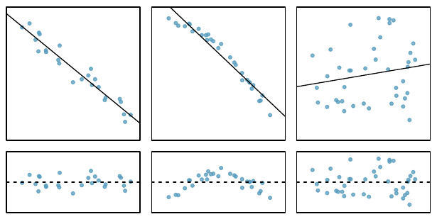
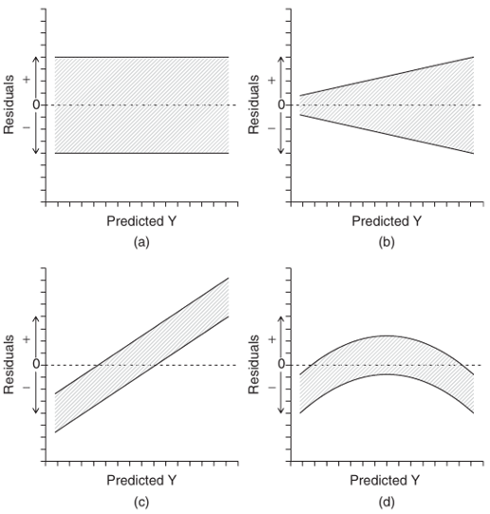
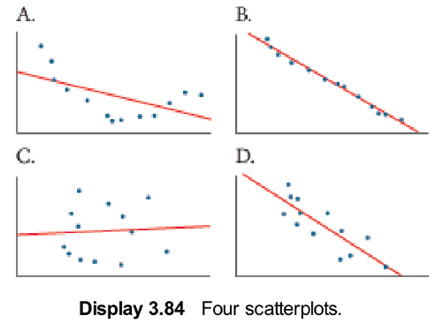
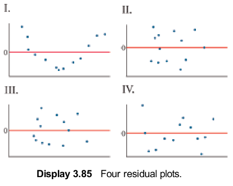
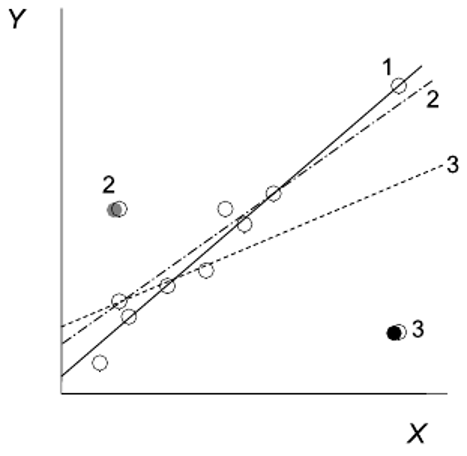

Когда и какую регрессию можно применять
========================================================

- Условия применимости регрессионного анализа
- Мощность линейной регрессии

```{r setup, include = FALSE, cache = FALSE}
#----------------------------------------------------------------
# RUN THE FRAGMENT BETWEEN LINES BEFORE COMPILING MARKDOWN
# to configure markdown parsing
options(markdown.extensions = 
          c("no_intra_emphasis",# skip markdown embedded in words
            "tables",           # create HTML tables
            "fenced_code",      # treat text as verbatim when surrounded with begin and ending lines with three ~ or ' characters.
            "autolink",         # create HTML links from urls and email addresses.
            "strikethrough",    # create strikethroughs by surrounding text with ~~.
            "lax_spacing",      # allow HTML tags inside paragraphs without being surrounded by newlines.
            "space_headers",    # add a space between header hashes and the header itself.
            "latex_math"))      # transforms all math equations into syntactically correct MathJax equations.
#--------------------------------------------------------------
# output options
options(width = 80, # set the maximum number of columns on a line
        scipen = 6, # fixed notation of floating point numbers, unless it is more than scipen digits wider, else - exponential notation
        digits = 3) # the number of digits to print when printing numeric values

# to render cyrillics in plots use cairo pdf
options(device = function(file, width = 7, height = 7, ...) {
  cairo_pdf(tempfile(), width = width, height = height, ...)
  })

# chunk default options
opts_chunk$set(fig.align='center',  # default figure alignment
               tidy = FALSE,        # save manual code formatting
               fig.width = 10,      # default figure width
               fig.height = 6)      # default figure height

# this allows for code formatting inline
knit_hooks$set(inline = function(x) {
   if (is.numeric(x)) return(knitr:::format_sci(x, 'latex'))
   x = as.character(x)
   h = knitr:::hilight_source(x, 'latex', list(prompt = FALSE, 
                                               size='normalsize', 
                                               highlight = FALSE))
   h = gsub("([_#$%&])", "\\\\\\1", h)
   h = gsub('(["\'])', '\\1{}', h)
   gsub('^\\\\begin\\{alltt\\}\\s*|\\\\end\\{alltt\\}\\s*$', '', h)})
```

```{r themes, echo = FALSE, cache = FALSE}
library(ggplot2)
library(grid)
theme_grey_slide <- function (base_size = 20, base_family = "") 
{
  # theme larger legend
  require(ggplot2)
  require(grid)
  theme_grey(base_size = base_size, base_family = base_family) %+replace% 
    theme(legend.key.size = unit(3, "lines"), 
          legend.text = element_text(hjust = 0))
}

theme_bw_slide <- function (base_size = 20, base_family = "") 
{
  # theme with larger legend
  require(ggplot2)
  require(grid)
  theme_bw(base_size = base_size, base_family = base_family) %+replace% 
    theme(legend.key.size = unit(3, "lines"), 
          legend.text = element_text(size = 20, hjust = 0.5))
}

theme_classic_slide <- function (base_size = 20, base_family = "") 
{
  # theme with larger legend
  require(ggplot2)
  require(grid)
  theme_classic(base_size = base_size, base_family = base_family) %+replace% 
    theme(legend.key.size = unit(3, "lines"), 
          legend.text = element_text(size = 20, hjust = 0.5))
}

theme_set(theme_grey_slide())
```

--- .learning

Вы сможете
========================================================
- Проверить условия применимости простой линейной регрессии
- Рассчитать мощность линейной регрессии

--- .sub-section &twocol

Пример: усыхающие личинки мучных хрущаков
=========================================================

Как зависит потеря влаги личинками [малого мучного хрущака](http://ru.wikipedia.org/wiki/Хрущак_малый_мучной) _Tribolium confusum_ от влажности воздуха? (Nelson, 1964)

```{r include = FALSE}
library(XLConnect)
wb <- loadWorkbook("./../data/nelson.xlsx")
nelson <- readWorksheet(wb, sheet = 1)
library(ggplot2)
theme_set(theme_classic_slide(18))
```


*** left

```{r eval = FALSE}
# Внимание, установите рабочую директорию, 
# или используйте полный путь к файлу
setwd("C:/mathmethr/week2")
## из .xlsx
library(XLConnect)
wb <- loadWorkbook("./data/nelson.xlsx")
nelson <- readWorksheet(wb, sheet = 1)
## или из .csv 
# nelson <- read.table(file="./data/nelson.csv",
#                      header = TRUE, sep = "\t",
#                      dec = ".") 
```

*** right


<div class = "footnote">Данные из Sokal, Rohlf, 1997, табл. 14.1 по Logan, 2010. глава 8, пример 8c</div>

--- 

Как зависит потеря веса от влажности? График рассеяния.
========================================================
```{r eval = FALSE}
library(ggplot2)
theme_set(theme_classic()) # устанавливаем понравившуюся тему до конца сессии
p_nelson <- ggplot(data=nelson, aes(x = humidity, y = weightloss)) + 
  geom_point() + 
  geom_smooth(method = "lm", colour = "red") +
  labs(x = "Относительная влажность, %", y = "Потеря веса, мг")
p_nelson
```
```{r echo = FALSE, fig.height = 4.5}
p_nelson <- ggplot(data=nelson, aes(x = humidity, y = weightloss)) + 
  geom_point() + 
  geom_smooth(method = "lm", colour = "red") +
  labs(x = "Относительная влажность, %", y = "Потеря веса, мг")
p_nelson
```

---

Проверяем, есть ли зависимость потери веса от влажности с помощью линейной регрессии
========================================================

```{r}
# линейная регрессия из прошлой лекции
nelson_lm <- lm(weightloss ~ humidity, nelson)
summary(nelson_lm)
```

---

Зависимость потери веса от влажности можно описать уравнением
========================================================

Для этого подставим коэффициенты в уравнение линейной регрессии $y = b _0 + b _1 x$

```{r}
coef(nelson_lm) # Коэффициенты регрессии
```

$weightloss =$  `r round(coef(nelson_lm)[1], 2)` `r round(coef(nelson_lm)[2], 2)`  $humidity$

Чаще более академические обозначения:

$y =$ `r round(coef(nelson_lm)[1], 2)` `r round(coef(nelson_lm)[2], 2)` $x$, $R^2 =$ `r summary(nelson_lm)$r.squared`

Потеря веса мучными хрущаками в результате высыхания достоверно зависит от относительной влажности ($\beta _1 =$ `r round(coef(nelson_lm)[2], 2)` $\pm$ `r round((confint(nelson_lm)[2, 2] - confint(nelson_lm)[2, 1])/2, 2)`, $p < 0.01$)

--- .segue

Условия применимости простой линейной регрессии и анализ остатков
========================================================
Насколько можно доверять оценкам коэффициентов, которые мы получили?
--------------------------------------------------------

---

Условия применимости простой линейной регрессии 
========================================================
должны выполняться, чтобы тестировать гипотезы

1. Независимость

1. Линейность 

1. Нормальное распределение

1. Гомогенность дисперсий

--- 

1. Независимость
========================================================

- Значения $y _i$ должны быть независимы друг от друга
  - берегитесь псевдоповторностей
  - берегитесь автокорреляций (например, временных)
- Контролируется на этапе планирования
- Проверяем на графике остатков




<div class="footnote">Рисунок из кн. Diez et al., 2010, стр. 332, рис. 7.8</div>

---

2. Линейность связи
========================================================
- проверяем на графике рассеяния исходных данных
- проверяем на графике остатков

<br /><br /><br />


<div class="footnote">Рисунок из кн. Diez et al., 2010, стр. 332, рис. 7.8</div>

--- &twocol

Вот, что бывает, если неглядя применять линейную регрессию
========================================================

*** left

[Квартет Энскомба](http://ru.wikipedia.org/wiki/Квартет_Энскомба) - примеры данных, где регрессии одинаковы во всех случаях (Anscombe, 1973)

$y _i = 3.0 + 0.5 x _i$,

$r^2 = 0.68$, 

$H _0: \beta _1 = 0$, $t = 4.24$, $p = 0.002$

*** right


<div class="footnote">Рисунок из кн. Quinn, Keough, 2002, стр. 97, рис. 5.9</div>

--- &twocol

3. Нормальное распределение
========================================================

*** left

Нужно, т.к. в модели $Y _i = β _0 + βx _i + \epsilon _i$

$Y \sim N(0,\sigma^2)$

<br />

>- К счастью, это значит, что $\epsilon _i \sim N(0,\sigma^2)$

<br /><br /><br />

>- Нужно для тестов параметров, а не для подбора методом наименьших квадратов

>- Тесты устойчивы к небольшим отклонениям от нормального распределения

>- Проверяем распределение остатков на нормально-вероятностном графике


*** right


<div class="footnote">Рисунок из кн. Watkins et al., 2008, стр. 743, рис. 11.4</div>

--- &twocol

4. Гомогенность дисперсий
========================================================

*** left

Нужно, т.к. в модели $Y _i = β _0 + βx _i + \epsilon _i$

$Y \sim N(0,\sigma^2)$,

и дисперсии $\sigma^2 _1 = \sigma^2 _2 = ... = \sigma^2 _i$ для каждого $Y _i$ 

>- К счастью, поскольку $\epsilon _i \sim N(0,\sigma^2)$, можно проверить равенство дисперсий остатков $\epsilon _i$

<br />
>- Нужно и важно для тестов параметров

>- Проверяем на графике остатков по отношению к предсказанным значениям

>- Можно сделать тест С Кокрана (Cochran's C), но только если несколько значений y для каждого x

*** right


<div class="footnote">Рисунок из кн. Watkins et al., 2008, стр. 743, рис. 11.4</div>

--- &twocol

Диагностика регрессии по графикам остатков
========================================================

*** left



<div class="footnote">Рисунок из кн. Logan, 2010, стр. 174, рис. 8.5 d</div>

*** right

<br />
>- условия:
  - a - все выполнены
  - b - разброс остатков разный (wedge-shaped pattern)
  - c - разброс остатков одинаковый, но нужны дополнительные предикторы
  - d - к нелинейной зависимости применили линейную регрессию

--- .prompt &twocol

Скажите, 
========================================================

- какой регрессии соответствует какой график остатков?
- все ли условия применимости регрессии здесь выполняются?
- назовите случаи, в которых можно и нельзя применить линейную регрессию?

*** left



*** right



<div class="footnote">Рисунок из кн. Watkins et al. 2008, стр. 177, рис. 3.84-3.85</div>

*** pnotes

- A1 - нелинейная связь - нельзя; 
- B2 - все в порядке, можно; 
- C3 - все в порядке, можно; 
- D4 - синусоидальный тренд в остатках, нарушено условие независимости или зависимость нелинейная - нельзя.

--- &twocol

Какие наблюдения влияют на ход регрессии больше других?
========================================================

*** left

Влиятельные наблюдения, выбросы, outliers

- большая абсолютная величина остатка
- близость к краям области определения ([leverage](http://en.wikipedia.org/wiki/Leverage_(statistics\) ) - рычаг, "сила"; иногда называют hat)

<br />
>-
  - 1 - не влияет
  - 2 - умеренно влияет (большой остаток, малая сила влияния)
  - 3 - очень сильно влияет (большой остаток, большая сила влияния)

*** right



<div class="footnote">Рисунок из кн. Quinn, Keough, 2002, стр. 96, рис. 5.8</div>

--- &twocol

Как оценить влиятельность наблюдений
========================================================

*** left

[Расстояние Кука (Cook's d)](http://en.wikipedia.org/wiki/Cook's_distance) (Cook, 1977)

>- Учитывает одновременно величину остатка и близость к краям области определения (leverage)

>- Условное пороговое значение:  
выброс, если $d \ge 4/(N - k - 1)$,  
где $N$ - объем выборки,  
$k$ - число предикторов.  

>- Дж. Фокс советует не обращать внимания на пороговые значения (Fox, 1991).

>- Что делать с влиятельными точками?
  - Проверить, не ошибка ли это.  
    Если это не ошибка, не удалять - обсуждать!
  - Проверить, что будет, если их исключить из модели

*** right


<div class="footnote">Рисунок из кн. Quinn, Keough, 2002, стр. 96, рис. 5.8</div>

--- &twocol

Что делать с выбросами?
========================================================

*** left

  - Проверить, не ошибка ли это.  
    Если это не ошибка, не удалять - обсуждать!
  - Проверить, что будет, если их исключить из модели

*** right


<div class="footnote">Рисунок из кн. Quinn, Keough, 2002, стр. 96, рис. 5.8</div>


--- .segue

Проверим условия применимости
========================================================


--- .prompt

Проверьте линейность связи, 
========================================================
постройте для этого график рассеяния

```{r eval = FALSE}
ggplot()
aes()
geom_point()
```


*** pnotes

```{r}
ggplot(data = nelson, aes(x = humidity, y = weightloss)) + 
  geom_point()
```

---

Для анализа остатков выделим нужные данные в новый датафрейм
========================================================

```{r}
# нам нужна линейная регрессия из прошлой лекции
nelson_lm <- lm(weightloss ~ humidity, nelson) # линейная регрессия
# library(ggplot2) # функция fortify() находится в пакете ggplot2
nelson_diag <- fortify(nelson_lm)
names(nelson_diag) # названия переменных
```

<br />

>- Кроме `weightloss` и `humidity` нам понадобятся  
  - `.cooksd` - расстояние Кука  
  - `.fitted` - предсказанные значения  
  - `.resid` - остатки  
  - `.stdresid` - стандартизованные остатки

--- .prompt

Постройте график зависимости остатков от предиктора,  
========================================================
используя данные из `nelson_diag`

- `humidity` - относительная влажность (наш предиктор)
- `.resid` - остатки  

```{r eval = FALSE}
names() 
ggplot()
aes()
geom_point()
```

>- По абсолютным остаткам сложно сказать, большие они или маленькие.  Нужна стандартизация


*** pnotes

```{r}
ggplot(data = nelson_diag, aes(x = humidity, y = .resid)) +
  geom_point()
```
По абсолютным остаткам сложно сказать, большие они или маленькие. Нужна стандартизация

--- .prompt

Постройте график зависимости __стандартизованных остатков__ от предсказанных значений
========================================================

Стандартизованные остатки $\frac {y _i - \hat y _i} {\sqrt{MS _e}}$
- можно сравнивать между регрессиями
- можно сказать, какие остатки большие, какие нет
  - $\le 2 SD$ - обычные
  - $> 3 SD$ - редкие

Использйте данные из `nelson_diag`  
- `.fitted` - предсказанные значения  
- `.resid` - остатки  

```{r eval = FALSE}
ggplot()
aes()
geom_point()
```


*** pnotes

```{r}
ggplot(data = nelson_diag, aes(x = .fitted, y = .stdresid)) +
  geom_point()
```

---

График станет информативнее, если кое-что добавить
========================================================

```{r}
ggplot(data = nelson_diag, aes(x = .fitted, y = .stdresid)) +
  geom_point(aes(size = .cooksd)) +          # расстояние Кука
  geom_smooth(method="loess", se = FALSE) +  # линия тренда, сглаживание локальной регрессией
  geom_hline(yintercept = 0)                 # горизонтальная линия на уровне y = 0
```

--- &twocol

Какие выводы можно сделать по графику остатков?
========================================================

*** left

```{r resplot, fig.height=6, fig.width=7, echo=FALSE}
ggplot(data = nelson_diag, aes(x = .fitted, y = .stdresid)) +
  geom_point(aes(size = .cooksd)) +          # расстояние Кука
  geom_smooth(method="loess", se = FALSE) +  # линия тренда
  geom_hline(yintercept = 0)                 # горизонтальная линия на уровне y = 0
```

*** right

>- Стандартизованные остатки умеренной величины (в пределах двух стандартных отклонений), их разброс почти одинаков
>- Мало точек, чтобы надежно оценить наличие трендов среди остатков

--- &twocol

Нормально-вероятностный график стандартизованных остатков
========================================================

```{r qqplot, warning = FALSE, message=FALSE, eval = TRUE, fig.keep='none'}
mean_val <- mean(nelson_diag$.stdresid)  
sd_val <- sd(nelson_diag$.stdresid)
quantile_plot <- ggplot(nelson_diag, aes(sample = .stdresid)) + 
  geom_point(stat = "qq") +
geom_abline(intercept = mean_val, slope = sd_val) + # на эту линию должны ложиться значения
  labs(x = "Квантили стандартного нормального распределения", y = "Квантили набора данных")
quantile_plot
```
<br />

*** left

```{r echo = FALSE, warning = FALSE, fig.height = 5, fig.width = 7}
quantile_plot
```

*** right

Используется, чтобы оценить форму распределения.

Если точки лежат на одной прямой - нормальное распределение.

<br />
>- Небольшие отклонения от нормального распределения, но мало точек, чтобы оценить с уверенностью

--- .segue

Мощность линейной регрессии 
========================================================

---

Величина эффекта из общих соображений
========================================================
```{r}
library(pwr)
cohen.ES(test="f2",size="large")
```

*** pnotes

Слабый | Умеренный | Сильный
--- | --- | ---
0.02 | 0.15 | 0.35

---

Величину эффекта можно оценить по $R^2$
======================================================

$$f^2 = \frac {R^2}{1 - R^2}$$

$R^2$ - коэффициент детерминации

--- .prompt

Посчитайте 
======================================================
какой нужен объем выборки, чтобы с вероятностью 0.8 обнаружить зависимость при помощи простой линейной регрессии, если ожидается $R^2 = 0.6$ ?

$$f^2 = \frac {R^2}{1 - R^2}$$

```{r eval=FALSE}
pwr.f2.test()
```

*** pnotes

```{r}
effect <- 0.6 * (1 - 0.6)
pwr.f2.test(u=1, v=NULL, f2=effect, sig.level=0.05, power=0.8)
```

---

Take home messages
========================================================
>- Условия применимости простой линейной регрессии должны выполняться, чтобы тестировать гипотезы
  1. Независимость
  1. Линейность 
  1. Нормальное распределение
  1. Гомогенность дисперсий
  
>- Мощность линейной регрессии можно рассчитать как мощность F-критерия. Величину эффекта можно оценить по $R^2$

---

Дополнительные ресурсы
========================================================

- Logan, 2010, pp. 170-207
- Quinn, Keough, 2002, pp. 92-104
- [Open Intro to Statistics](http://www.openintro.org/stat/), pp. 315-353.

