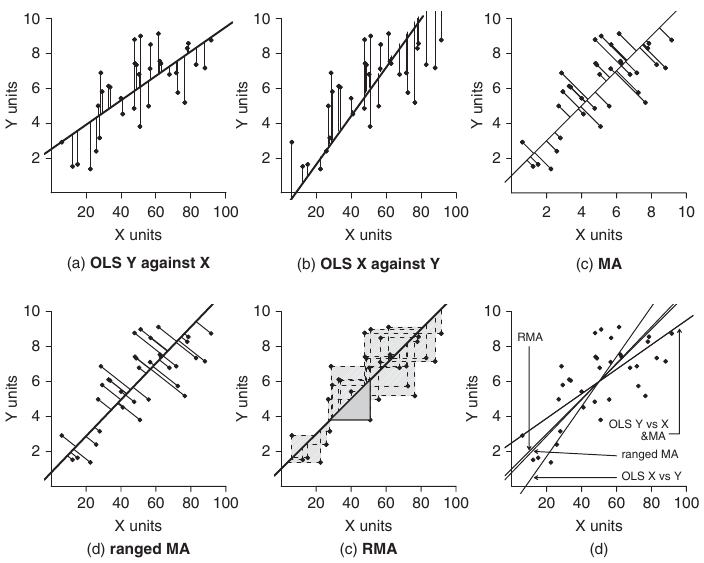
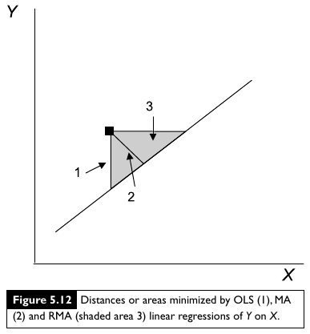
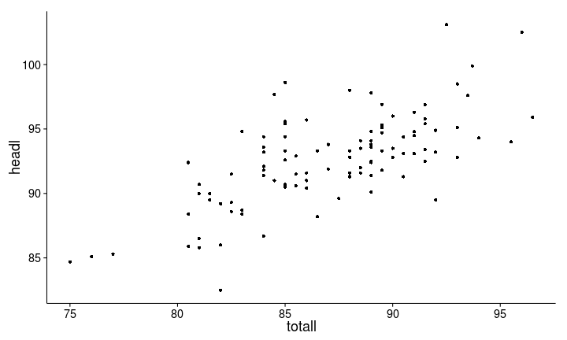
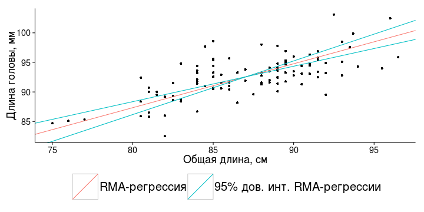
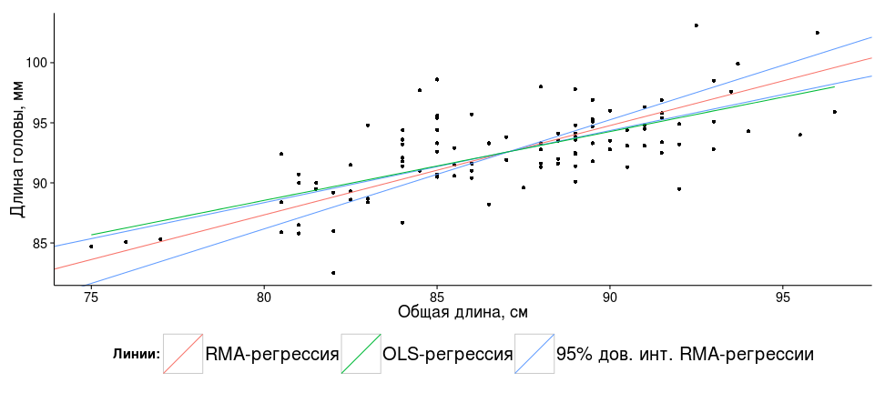

Когда и какую регрессию можно применять
========================================================

- Условия применимости регрессионного анализа
- Мощность линейной регрессии
- Регрессия по I и II модели


--- .learning

Вы сможете
========================================================
- Проверить условия применимости простой линейной регрессии
- Рассчитать мощность линейной регрессии
- Объяснить, какие данные подходят для рассчета регрессии по I и II модели
- Отличать случаи, когда обычная регрессия методом наименьших квадратов применима к данным, собранным для II модели
- Рассчитывать коэффициенты регрессии по II модели методом RMA (Ranged Major Axis), их стандартные ошибки, и записывать их в виде уравнения.


--- .sub-section &twocol

Пример: усыхающие личинки мучных хрущаков
=========================================================

Как зависит потеря влаги личинками [малого мучного хрущака](http://ru.wikipedia.org/wiki/Хрущак_малый_мучной) _Tribolium confusum_ от влажности воздуха? (Nelson, 1964)


*** left


```r
# Внимание, установите рабочую директорию, 
# или используйте полный путь к файлу
setwd("C:/mathmethr/week2")
## из .xlsx
library(XLConnect)
wb <- loadWorkbook("./data/nelson.xlsx")
nelson <- readWorksheet(wb, sheet = 1)
## или из .csv 
# nelson <- read.table(file="./data/nelson.csv",
#                      header = TRUE, sep = "\t",
#                      dec = ".") 
```


*** right


<div class = "footnote">Данные из Sokal, Rohlf, 1997, табл. 14.1 по Logan, 2010. глава 8, пример 8c</div>

--- 

Как зависит потеря веса от влажности? График рассеяния.
========================================================

```r
library(ggplot2)
theme_set(theme_classic()) # устанавливаем понравившуюся тему до конца сессии
p_nelson <- ggplot(data=nelson, aes(x = humidity, y = weightloss)) + 
  geom_point() + 
  geom_smooth(method = "lm", colour = "red") +
  labs(x = "Относительная влажность, %", y = "Потеря веса, мг")
p_nelson
```


---

Проверяем, есть ли зависимость потери веса от влажности с помощью линейной регрессии
========================================================


```r
# линейная регрессия из прошлой лекции
nelson_lm <- lm(weightloss ~ humidity, nelson)
summary(nelson_lm)
```

```
## 
## Call:
## lm(formula = weightloss ~ humidity, data = nelson)
## 
## Residuals:
##     Min      1Q  Median      3Q     Max 
## -0.4640 -0.0344  0.0167  0.0746  0.4524 
## 
## Coefficients:
##             Estimate Std. Error t value      Pr(>|t|)    
## (Intercept)  8.70403    0.19156    45.4 0.00000000065 ***
## humidity    -0.05322    0.00326   -16.4 0.00000078161 ***
## ---
## Signif. codes:  0 '***' 0.001 '**' 0.01 '*' 0.05 '.' 0.1 ' ' 1
## 
## Residual standard error: 0.297 on 7 degrees of freedom
## Multiple R-squared:  0.974,	Adjusted R-squared:  0.971 
## F-statistic:  267 on 1 and 7 DF,  p-value: 0.000000782
```


---

Зависимость потери веса от влажности можно описать уравнением
========================================================

Для этого подставим коэффициенты в уравнение линейной регрессии $y = b _0 + b _1 x$


```r
coef(nelson_lm) # Коэффициенты регрессии
```

```
## (Intercept)    humidity 
##      8.7040     -0.0532
```


$weightloss =$  8.7 -0.05  $humidity$

Чаще более академические обозначения:

$y =$ 8.7 -0.05 $x$, $R^2 =$ 0.974

Потеря веса мучными хрущаками в результате высыхания достоверно зависит от относительной влажности ($\beta _1 =$ -0.05 $\pm$ 0.01, $p < 0.01$)

--- .segue

Условия применимости простой линейной регрессии и анализ остатков
========================================================
Насколько можно доверять оценкам коэффициентов, которые мы получили?
--------------------------------------------------------

---

Условия применимости простой линейной регрессии 
========================================================
должны выполняться, чтобы тестировать гипотезы

1. Независимость

1. Линейность 

1. Нормальное распределение

1. Гомогенность дисперсий

--- 

1. Независимость
========================================================

- Значения $y _i$ должны быть независимы друг от друга
  - берегитесь псевдоповторностей
  - берегитесь автокорреляций (например, временных)
- Контролируется на этапе планирования
- Проверяем на графике остатков


<div class="footnote">Рисунок из кн. Diez et al., 2010, стр. 332, рис. 7.8</div>

---

2. Линейность связи
========================================================
- проверяем на графике рассеяния исходных данных
- проверяем на графике остатков

<br /><br /><br />


<div class="footnote">Рисунок из кн. Diez et al., 2010, стр. 332, рис. 7.8</div>

--- &twocol

Вот, что бывает, если неглядя применять линейную регрессию
========================================================

*** left

[Квартет Энскомба](http://ru.wikipedia.org/wiki/Квартет_Энскомба) - примеры данных, где регрессии одинаковы во всех случаях (Anscombe, 1973)

$y _i = 3.0 + 0.5 x _i$,

$r^2 = 0.68$, 

$H _0: \beta _1 = 0$, $t = 4.24$, $p = 0.002$

*** right


<div class="footnote">Рисунок из кн. Quinn, Keough, 2002, стр. 97, рис. 5.9</div>

--- &twocol

3. Нормальное распределение
========================================================

*** left

Нужно, т.к. в модели $Y _i = β _0 + βx _i + \epsilon _i$

$Y \sim N(0,\sigma^2)$

<br />

>- К счастью, это значит, что $\epsilon _i \sim N(0,\sigma^2)$

<br /><br /><br />

>- Нужно для тестов параметров, а не для подбора методом наименьших квадратов

>- Тесты устойчивы к небольшим отклонениям от нормального распределения

>- Проверяем распределение остатков на нормально-вероятностном графике


*** right


<div class="footnote">Рисунок из кн. Watkins et al., 2008, стр. 743, рис. 11.4</div>

--- &twocol

4. Гомогенность дисперсий
========================================================

*** left

Нужно, т.к. в модели $Y _i = β _0 + βx _i + \epsilon _i$

$Y \sim N(0,\sigma^2)$,

и дисперсии $\sigma^2 _1 = \sigma^2 _2 = ... = \sigma^2 _i$ для каждого $Y _i$ 

>- К счастью, поскольку $\epsilon _i \sim N(0,\sigma^2)$, можно проверить равенство дисперсий остатков $\epsilon _i$

<br />
>- Нужно и важно для тестов параметров

>- Проверяем на графике остатков по отношению к предсказанным значениям

>- Можно сделать тест С Кокрана (Cochran's C), но только если несколько значений y для каждого x

*** right


<div class="footnote">Рисунок из кн. Watkins et al., 2008, стр. 743, рис. 11.4</div>

--- &twocol

Диагностика регрессии по графикам остатков
========================================================

*** left


<div class="footnote">Рисунок из кн. Logan, 2010, стр. 174, рис. 8.5 d</div>

*** right

<br />
>- условия:
  - a - все выполнены
  - b - разброс остатков разный (wedge-shaped pattern)
  - c - разброс остатков одинаковый, но нужны дополнительные предикторы
  - d - к нелинейной зависимости применили линейную регрессию

--- .prompt &twocol

Скажите, 
========================================================

- какой регрессии соответствует какой график остатков?
- все ли условия применимости регрессии здесь выполняются?
- назовите случаи, в которых можно и нельзя применить линейную регрессию?

*** left


*** right


<div class="footnote">Рисунок из кн. Watkins et al. 2008, стр. 177, рис. 3.84-3.85</div>

*** pnotes

- A1 - нелинейная связь - нельзя; 
- B2 - все в порядке, можно; 
- C3 - все в порядке, можно; 
- D4 - синусоидальный тренд в остатках, нарушено условие независимости или зависимость нелинейная - нельзя.

--- &twocol

Какие наблюдения влияют на ход регрессии больше других?
========================================================

*** left

Влиятельные наблюдения, выбросы, outliers

- большая абсолютная величина остатка
- близость к краям области определения ([leverage](http://en.wikipedia.org/wiki/Leverage_(statistics\) ) - рычаг, "сила"; иногда называют hat)

<br />
>-
  - 1 - не влияет
  - 2 - умеренно влияет (большой остаток, малая сила влияния)
  - 3 - очень сильно влияет (большой остаток, большая сила влияния)

*** right


<div class="footnote">Рисунок из кн. Quinn, Keough, 2002, стр. 96, рис. 5.8</div>

--- &twocol

Как оценить влиятельность наблюдений
========================================================

*** left

[Расстояние Кука (Cook's d)](http://en.wikipedia.org/wiki/Cook's_distance) (Cook, 1977)

>- Учитывает одновременно величину остатка и близость к краям области определения (leverage)

>- Условное пороговое значение:  
выброс, если $d \ge 4/(N - k - 1)$,  
где $N$ - объем выборки,  
$k$ - число предикторов.  

>- Дж. Фокс советует не обращать внимания на пороговые значения (Fox, 1991).

>- Что делать с влиятельными точками?
  - Проверить, не ошибка ли это.  
    Если это не ошибка, не удалять - обсуждать!
  - Проверить, что будет, если их исключить из модели

*** right


<div class="footnote">Рисунок из кн. Quinn, Keough, 2002, стр. 96, рис. 5.8</div>

--- &twocol

Что делать с выбросами?
========================================================

*** left

  - Проверить, не ошибка ли это.  
    Если это не ошибка, не удалять - обсуждать!
  - Проверить, что будет, если их исключить из модели

*** right


<div class="footnote">Рисунок из кн. Quinn, Keough, 2002, стр. 96, рис. 5.8</div>


--- .segue

Проверим условия применимости
========================================================


--- .prompt

Проверьте линейность связи, 
========================================================
постройте для этого график рассеяния


```r
ggplot()
aes()
geom_point()
```


*** pnotes


```r
ggplot(data = nelson, aes(x = humidity, y = weightloss)) + 
  geom_point()
```


---

Для анализа остатков выделим нужные данные в новый датафрейм
========================================================


```r
# нам нужна линейная регрессия из прошлой лекции
nelson_lm <- lm(weightloss ~ humidity, nelson) # линейная регрессия
# library(ggplot2) # функция fortify() находится в пакете ggplot2
nelson_diag <- fortify(nelson_lm)
names(nelson_diag) # названия переменных
```

```
## [1] "weightloss" "humidity"   ".hat"       ".sigma"     ".cooksd"   
## [6] ".fitted"    ".resid"     ".stdresid"
```


<br />

>- Кроме `weightloss` и `humidity` нам понадобятся  
  - `.cooksd` - расстояние Кука  
  - `.fitted` - предсказанные значения  
  - `.resid` - остатки  
  - `.stdresid` - стандартизованные остатки

--- .prompt

Постройте график зависимости остатков от предиктора,  
========================================================
используя данные из `nelson_diag`

- `humidity` - относительная влажность (наш предиктор)
- `.resid` - остатки  


```r
names() 
ggplot()
aes()
geom_point()
```


>- По абсолютным остаткам сложно сказать, большие они или маленькие.  Нужна стандартизация


*** pnotes


```r
ggplot(data = nelson_diag, aes(x = humidity, y = .resid)) +
  geom_point()
```


По абсолютным остаткам сложно сказать, большие они или маленькие. Нужна стандартизация

--- .prompt

Постройте график зависимости __стандартизованных остатков__ от предсказанных значений
========================================================

Стандартизованные остатки $\frac {y _i - \hat y _i} {\sqrt{MS _e}}$
- можно сравнивать между регрессиями
- можно сказать, какие остатки большие, какие нет
  - $\le 2 SD$ - обычные
  - $> 3 SD$ - редкие

Использйте данные из `nelson_diag`  
- `.fitted` - предсказанные значения  
- `.resid` - остатки  


```r
ggplot()
aes()
geom_point()
```


*** pnotes


```r
ggplot(data = nelson_diag, aes(x = .fitted, y = .stdresid)) +
  geom_point()
```


---

График станет информативнее, если кое-что добавить
========================================================


```r
ggplot(data = nelson_diag, aes(x = .fitted, y = .stdresid)) +
  geom_point(aes(size = .cooksd)) +          # расстояние Кука
  geom_smooth(method="loess", se = FALSE) +  # линия тренда, сглаживание локальной регрессией
  geom_hline(yintercept = 0)                 # горизонтальная линия на уровне y = 0
```


--- &twocol

Какие выводы можно сделать по графику остатков?
========================================================

*** left


*** right

>- Стандартизованные остатки умеренной величины (в пределах двух стандартных отклонений), их разброс почти одинаков
>- Мало точек, чтобы надежно оценить наличие трендов среди остатков

--- &twocol

Нормально-вероятностный график стандартизованных остатков
========================================================


```r
mean_val <- mean(nelson_diag$.stdresid)  
sd_val <- sd(nelson_diag$.stdresid)
quantile_plot <- ggplot(nelson_diag, aes(sample = .stdresid)) + 
  geom_point(stat = "qq") +
geom_abline(intercept = mean_val, slope = sd_val) + # на эту линию должны ложиться значения
  labs(x = "Квантили стандартного нормального распределения", y = "Квантили набора данных")
quantile_plot
```

<br />

*** left


*** right

Используется, чтобы оценить форму распределения.

Если точки лежат на одной прямой - нормальное распределение.

<br />
>- Небольшие отклонения от нормального распределения, но мало точек, чтобы оценить с уверенностью

--- .segue

Мощность линейной регрессии 
========================================================

---

Величина эффекта из общих соображений
========================================================

```r
library(pwr)
cohen.ES(test="f2",size="large")
```

```
## 
##      Conventional effect size from Cohen (1982) 
## 
##            test = f2
##            size = large
##     effect.size = 0.35
```


*** pnotes

Слабый | Умеренный | Сильный
--- | --- | ---
0.02 | 0.15 | 0.35

---

Величину эффекта можно оценить по $R^2$
======================================================

$$f^2 = \frac {R^2}{1 - R^2}$$

$R^2$ - коэффициент детерминации

--- .prompt

Посчитайте 
======================================================
какой нужен объем выборки, чтобы с вероятностью 0.8 обнаружить зависимость при помощи простой линейной регрессии, если ожидается $R^2 = 0.6$ ?

$$f^2 = \frac {R^2}{1 - R^2}$$


```r
pwr.f2.test()
```


*** pnotes


```r
effect <- 0.6 * (1 - 0.6)
pwr.f2.test(u=1, v=NULL, f2=effect, sig.level=0.05, power=0.8)
```

```
## 
##      Multiple regression power calculation 
## 
##               u = 1
##               v = 32.7
##              f2 = 0.24
##       sig.level = 0.05
##           power = 0.8
```


--- .segue

Регрессия по I и II модели
========================================================

--- &twocol

Регрессия по I и II модели
========================================================

*** left

>- I модель
  - $x _i$ - фиксированные факторы, заранее заданные значения
  - предсказывать можно только для существующих в модели значений $x _i$
>- используется
  - метод наименьших квадратов (Ordinary Least Squares, __OLS__)

<br /><br /><br />
>- Предсказания и тесты гипотез по I модели иногда применимы и к случайным факторам (Quinn Keough 2002).

*** right

>- II модель
  - $x _i$ - случайные факторы, значения неизвестны заранее
  - предсказывать можно для любых значений $x _i$
>- используется
  - метод главных осей (Major Axis, __MA__)
  - метод сжатых главных осей (Ranged Major Axis, __RMA__)

<br /><br />
>- Если главная цель точные __оценки коэффициентов и их сравнение, обязательно II модель__.

--- &twocol

Сравнение OLS, MA и RMA регрессии
========================================================



<div class="footnote">Рисунок из кн. Logan, 2010, стр. 174, рис. 8.4 d</div>


*** pnotes

Расстояния, минимизируемые в OLS, MA и RMA регрессии
========================================================



<div class="footnote">Рисунок из кн. Quinn, Keough, 2002, стр. 101, рис. 5.12</div>

---

Пример: морфометрия поссумов
========================================================


```r
wb <- loadWorkbook("./data/possum-small.xls")
possum <- readWorksheet(wb, sheet = 1)
## или из .csv 
# possum <- read.table(file="./data/possum-small.csv", header = TRUE, 
#   sep = "\t", dec = ".") 
```


```r
str(possum)
```

```
## 'data.frame':	104 obs. of  8 variables:
##  $ site  : num  1 1 1 1 1 1 1 1 1 1 ...
##  $ pop   : chr  "Vic" "Vic" "Vic" "Vic" ...
##  $ sex   : chr  "m" "f" "f" "f" ...
##  $ age   : num  8 6 6 6 2 1 2 6 9 6 ...
##  $ headl : num  94.1 92.5 94 93.2 91.5 93.1 95.3 94.8 93.4 91.8 ...
##  $ skullw: num  60.4 57.6 60 57.1 56.3 54.8 58.2 57.6 56.3 58 ...
##  $ totall: num  89 91.5 95.5 92 85.5 90.5 89.5 91 91.5 89.5 ...
##  $ taill : num  36 36.5 39 38 36 35.5 36 37 37 37.5 ...
```


---
Зависит ли длина головы поссумов от общей длины тела?
========================================================


```r
ggplot(data = possum, aes(x = totall, y = headl)) + geom_point()
```




>- Общая длина тела (`headl`) - случайная переменная,  
нужно использовать регрессию по II модели

---

RMA-регрессия (Ranged Major Axis Regression, RMA)
========================================================


```r
# install.packages("lmodel2")
library(lmodel2)
possum_rma <- lmodel2(headl ~ totall, data = possum,range.y="relative", 
                      range.x = "relative", nperm = 100)
possum_rma
```


--- 


```
## 
## Model II regression
## 
## Call: lmodel2(formula = headl ~ totall, data = possum, range.y =
## "relative", range.x = "relative", nperm = 100)
## 
## n = 104   r = 0.691   r-square = 0.478 
## Parametric P-values:   2-tailed = 4.68e-16    1-tailed = 2.34e-16 
## Angle between the two OLS regression lines = 20.4 degrees
## 
## Permutation tests of OLS, MA, RMA slopes: 1-tailed, tail corresponding to sign
## A permutation test of r is equivalent to a permutation test of the OLS slope
## P-perm for SMA = NA because the SMA slope cannot be tested
## 
## Regression results
##   Method Intercept     Slope  Angle (degrees)  P-perm (1-tailed)
## 1    OLS      42.7     0.573             29.8             0.0099
## 2     MA      26.1     0.764             37.4             0.0099
## 3    SMA      20.4     0.829             39.7                 NA
## 4    RMA      27.9     0.743             36.6             0.0099
## 
## Confidence intervals
##   Method  2.5%-Intercept 97.5%-Intercept  2.5%-Slope 97.5%-Slope
## 1    OLS           32.45            53.0       0.455       0.691
## 2     MA           11.25            38.9       0.617       0.934
## 3    SMA            9.44            29.9       0.720       0.955
## 4    RMA           13.57            40.4       0.599       0.908
## 
## Eigenvalues: 26.7 4.64 
## 
## H statistic used for computing C.I. of MA: 0.00982
```


---

Подставим коэффициенты в уравнение линейной регрессии 
========================================================
$y = b _0 + b _1 x$


```r
possum_rma$regression.results # Коэффициенты регрессии, нас интересует RMA
```

```
##   Method Intercept     Slope  Angle (degrees)  P-perm (1-tailed)
## 1    OLS      42.7     0.573             29.8             0.0099
## 2     MA      26.1     0.764             37.4             0.0099
## 3    SMA      20.4     0.829             39.7                 NA
## 4    RMA      27.9     0.743             36.6             0.0099
```


$headl =$  27.89 + 0.74  $totall$

или в более академических обозначениях:

$y =$ 27.89 + 0.74 $x$, $R^2 =$ 0.478

Длина головы достоверно зависит от общей длины туловища (RMA-регрессия, $\beta _1 =$ 0.74 $\pm$ 0.15, $p < 0.01$)

---

График RMA-регрессии
========================================================

```r
plot(possum_rma, "RMA", main = "", 
     xlab = "Общая длина, см", ylab = "Длина головы, мм")
```


---

График RMA-регрессии
========================================================


```r
source(url("http://varmara.github.io/mathmethr-2013/w3-regression2/int_slope_lmodel2.R"))
reg_lines <- int_slope_lmodel2(possum_rma)
rma_plot <- ggplot(possum, aes(x = totall, y = headl)) + geom_point() +
  geom_abline(data = reg_lines, aes(intercept = intercept, slope = slope, 
    colour = c("blue", "red", "red")), show_guide = TRUE) + 
  scale_color_discrete(name = "", labels = c("RMA-регрессия", "95% дов. инт. RMA-регрессии")) +
  labs(x = "Общая длина, см", y = "Длина головы, мм") + theme(legend.position = 'bottom')
rma_plot
```




--- 

Для сравнения - RMA- и обычная регрессия
========================================================

```r
rma_plot + geom_smooth(method = 'lm', se = FALSE, aes(colour = 'green'), show_guide = FALSE) +
  scale_colour_discrete(name = "Линии:", 
    labels = c("RMA-регрессия", "OLS-регрессия", "95% дов. инт. RMA-регрессии"))
```




---

А можно ли использовать метод наименьших квадратов (OLS), если данные собраны по II модели, ?
========================================================

>- Можно, если :
  - Ошибка в оценке $y_i >>$ ошибки в оценке $x _i$
  - Распределение y и x __не__ многомерное нормальное
  - Зависимость y от x линейная

<br /><br />

>- Если цель предсказание y для x, то :
  - можно использовать OLS-оценки коэффициентов
  - нельзя - стандартные ошибки, доверительные интервалы, тесты параметров

<div class = "footnote">Legendre, P., 2013. lmodel2: Model II Regression. R package version 1.7-1. http://CRAN.R-project.org/package=lmodel2
</div>

---

Take home messages
========================================================
>- Условия применимости простой линейной регрессии должны выполняться, чтобы тестировать гипотезы
  1. Независимость
  1. Линейность 
  1. Нормальное распределение
  1. Гомогенность дисперсий
  
>- Мощность линейной регрессии можно рассчитать как мощность F-критерия. Величину эффекта можно оценить по $R^2$

>- I модель.  Фиксированные факторы, заранее заданные значения $x _i$, метод наименьших квадратов (OLS)

>- II модель. Случайные факторы, значения $x _i$ неизвестны заранее, метод главных осей (MA), метод сжатых главных осей (RMA)

>- Предсказания и тесты гипотез по I модели иногда применимы и к случайным факторам (Quinn Keough 2002). Но если главная цель точные __оценки коэффициентов и их сравнение, обязательно II модель__.

---

Дополнительные ресурсы
========================================================

- Logan, 2010, pp. 170-207
- Quinn, Keough, 2002, pp. 92-104
- [Open Intro to Statistics](http://www.openintro.org/stat/), pp. 315-353.

