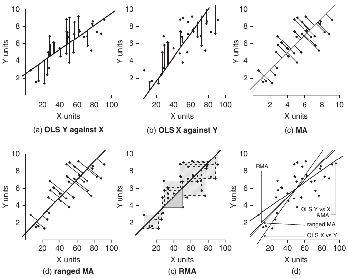

Множественная регрессия. I и II модели регрессии
========================================================
- Множественная линейная регрессия
- Условия применимости множественной регрессии
- I и II модели регрессии
- RMA-регрессия

```{r setup, include = FALSE, cache = FALSE}
#----------------------------------------------------------------
# RUN THE FRAGMENT BETWEEN LINES BEFORE COMPILING MARKDOWN
# to configure markdown parsing
options(markdown.extensions = 
          c("no_intra_emphasis",# skip markdown embedded in words
            "tables",           # create HTML tables
            "fenced_code",      # treat text as verbatim when surrounded with begin and ending lines with three ~ or ' characters.
            "autolink",         # create HTML links from urls and email addresses.
            "strikethrough",    # create strikethroughs by surrounding text with ~~.
            "lax_spacing",      # allow HTML tags inside paragraphs without being surrounded by newlines.
            "space_headers",    # add a space between header hashes and the header itself.
            "latex_math"))      # transforms all math equations into syntactically correct MathJax equations.
#--------------------------------------------------------------
# output options
options(width = 80, # set the maximum number of columns on a line
        scipen = 6, # fixed notation of floating point numbers, unless it is more than scipen digits wider, else - exponential notation
        digits = 3) # the number of digits to print when printing numeric values

# # to render cyrillics in plots use cairo pdf
options(device = function(file, width = 7, height = 7, ...) {
  cairo_pdf(tempfile(), width = width, height = height, ...)
  })

# chunk default options
opts_chunk$set(fig.align='center',  # default figure alignment
               tidy = FALSE,        # save manual code formatting
               fig.width = 10,      # default figure width
               fig.height = 6)      # default figure height

# this allows for code formatting inline
knit_hooks$set(inline = function(x) {
   if (is.numeric(x)) return(knitr:::format_sci(x, 'latex'))
   x = as.character(x)
   h = knitr:::hilight_source(x, 'latex', list(prompt = FALSE, 
                                               size='normalsize', 
                                               highlight = FALSE))
   h = gsub("([_#$%&])", "\\\\\\1", h)
   h = gsub('(["\'])', '\\1{}', h)
   gsub('^\\\\begin\\{alltt\\}\\s*|\\\\end\\{alltt\\}\\s*$', '', h)})
```

--- .learning

Вы сможете
========================================================
- Подобрать модель множественной линейной регрессии и проверить ее условия применимости
- Проверить валидность множественной линейной регрессии и интерпретировать коэффициенты при разных предикторах.
- Объяснить, какие данные подходят для рассчета регрессии по I и II модели
- Отличать случаи, когда обычная регрессия методом наименьших квадратов применима к данным, собранным для II модели
- Рассчитывать коэффициенты регрессии по II модели методом RMA (Ranged Major Axis), их стандартные ошибки, и записывать их в виде уравнения.

--- .segue

Множественная линейная регрессия
========================================================

---

Модель линейной регрессии
========================================================

- простая

$$Y _i = β _0 + βx _i + \epsilon _i$$

- множественная

$$Y _i = β _0 + β _1 x _{1 i} + + β _2 x _{2 i} + ... + \epsilon _i$$

---
Пример: птицы Австралии
========================================================

Зависит ли обилие птиц в лесах Австралии от
характеристик леса?  
(Loyn, 1987)

56 лесных участков в юго-восточной Виктории,
Австралия
- `l10area` - Площадь леса, га
- `l10dist` - Расстояние до ближайшего леса, км (логарифм)
- `l10ldist` - Расстояние до ближайшего леса большего размера,
км (логарифм)
- `yr.isol` - Продолжительности изоляции, лет

`abund` - Обилие птиц

<div class="footnote">Пример из кн. Quinn, Keough, 2002</div>

---
Открываем данные
========================================================

```{r eval = FALSE}
## setwd("C://mathmethr/w4") # установите рабочую директорию
# birds <- read.delim(file = "./data/loyn.csv")
library(XLConnect)
birds <- readWorksheetFromFile(file="./data/loyn.xls", sheet = 1)
str(birds)
```

```{r echo = FALSE, message=FALSE}
library(XLConnect)
birds <- readWorksheetFromFile(file="./../data/loyn.xls", sheet = 1)
str(birds)
```

--- .prompt

Запишите в обозначениях R модель множественной линейной регрессии
========================================================

Как зависит обилие птиц от характеристик леса?

$$Y _i = b _0 + b _1 x _{1 i} + b _2 x _{2 i} + b _3 x _{3 i} + b _4 x _{4 i}$$

Используйте названия переменных вместо $x _{1 i} - x _{4 i}$

- `abund` - Обилие птиц
- `l10area` - Площадь леса, га
- `l10dist` - Расстояние до ближайшего леса, км (логарифм)
- `l10ldist` - Расстояние до ближайшего леса большего размера,
км (логарифм)
- `yr.isol` - Продолжительности изоляции, лет


*** pnotes

$$abund ~ l10area + l10dist + l10ldist + yr.isol$$

---

Подбираем параметры модели и проверяем валидность с помощью t-критерия
========================================================
$H _0: \beta _i = 0$

```{r}
bird_lm <- lm(abund ~ l10area + l10dist + l10ldist + yr.isol, data = birds)
summary(bird_lm)
```

--- .prompt

Запишите уравнение множественной линейной регрессии
========================================================
В качестве подсказки:  

```{r}
coef(bird_lm)
bird_lm$call
```

```{r echo = FALSE}
lm_equation <- function(fit, strict = TRUE){
#   extracting call formula 
  frml <- as.character(fit$call)[2]
#   extract signs
    sign <- ifelse(grepl("-", coef(fit)[-1]), " - ", " + ")
  # extract coefficients
  coeffs <- format(abs(coef(fit)), digits = 2, trim = TRUE)
  if(strict == TRUE){
    i <- 1:(length(coeffs) - 1)
    vars <- c("Y", paste0(" X", i))
    
  } else {
# extract vector of variable names
  vars <- unlist(strsplit(frml, "[~+]"))
# combine everything
  }
  start <- ifelse(coef(fit)[1] > 0, paste(vars[1], coeffs[1], sep = " = "), paste(vars[1], coeffs[1], sep = " = - "))
  end <- paste(sign, coeffs[-1], vars[-1], sep = "", collapse = "")
  return(cat(start, end, sep = ""))
}
```

---

Уравнение множественной линейной регрессии
========================================================
<br />

```{r}
coef(bird_lm)
```
<br />
Уравнение регрессии:  

```{r results='asis', echo=FALSE}
lm_equation(bird_lm, strict=FALSE)
```

более формальная запись:  

```{r results='asis', echo=FALSE}
lm_equation(bird_lm)
```

---

Бета-коэффициенты 
========================================================
- измерены в стандартных отклонениях
- относительная оценка влияния фактора
- можно сравнивать

```{r}
scaled_bird_lm <- lm(abund ~ scale(l10area) + scale(l10dist) + 
                       scale(l10ldist) + scale(yr.isol), data = birds)
coef(scaled_bird_lm)
```

а вот для сравнения обычные коэффициенты:

```{r}
coef(bird_lm)
```

--- .prompt

Определите по значениям beta-коэффициентов, какие факторы сильнее всего влияют на обилие птиц
========================================================
```{r echo = FALSE}
summary(scaled_bird_lm)
```

---

Качество подгонки модели
========================================================
Скорректированный $R^2$
```{r}
summary(bird_lm)$adj.r.squared
```

---

Условия применимости множественной линейной регрессии
========================================================
Те же, что для простой линейной регрессии:
- Нормальное распределение
- Гомогенность дисперсий
- Независимость наблюдений
- Линейная связь

Дополнительное условие: 
- отсутствие колинеарности предикторов

---

Колинеарность – когда предикторы коррелируют друг с другом
========================================================
- Модель неустойчива к изменению данных
- При добавлении или исключении наблюдений
может меняться
  - Оценка коэффициентов
  - Знак коэффициентов

<br />

>- Примеры: 
  - Видовое богатство растений коррелирует с pH почвы и содержанием кальция
  - Возраст и диета коррелирует с размером животного


--- &twocol

Проверка на колинеарность
========================================================

*** left

Толерантность (tolerance)

<br /><br />
- $1-R^2$ регрессии данного предиктора от всех других

<br /><br /><br />
$T ≤ 0.25$ - коллинеарность

*** right

Показатель инфляции для дисперсии  (коэффициент распространения дисперсии, Variance inflation factor, VIF)

<br />

- $VIF = 1/T$

<br /><br /><br />
$\sqrt{VIF} > 2$  - коллинеарность


---

Проверим, есть ли в этих данных колинеарность предикторов
========================================================

```{r message = FALSE}
# install.packages("car") # "Companion for Applied Regression"
library(car)
vif(bird_lm) # variance inflation factors
sqrt(vif(bird_lm)) > 2 # есть ли проблемы?
1/vif(bird_lm) # tolerance
```

---

Что делать с колинеарностью?
========================================================
- Удалить из модели избыточные предикторы
- Получить вместо скоррелированных
предикторов один новый комбинированный при
помощи метода главных компонент

--- .prompt &twocol

Проверьте условия применимости линейной регрессии
========================================================
Постройте для стандартизованных остатков:
- график зависимости от предсказанного значения
- квантильный график

Выполняются ли условия применения линейной регрессии?

Используйте материалы прошлой лекции

*** left

```{r eval = FALSE}
library()
fortify()
str()
mean()
sd()
ggplot()
```

*** right

```{r eval = FALSE}
aes()
geom_abline()
geom_hline()
geom_point()
geom_smooth()
labs()
```

---

```{r echo = FALSE}
library(ggplot2)
theme_set(theme_bw(base_size = 20))
update_geom_defaults("point", list(shape = 19)) # for antialiased filled shapes
```
```{r eval = FALSE}
library(ggplot2)
theme_set(theme_bw())
```
```{r}
bird_diag <- fortify(bird_lm)
ggplot(data = bird_diag, aes(x = .fitted, y = .stdresid)) +
  geom_point(aes(size = .cooksd)) +          # расстояние Кука
  geom_smooth(method="loess", se = FALSE) +  # линия тренда
  geom_hline(yintercept = 0)                 # горизонтальная линия на уровне y = 0
```

---

```{r}
mean_val <- mean(bird_diag$.stdresid)  
sd_val <- sd(bird_diag$.stdresid)
quantile_plot <- ggplot(bird_diag, aes(sample = .stdresid)) + 
  geom_point(stat = "qq") +
geom_abline(intercept = mean_val, slope = sd_val) + # на эту линию должны ложиться значения
  labs(x = "Квантили стандартного нормального распределения", y = "Квантили набора данных")
quantile_plot
```

--- .segue

Регрессия по I и II модели
========================================================

--- &twocol

Регрессия по I и II модели
========================================================

*** left

>- I модель
  - $x _i$ - фиксированные факторы, заранее заданные значения
  - предсказывать можно только для существующих в модели значений $x _i$
>- используется
  - метод наименьших квадратов (Ordinary Least Squares, __OLS__)

<br /><br /><br />
>- Предсказания и тесты гипотез по I модели иногда применимы и к случайным факторам (Quinn Keough 2002).

*** right

>- II модель
  - $x _i$ - случайные факторы, значения неизвестны заранее
  - предсказывать можно для любых значений $x _i$
>- используется
  - метод главных осей (Major Axis, __MA__)
  - метод сжатых главных осей (Ranged Major Axis, __RMA__)

<br /><br />
>- Если главная цель точные __оценки коэффициентов и их сравнение, обязательно II модель__.

--- &twocol

Сравнение OLS, MA и RMA регрессии
========================================================



<div class="footnote">Рисунок из кн. Logan, 2010, стр. 174, рис. 8.4 d</div>


*** pnotes

Расстояния, минимизируемые в OLS, MA и RMA регрессии
========================================================


<div class="footnote">Рисунок из кн. Quinn, Keough, 2002, стр. 101, рис. 5.12</div>

---

Пример: морфометрия поссумов
========================================================

```{r include = FALSE}
wb <- loadWorkbook("./../data/possum-small.xls")
possum <- readWorksheet(wb, sheet = 1)
```

```{r eval = FALSE}
wb <- loadWorkbook("./data/possum-small.xls")
possum <- readWorksheet(wb, sheet = 1)
## или из .csv 
# possum <- read.table(file="./data/possum-small.csv", header = TRUE, 
#   sep = "\t", dec = ".") 
```
```{r}
str(possum)
```

---
Зависит ли длина головы поссумов от общей длины тела?
========================================================

```{r}
ggplot(data = possum, aes(x = totall, y = headl)) + geom_point()
```

>- Общая длина тела (`headl`) - случайная переменная,  
нужно использовать регрессию по II модели

---

RMA-регрессия (Ranged Major Axis Regression, RMA)
========================================================

```{r results = 'hide', message=FALSE}
# install.packages("lmodel2")
library(lmodel2)
possum_rma <- lmodel2(headl ~ totall, data = possum,range.y="relative", 
                      range.x = "relative", nperm = 100)
possum_rma
```

--- 

```{r echo = FALSE}
possum_rma
```

---

Подставим коэффициенты в уравнение линейной регрессии 
========================================================
$y = b _0 + b _1 x$

```{r}
possum_rma$regression.results # Коэффициенты регрессии, нас интересует RMA
```

---
Подставим коэффициенты в уравнение линейной регрессии 
========================================================
$y = b _0 + b _1 x$

```{r}
possum_rma$regression.results # Коэффициенты регрессии, нас интересует RMA
```

$headl =$  `r round(possum_rma$regression.results[4, 2], 2)` + `r round(possum_rma$regression.results[4, 3], 2)`  $totall$

или в более академических обозначениях:

$y =$ `r round(possum_rma$regression.results[4, 2], 2)` + `r round(possum_rma$regression.results[4, 3], 2)` $x$, $R^2 =$ `r possum_rma$rsquare`

>- Длина головы достоверно зависит от общей длины туловища (RMA-регрессия, $\beta _1 =$ `r round(possum_rma$regression.results[4, 3], 2)` $\pm$ `r round((possum_rma$confidence.intervals[4, 5] - possum_rma$confidence.intervals[4, 4])/2, 2)`, $p < 0.01$)

---
График RMA-регрессии
========================================================
```{r warning = FALSE}
plot(possum_rma, "RMA", main = "", 
     xlab = "Общая длина, см", ylab = "Длина головы, мм")
```

---

График RMA-регрессии
========================================================

```{r warning = FALSE, fig.height=5}
source(url("http://varmara.github.io/mathmethr-2013/w4-regression3/int_slope_lmodel2.R"))
reg_lines <- int_slope_lmodel2(possum_rma)
rma_plot <- ggplot(possum, aes(x = totall, y = headl)) + geom_point() +
  geom_abline(data = reg_lines, aes(intercept = intercept, slope = slope, 
    colour = c("blue", "red", "red")), show_guide = TRUE, size = 1) + 
  scale_color_discrete(name = "", labels = c("RMA-регрессия", "95% дов. инт. RMA-регрессии")) +
  labs(x = "Общая длина, см", y = "Длина головы, мм") + theme(legend.position = 'bottom')
rma_plot
```

--- 

Для сравнения - RMA- и обычная регрессия
========================================================
```{r warning = FALSE, message=FALSE, fig.width=13.5}
rma_plot + geom_smooth(method = 'lm', se = FALSE, aes(colour = 'green'), show_guide = FALSE, size = 1) +
  scale_colour_discrete(name = "Линии:", 
    labels = c("RMA-регрессия", "OLS-регрессия", "95% дов. инт. RMA-регрессии"))
```

---

А можно ли использовать метод наименьших квадратов (OLS), если данные собраны по II модели, ?
========================================================

>- Можно, если :
  - Ошибка в оценке $y_i >>$ ошибки в оценке $x _i$
  - Распределение y и x __не__ многомерное нормальное
  - Зависимость y от x линейная

<br /><br />

>- Если цель предсказание y для x, то :
  - можно использовать OLS-оценки коэффициентов
  - нельзя - стандартные ошибки, доверительные интервалы, тесты параметров

<div class = "footnote">Legendre, P., 2013. lmodel2: Model II Regression. R package version 1.7-1. http://CRAN.R-project.org/package=lmodel2
</div>

---

Take home messages
========================================================

>- Условия применимости множественной линейной регрессии
  - как у простой + нет колинеарности предикторов

>- Для сравнения влияния разных предикторов можно использовать бета-коэффициенты

>- I модель.  Фиксированные факторы, заранее заданные значения $x _i$, метод наименьших квадратов (OLS)

>- II модель. Случайные факторы, значения $x _i$ неизвестны заранее, метод главных осей (MA), метод сжатых главных осей (RMA)

>- Предсказания и тесты гипотез по I модели иногда применимы и к случайным факторам (Quinn Keough 2002). Но если главная цель точные __оценки коэффициентов и их сравнение, обязательно II модель__.

---

Дополнительные ресурсы
========================================================

- Quinn, Keough, 2002, pp. 100-104, pp.111-130
- Logan, 2010, pp. 173-176, pp. 208-211
- [Open Intro to Statistics](http://www.openintro.org/stat/), pp. 354-367
- Sokal, Rohlf, 1995, pp. 541-554, pp.609-653
- Zar, 2010, pp. 419-439

