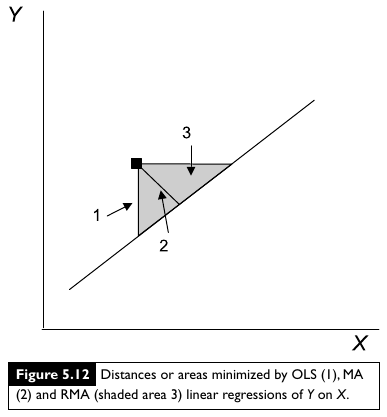

Множественная регрессия. I и II модели регрессии
========================================================
- Множественная линейная регрессия
- Условия применимости множественной регрессии
- I и II модели регрессии
- RMA-регрессия


--- .learning

Вы сможете
========================================================
- Подобрать модель множественной линейной регрессии и проверить ее условия применимости
- Проверить валидность множественной линейной регрессии и интерпретировать коэффициенты при разных предикторах.
- Объяснить, какие данные подходят для рассчета регрессии по I и II модели
- Отличать случаи, когда обычная регрессия методом наименьших квадратов применима к данным, собранным для II модели
- Рассчитывать коэффициенты регрессии по II модели методом RMA (Ranged Major Axis), их стандартные ошибки, и записывать их в виде уравнения.

--- .segue

Множественная линейная регрессия
========================================================

---

Модель линейной регрессии
========================================================

- простая

$$Y _i = β _0 + βx _i + \epsilon _i$$

- множественная

$$Y _i = β _0 + β _1 x _{1 i} + + β _2 x _{2 i} + ... + \epsilon _i$$

---
Пример: птицы Австралии
========================================================

Зависит ли обилие птиц в лесах Австралии от
характеристик леса?  
(Loyn, 1987)

56 лесных участков в юго-восточной Виктории,
Австралия
- `l10area` - Площадь леса, га
- `l10dist` - Расстояние до ближайшего леса, км (логарифм)
- `l10ldist` - Расстояние до ближайшего леса большего размера,
км (логарифм)
- `yr.isol` - Продолжительности изоляции, лет

`abund` - Обилие птиц

<div class="footnote">Пример из кн. Quinn, Keough, 2002</div>

---
Открываем данные
========================================================


```r
## setwd("C://mathmethr/w4") # установите рабочую директорию
# birds <- read.delim(file = "./data/loyn.csv")
library(XLConnect)
birds <- readWorksheetFromFile(file="./data/loyn.xls", sheet = 1)
str(birds)
```


```
## 'data.frame':	56 obs. of  21 variables:
##  $ abund   : num  5.3 2 1.5 17.1 13.8 14.1 3.8 2.2 3.3 3 ...
##  $ area    : num  0.1 0.5 0.5 1 1 1 1 1 1 1 ...
##  $ yr.isol : num  1968 1920 1900 1966 1918 ...
##  $ dist    : num  39 234 104 66 246 234 467 284 156 311 ...
##  $ ldist   : num  39 234 311 66 246 ...
##  $ graze   : num  2 5 5 3 5 3 5 5 4 5 ...
##  $ alt     : num  160 60 140 160 140 130 90 60 130 130 ...
##  $ l10dist : num  1.59 2.37 2.02 1.82 2.39 ...
##  $ l10ldist: num  1.59 2.37 2.49 1.82 2.39 ...
##  $ l10area : num  -1 -0.301 -0.301 0 0 ...
##  $ cyr.isol: num  18.2 -29.8 -49.8 16.2 -31.8 ...
##  $ cl10area: num  -1.932 -1.233 -1.233 -0.932 -0.932 ...
##  $ cgraze  : num  -0.9821 2.0179 2.0179 0.0179 2.0179 ...
##  $ resid1  : num  -4.22 -1.03 -1.86 2.28 7.14 ...
##  $ predict1: num  9.52 3.03 3.36 14.82 6.66 ...
##  $ arearesy: num  -16.49 -3.28 -6.69 -1.78 4.71 ...
##  $ arearesx: num  -1.642 -0.3 -0.647 -0.543 -0.326 ...
##  $ grazresy: num  -1.318 -0.805 -1.425 2.459 6.157 ...
##  $ grazresx: num  -1.741 -0.137 -0.258 -0.108 0.589 ...
##  $ yrresy  : num  -4.32 -1.94 -3.81 3.06 6.47 ...
##  $ yrresx  : num  -1.39 -12.31 -26.43 10.53 -9.03 ...
```


--- .prompt

Запишите в обозначениях R модель множественной линейной регрессии
========================================================

Как зависит обилие птиц от характеристик леса?

$$Y _i = b _0 + b _1 x _{1 i} + b _2 x _{2 i} + b _3 x _{3 i} + b _4 x _{4 i}$$

Используйте названия переменных вместо $x _{1 i} - x _{4 i}$

- `abund` - Обилие птиц
- `l10area` - Площадь леса, га
- `l10dist` - Расстояние до ближайшего леса, км (логарифм)
- `l10ldist` - Расстояние до ближайшего леса большего размера,
км (логарифм)
- `yr.isol` - Продолжительности изоляции, лет


*** pnotes

$$abund ~ l10area + l10dist + l10ldist + yr.isol$$

---

Подбираем параметры модели и проверяем валидность с помощью t-критерия
========================================================
$H _0: \beta _i = 0$


```r
bird_lm <- lm(abund ~ l10area + l10dist + l10ldist + yr.isol, data = birds)
summary(bird_lm)
```

```
## 
## Call:
## lm(formula = abund ~ l10area + l10dist + l10ldist + yr.isol, 
##     data = birds)
## 
## Residuals:
##     Min      1Q  Median      3Q     Max 
## -16.663  -3.546   0.086   2.884  16.530 
## 
## Coefficients:
##              Estimate Std. Error t value     Pr(>|t|)    
## (Intercept) -224.4246    74.8504   -3.00       0.0042 ** 
## l10area        9.2348     1.2760    7.24 0.0000000023 ***
## l10dist       -0.7046     2.7077   -0.26       0.7957    
## l10ldist      -1.5935     2.0954   -0.76       0.4505    
## yr.isol        0.1236     0.0379    3.26       0.0020 ** 
## ---
## Signif. codes:  0 '***' 0.001 '**' 0.01 '*' 0.05 '.' 0.1 ' ' 1
## 
## Residual standard error: 6.58 on 51 degrees of freedom
## Multiple R-squared:  0.652,	Adjusted R-squared:  0.625 
## F-statistic: 23.9 on 4 and 51 DF,  p-value: 3.62e-11
```


--- .prompt

Запишите уравнение множественной линейной регрессии
========================================================
В качестве подсказки:  


```r
coef(bird_lm)
```

```
## (Intercept)     l10area     l10dist    l10ldist     yr.isol 
##    -224.425       9.235      -0.705      -1.593       0.124
```

```r
bird_lm$call
```

```
## lm(formula = abund ~ l10area + l10dist + l10ldist + yr.isol, 
##     data = birds)
```


---

Уравнение множественной линейной регрессии
========================================================
<br />


```r
coef(bird_lm)
```

```
## (Intercept)     l10area     l10dist    l10ldist     yr.isol 
##    -224.425       9.235      -0.705      -1.593       0.124
```

<br />
Уравнение регрессии:  

abund  = - 224.42 + 9.23 l10area  - 0.70 l10dist  - 1.59 l10ldist  + 0.12 yr.isol


более формальная запись:  

Y = - 224.42 + 9.23 X1 - 0.70 X2 - 1.59 X3 + 0.12 X4


---

Бета-коэффициенты 
========================================================
- измерены в стандартных отклонениях
- относительная оценка влияния фактора
- можно сравнивать


```r
scaled_bird_lm <- lm(abund ~ scale(l10area) + scale(l10dist) + 
                       scale(l10ldist) + scale(yr.isol), data = birds)
coef(scaled_bird_lm)
```

```
##     (Intercept)  scale(l10area)  scale(l10dist) scale(l10ldist)  scale(yr.isol) 
##          19.514           7.502          -0.292          -0.916           3.161
```


а вот для сравнения обычные коэффициенты:


```r
coef(bird_lm)
```

```
## (Intercept)     l10area     l10dist    l10ldist     yr.isol 
##    -224.425       9.235      -0.705      -1.593       0.124
```


--- .prompt

Определите по значениям beta-коэффициентов, какие факторы сильнее всего влияют на обилие птиц
========================================================

```
## 
## Call:
## lm(formula = abund ~ scale(l10area) + scale(l10dist) + scale(l10ldist) + 
##     scale(yr.isol), data = birds)
## 
## Residuals:
##     Min      1Q  Median      3Q     Max 
## -16.663  -3.546   0.086   2.884  16.530 
## 
## Coefficients:
##                 Estimate Std. Error t value     Pr(>|t|)    
## (Intercept)       19.514      0.879   22.20      < 2e-16 ***
## scale(l10area)     7.502      1.037    7.24 0.0000000023 ***
## scale(l10dist)    -0.292      1.120   -0.26        0.796    
## scale(l10ldist)   -0.916      1.205   -0.76        0.450    
## scale(yr.isol)     3.161      0.971    3.26        0.002 ** 
## ---
## Signif. codes:  0 '***' 0.001 '**' 0.01 '*' 0.05 '.' 0.1 ' ' 1
## 
## Residual standard error: 6.58 on 51 degrees of freedom
## Multiple R-squared:  0.652,	Adjusted R-squared:  0.625 
## F-statistic: 23.9 on 4 and 51 DF,  p-value: 3.62e-11
```


---

Качество подгонки модели
========================================================
Скорректированный $R^2$

```r
summary(bird_lm)$adj.r.squared
```

```
## [1] 0.625
```


---

Условия применимости множественной линейной регрессии
========================================================
Те же, что для простой линейной регрессии:
- Нормальное распределение
- Гомогенность дисперсий
- Независимость наблюдений
- Линейная связь

Дополнительное условие: 
- отсутствие колинеарности предикторов

---

Колинеарность – когда предикторы коррелируют друг с другом
========================================================
- Модель неустойчива к изменению данных
- При добавлении или исключении наблюдений
может меняться
  - Оценка коэффициентов
  - Знак коэффициентов

<br />

>- Примеры: 
  - Видовое богатство растений коррелирует с pH почвы и содержанием кальция
  - Возраст и диета коррелирует с размером животного


--- &twocol

Проверка на колинеарность
========================================================

*** left

Толерантность (tolerance)

<br /><br />
- $1-R^2$ регрессии данного предиктора от всех других

<br /><br /><br />
$T ≤ 0.25$ - коллинеарность

*** right

Показатель инфляции для дисперсии  (коэффициент распространения дисперсии, Variance inflation factor, VIF)

<br />

- $VIF = 1/T$

<br /><br /><br />
$\sqrt{VIF} > 2$  - коллинеарность


---

Проверим, есть ли в этих данных колинеарность предикторов
========================================================


```r
# install.packages("car") # "Companion for Applied Regression"
library(car)
vif(bird_lm) # variance inflation factors
```

```
##  l10area  l10dist l10ldist  yr.isol 
##     1.37     1.60     1.84     1.20
```

```r
sqrt(vif(bird_lm)) > 2 # есть ли проблемы?
```

```
##  l10area  l10dist l10ldist  yr.isol 
##    FALSE    FALSE    FALSE    FALSE
```

```r
1/vif(bird_lm) # tolerance
```

```
##  l10area  l10dist l10ldist  yr.isol 
##    0.732    0.627    0.542    0.835
```


---

Что делать с колинеарностью?
========================================================
- Удалить из модели избыточные предикторы
- Получить вместо скоррелированных
предикторов один новый комбинированный при
помощи метода главных компонент

--- .prompt &twocol

Проверьте условия применимости линейной регрессии
========================================================
Постройте для стандартизованных остатков:
- график зависимости от предсказанного значения
- квантильный график

Выполняются ли условия применения линейной регрессии?

Используйте материалы прошлой лекции

*** left


```r
library()
fortify()
str()
mean()
sd()
ggplot()
```


*** right


```r
aes()
geom_abline()
geom_hline()
geom_point()
geom_smooth()
labs()
```


---


```r
library(ggplot2)
theme_set(theme_bw())
```


```r
bird_diag <- fortify(bird_lm)
ggplot(data = bird_diag, aes(x = .fitted, y = .stdresid)) +
  geom_point(aes(size = .cooksd)) +          # расстояние Кука
  geom_smooth(method="loess", se = FALSE) +  # линия тренда
  geom_hline(yintercept = 0)                 # горизонтальная линия на уровне y = 0
```


---


```r
mean_val <- mean(bird_diag$.stdresid)  
sd_val <- sd(bird_diag$.stdresid)
quantile_plot <- ggplot(bird_diag, aes(sample = .stdresid)) + 
  geom_point(stat = "qq") +
geom_abline(intercept = mean_val, slope = sd_val) + # на эту линию должны ложиться значения
  labs(x = "Квантили стандартного нормального распределения", y = "Квантили набора данных")
quantile_plot
```


--- .segue

Регрессия по I и II модели
========================================================

--- &twocol

Регрессия по I и II модели
========================================================

*** left

>- I модель
  - $x _i$ - фиксированные факторы, заранее заданные значения
  - предсказывать можно только для существующих в модели значений $x _i$
>- используется
  - метод наименьших квадратов (Ordinary Least Squares, __OLS__)

<br /><br /><br />
>- Предсказания и тесты гипотез по I модели иногда применимы и к случайным факторам (Quinn Keough 2002).

*** right

>- II модель
  - $x _i$ - случайные факторы, значения неизвестны заранее
  - предсказывать можно для любых значений $x _i$
>- используется
  - метод главных осей (Major Axis, __MA__)
  - метод сжатых главных осей (Ranged Major Axis, __RMA__)

<br /><br />
>- Если главная цель точные __оценки коэффициентов и их сравнение, обязательно II модель__.

--- &twocol

Сравнение OLS, MA и RMA регрессии
========================================================


<div class="footnote">Рисунок из кн. Logan, 2010, стр. 174, рис. 8.4 d</div>


*** pnotes

Расстояния, минимизируемые в OLS, MA и RMA регрессии
========================================================



<div class="footnote">Рисунок из кн. Quinn, Keough, 2002, стр. 101, рис. 5.12</div>

---

Пример: морфометрия поссумов
========================================================


```r
wb <- loadWorkbook("./data/possum-small.xls")
possum <- readWorksheet(wb, sheet = 1)
## или из .csv 
# possum <- read.table(file="./data/possum-small.csv", header = TRUE, 
#   sep = "\t", dec = ".") 
```


```r
str(possum)
```

```
## 'data.frame':	104 obs. of  8 variables:
##  $ site  : num  1 1 1 1 1 1 1 1 1 1 ...
##  $ pop   : chr  "Vic" "Vic" "Vic" "Vic" ...
##  $ sex   : chr  "m" "f" "f" "f" ...
##  $ age   : num  8 6 6 6 2 1 2 6 9 6 ...
##  $ headl : num  94.1 92.5 94 93.2 91.5 93.1 95.3 94.8 93.4 91.8 ...
##  $ skullw: num  60.4 57.6 60 57.1 56.3 54.8 58.2 57.6 56.3 58 ...
##  $ totall: num  89 91.5 95.5 92 85.5 90.5 89.5 91 91.5 89.5 ...
##  $ taill : num  36 36.5 39 38 36 35.5 36 37 37 37.5 ...
```


---
Зависит ли длина головы поссумов от общей длины тела?
========================================================


```r
ggplot(data = possum, aes(x = totall, y = headl)) + geom_point()
```


>- Общая длина тела (`headl`) - случайная переменная,  
нужно использовать регрессию по II модели

---

RMA-регрессия (Ranged Major Axis Regression, RMA)
========================================================


```r
# install.packages("lmodel2")
library(lmodel2)
possum_rma <- lmodel2(headl ~ totall, data = possum,range.y="relative", 
                      range.x = "relative", nperm = 100)
possum_rma
```


--- 


```
## 
## Model II regression
## 
## Call: lmodel2(formula = headl ~ totall, data = possum, range.y =
## "relative", range.x = "relative", nperm = 100)
## 
## n = 104   r = 0.691   r-square = 0.478 
## Parametric P-values:   2-tailed = 4.68e-16    1-tailed = 2.34e-16 
## Angle between the two OLS regression lines = 20.4 degrees
## 
## Permutation tests of OLS, MA, RMA slopes: 1-tailed, tail corresponding to sign
## A permutation test of r is equivalent to a permutation test of the OLS slope
## P-perm for SMA = NA because the SMA slope cannot be tested
## 
## Regression results
##   Method Intercept     Slope  Angle (degrees)  P-perm (1-tailed)
## 1    OLS      42.7     0.573             29.8             0.0099
## 2     MA      26.1     0.764             37.4             0.0099
## 3    SMA      20.4     0.829             39.7                 NA
## 4    RMA      27.9     0.743             36.6             0.0099
## 
## Confidence intervals
##   Method  2.5%-Intercept 97.5%-Intercept  2.5%-Slope 97.5%-Slope
## 1    OLS           32.45            53.0       0.455       0.691
## 2     MA           11.25            38.9       0.617       0.934
## 3    SMA            9.44            29.9       0.720       0.955
## 4    RMA           13.57            40.4       0.599       0.908
## 
## Eigenvalues: 26.7 4.64 
## 
## H statistic used for computing C.I. of MA: 0.00982
```


---

Подставим коэффициенты в уравнение линейной регрессии 
========================================================
$y = b _0 + b _1 x$


```r
possum_rma$regression.results # Коэффициенты регрессии, нас интересует RMA
```

```
##   Method Intercept     Slope  Angle (degrees)  P-perm (1-tailed)
## 1    OLS      42.7     0.573             29.8             0.0099
## 2     MA      26.1     0.764             37.4             0.0099
## 3    SMA      20.4     0.829             39.7                 NA
## 4    RMA      27.9     0.743             36.6             0.0099
```


---
Подставим коэффициенты в уравнение линейной регрессии 
========================================================
$y = b _0 + b _1 x$


```r
possum_rma$regression.results # Коэффициенты регрессии, нас интересует RMA
```

```
##   Method Intercept     Slope  Angle (degrees)  P-perm (1-tailed)
## 1    OLS      42.7     0.573             29.8             0.0099
## 2     MA      26.1     0.764             37.4             0.0099
## 3    SMA      20.4     0.829             39.7                 NA
## 4    RMA      27.9     0.743             36.6             0.0099
```


$headl =$  27.89 + 0.74  $totall$

или в более академических обозначениях:

$y =$ 27.89 + 0.74 $x$, $R^2 =$ 0.478

>- Длина головы достоверно зависит от общей длины туловища (RMA-регрессия, $\beta _1 =$ 0.74 $\pm$ 0.15, $p < 0.01$)

---
График RMA-регрессии
========================================================

```r
plot(possum_rma, "RMA", main = "", 
     xlab = "Общая длина, см", ylab = "Длина головы, мм")
```


---

График RMA-регрессии
========================================================


```r
source(url("http://varmara.github.io/mathmethr-2013/w4-regression3/int_slope_lmodel2.R"))
reg_lines <- int_slope_lmodel2(possum_rma)
rma_plot <- ggplot(possum, aes(x = totall, y = headl)) + geom_point() +
  geom_abline(data = reg_lines, aes(intercept = intercept, slope = slope, 
    colour = c("blue", "red", "red")), show_guide = TRUE, size = 1) + 
  scale_color_discrete(name = "", labels = c("RMA-регрессия", "95% дов. инт. RMA-регрессии")) +
  labs(x = "Общая длина, см", y = "Длина головы, мм") + theme(legend.position = 'bottom')
rma_plot
```


--- 

Для сравнения - RMA- и обычная регрессия
========================================================

```r
rma_plot + geom_smooth(method = 'lm', se = FALSE, aes(colour = 'green'), show_guide = FALSE, size = 1) +
  scale_colour_discrete(name = "Линии:", 
    labels = c("RMA-регрессия", "OLS-регрессия", "95% дов. инт. RMA-регрессии"))
```


---

А можно ли использовать метод наименьших квадратов (OLS), если данные собраны по II модели, ?
========================================================

>- Можно, если :
  - Ошибка в оценке $y_i >>$ ошибки в оценке $x _i$
  - Распределение y и x __не__ многомерное нормальное
  - Зависимость y от x линейная

<br /><br />

>- Если цель предсказание y для x, то :
  - можно использовать OLS-оценки коэффициентов
  - нельзя - стандартные ошибки, доверительные интервалы, тесты параметров

<div class = "footnote">Legendre, P., 2013. lmodel2: Model II Regression. R package version 1.7-1. http://CRAN.R-project.org/package=lmodel2
</div>

---

Take home messages
========================================================

>- Условия применимости множественной линейной регрессии
  - как у простой + нет колинеарности предикторов

>- Для сравнения влияния разных предикторов можно использовать бета-коэффициенты

>- I модель.  Фиксированные факторы, заранее заданные значения $x _i$, метод наименьших квадратов (OLS)

>- II модель. Случайные факторы, значения $x _i$ неизвестны заранее, метод главных осей (MA), метод сжатых главных осей (RMA)

>- Предсказания и тесты гипотез по I модели иногда применимы и к случайным факторам (Quinn Keough 2002). Но если главная цель точные __оценки коэффициентов и их сравнение, обязательно II модель__.

---

Дополнительные ресурсы
========================================================

- Quinn, Keough, 2002, pp. 100-104, pp.111-130
- Logan, 2010, pp. 173-176, pp. 208-211
- [Open Intro to Statistics](http://www.openintro.org/stat/), pp. 354-367
- Sokal, Rohlf, 1995, pp. 541-554, pp.609-653
- Zar, 2010, pp. 419-439

