Знакомимся дисперсионным анализом
========================================================

- Опасности множественных сравнений
- Почему можно использовать дисперсии для сравнения средних
- Модель дисперсионного анализа
- Условия применимости дисперсионного анализа
- Post hoc тесты
- Представление результатов дисперсионного анализа


--- .learning

Вы сможете
========================================================
- Объяснить, в чем опасность множественных сравнений, и как с ними можно бороться
- Рассказать, как в дисперсионном анализе моделируются значения зависимой переменной
- Перечислить и проверить условия применимости дисперсионного анализа
- Интерпретировать и описать результаты, записанные в таблице дисперсионного анализа
- Провести множественные попарные сравнения при помощи post hoc теста Тьюки, представить и описать их результаты

---

Сеодня нам понадобятся...
========================================================


```r
# Пакеты
# install.packages(c("reshape", "multcomp"))
library(reshape)
library(multcomp)
library(XLConnect)
library(ggplot2)
# Настраиваем графику
# чтобы кружочки были круглые (в Windows может быть 
# не заметно на экране, но при выводе в файл должно работать)
update_geom_defaults("point", list(shape = 19)) 
# устанавливаем тему и относительный размер шрифта
theme_set(theme_bw(base_size = 16)) 
```


--- &twocol

Пример: рост корневой системы томатов
========================================================


```r
tomato <- readWorksheetFromFile(file = "./data/tomato.xlsx", sheet = 1)
# tomato <- read.table(file='./data/tomato.csv', header=TRUE, dec = ',')
tomato
```


*** left


```
##    weight   trt
## 1    1.50 Water
## 2    1.90 Water
## 3    1.30 Water
## 4    1.50 Water
## 5    2.40 Water
## 6    1.50 Water
## 7    1.50    1N
## 8    1.20    1N
## 9    1.20    1N
## 10   2.10    1N
## 11   2.90    1N
## 12   1.60    1N
## 13   1.90  D+1N
## 14   1.60  D+1N
## 15   0.80  D+1N
## 16   1.15  D+1N
## 17   0.90  D+1N
## 18   1.60  D+1N
## 19   1.00    3N
## 20   1.20    3N
## 21   1.30    3N
## 22   0.90    3N
## 23   0.70    3N
## 24   0.80    3N
```


*** right

Фактор:
- `trt`  - варианты обработки. Уровни фактора:
  - `Water` - вода,
  - `1N` - 1 конц. удобрения, 
  - `3N` - 3 конц. удобрения, 
  - `D+1N` - гербицид + 1 конц. удобрения

Зависимая переменная:
- `weight` - вес корневой системы томатов (г)

<div class = "footnote">Данные: Dr Ron Balham, Victoria University of Wellington NZ, 1971 - 1976.</div>

---

Для красоты на графиках упорядочиваем значения фактора `trt`
========================================================


```r
str(tomato)
```

```
## 'data.frame':	24 obs. of  2 variables:
##  $ weight: num  1.5 1.9 1.3 1.5 2.4 1.5 1.5 1.2 1.2 2.1 ...
##  $ trt   : chr  "Water" "Water" "Water" "Water" ...
```

```r
tomato$trt <- factor(tomato$trt) # Если вы открывали из xls
levels(tomato$trt) # уровни фактора
```

```
## [1] "1N"    "3N"    "D+1N"  "Water"
```

```r
# Хотим, чтобы первым был уровень "Water"
tomato$trt <- relevel(tomato$trt, ref = "Water")
str(tomato) # проверяем, что получилось
```

```
## 'data.frame':	24 obs. of  2 variables:
##  $ weight: num  1.5 1.9 1.3 1.5 2.4 1.5 1.5 1.2 1.2 2.1 ...
##  $ trt   : Factor w/ 4 levels "Water","1N","3N",..: 1 1 1 1 1 1 2 2 2 2 ...
```


---

В каких условиях корневая система лучше развивалась?
========================================================


```r
tom_p <- ggplot(data = tomato, aes(x = trt, y = weight)) + 
  labs(x = "Обработка", y = "Вес, г")
tom_p + geom_boxplot()
```

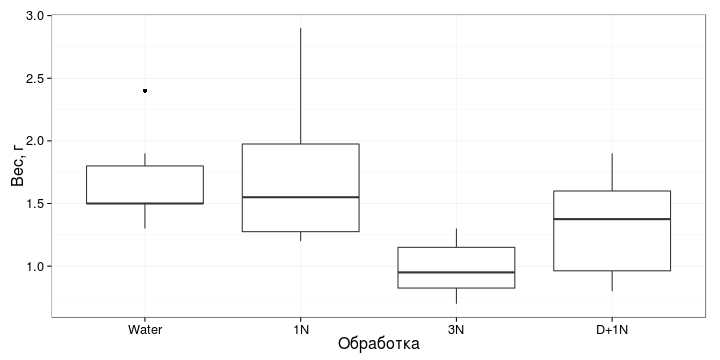


Как мы можем это посчитать?

--- .segue

Опасности множественных сравнений
========================================================

--- &twocol

Попарные сравнения средних
========================================================

*** left

### 2 группы - 1 сравнение

$\alpha _{для\ сравнения} = 0.05$

*** right

### 4 группы - 6 сравнений

$\alpha _{для\ сравнения} = 0.05$

### А для группы из 6 сравнений?

>- $\alpha _{для\ группы\ сравнений} = 0.05 \cdot 6 = 0.3$
- Опасно! Случайно найдем различия там, где их нет!

--- 

Что делать, если нужно много сравнений?
========================================================

### 1. Можно снизить $\alpha _{для\ сравнения}$

$\alpha _{для\ группы\ сравнений} = \alpha _{для\ сравнения} \cdot n$

Хотим зафиксировать $\alpha _{для\ группы\ сравнений} = 0.05$

>- Поправка Бонферрони:  
  $\alpha _{для\ сравнения} = \frac{\alpha _{для\ группы\ сравнений}}{n}$

>- для 4 групп, 6 сравнений, $\alpha _{для\ сравнения} = 0.008$  
  Очень жесткий критерий!

--- .segue

Дисперсионный анализ
========================================================

## Вместо множественных сравнений
## без потери мощности

---

Почему для сравнений средних можно использовать дисперсии?
========================================================

Где различия убедительнее?

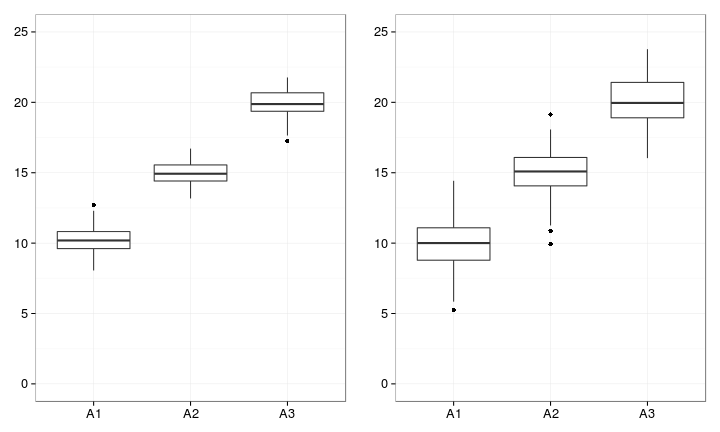


---

Сравним разброс значений внутри групп и между групповыми средними
========================================================

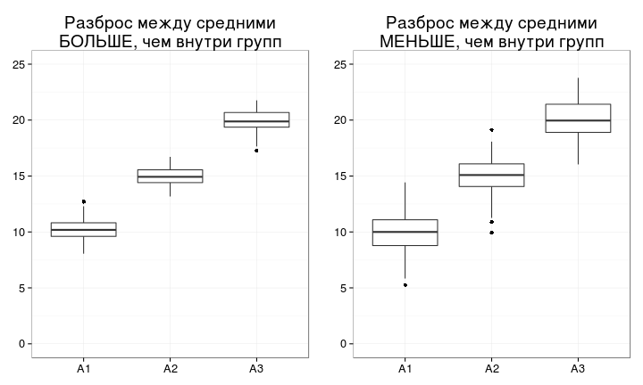


Можно проверить при помощи F-критерия

--- .segue

Модель дисперсионного анализа
========================================================

--- &twocol

Модель дисперсионного анализа
========================================================

*** left


```
##    weight   trt
## 1    1.50 Water
## 2    1.90 Water
## 3    1.30 Water
## 4    1.50 Water
## 5    2.40 Water
## 6    1.50 Water
## 7    1.50    1N
## 8    1.20    1N
## 9    1.20    1N
## 10   2.10    1N
## 11   2.90    1N
## 12   1.60    1N
## 13   1.90  D+1N
## 14   1.60  D+1N
## 15   0.80  D+1N
## 16   1.15  D+1N
## 17   0.90  D+1N
## 18   1.60  D+1N
## 19   1.00    3N
## 20   1.20    3N
## 21   1.30    3N
## 22   0.90    3N
## 23   0.70    3N
## 24   0.80    3N
```


*** right

$$y _{ij} = \mu + a _i + \epsilon _{ij}$$

Градации фактора | Общее среднее | Эффект фактора | Случайная изменчивость
----- | ----- | ----- | -----
Water | $$\mu$$ | $$a _1$$ | $\epsilon _{1}$, $\epsilon _{2}$, ..., $\epsilon _{6}$
1N | $$\mu$$ | $$a _2$$ | $\epsilon _{7}$, $\epsilon _{8}$, ..., $\epsilon _{12}$
3N | $$\mu$$ | $$a _3$$ | $\epsilon _{13}$, $\epsilon _{14}$, ..., $\epsilon _{18}$
D+1N | $$\mu$$ | $$a _4$$ | $\epsilon _{19}$, $\epsilon _{20}$, ..., $\epsilon _{24}$

---

Структура общей изменчивости
========================================================
Общая изменчивость (SSt) = Факторная (SSx) + Случайная (SSe)

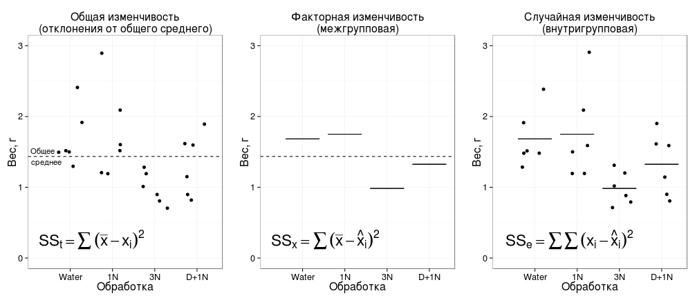

>- Если выборки из одной совокупности,  
Факторная изменчивость = Случайная изменчивость

--- 

Таблица дисперсионного анализа
========================================================

Источник изменчивости  |  Суммы квадратов отклонений,<br /><br /> SS   |   Число степеней свободы,<br /><br /> df   | Средний квадрат отклонений<br />(дисперсия),<br /> MS | F  
---------------------- | --------- | ------ | ------------------- | -----
Название фактора | $$SS _x = \sum{(\bar x - \hat x _i)^2}$$ | $$df _x = a - 1$$ | $$MS _x = \frac{SS _x}{df _x}$$ | $$F _{df _r, df _e} = \frac{MS _r}{MS _e}$$
Случайная | $$SS _e = \sum{(x _i - \hat x _i)^2}$$ | $$df _e = N - a$$ | $$MS _e = \frac{SS _e}{df _e}$$ | 
Общая | $$SS _t = \sum {(\bar x - x _i)^2}$$ | $$df _t = N - 1$$ | 

<br />
Гипотезы:

$H _0: MS _x = MS _e$

$H _1: MS _x ≠ MS _e$

--- .prompt

Назовите условия применимости дисперсионного анализа,
========================================================

если известно, что дисперсионный анализ - линейная модель, как и регрессия.

--- 

Условия примененимости дисперсионного анализа,
========================================================
- Случайность и независимость групп и наблюдений внутри групп
- Нормальное распределение вариант в группах
- Гомогенность дисперсий в группах

Другие ограничения
- Лучше работает, если размеры групп примерно одинаковы
- Устойчив к отклонениям от нормального распределения (при равных объемах групп)


--- .segue

Что же с ростом томатов?
========================================================

---

Посмотрим на данные
========================================================


```r
library(reshape) # есть удобные функции для описания данных
# статистику по столбцам можно получить так:
summarise(tomato, mean = mean(weight), variance = var(weight), sd = sd(weight), n = sum(!is.na(weight)))
```

```
##   mean variance    sd  n
## 1 1.44     0.28 0.529 24
```

<br />
__Статистика по столбцам и по группам__ одновременно (n, средние, дисперсии, стандартные отклонения)


```r
tomato_summary <- ddply(tomato, "trt", summarise, 
                        n = sum(!is.na(weight)),
                        mean = mean(weight), 
                        variance = var(weight),
                        sd = sd(weight))
tomato_summary # краткое описание данных
```

```
##     trt n  mean variance    sd
## 1 Water 6 1.683   0.1617 0.402
## 2    1N 6 1.750   0.4270 0.653
## 3    3N 6 0.983   0.0537 0.232
## 4  D+1N 6 1.325   0.1938 0.440
```


---

Этот график нам пригодится для представления результатов
========================================================


```r
tomato_p_means <- ggplot(tomato_summary, aes(x = trt, y = mean)) + 
  geom_bar(stat = "identity", fill = "gray70", colour = "black", width = 0.5) + 
  geom_errorbar(aes(ymin = mean - sd, ymax = mean + sd), width = 0.2) +
  labs(x = "Обработка", y = "Вес, г")
tomato_p_means
```

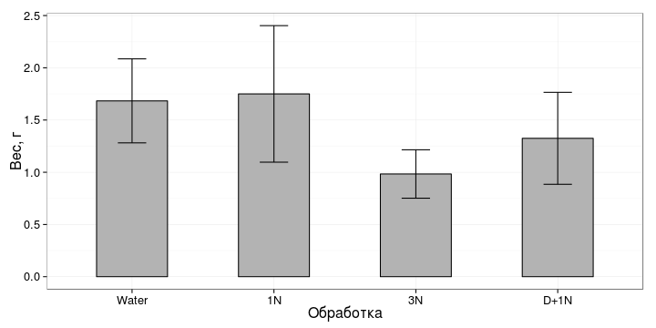


>- Чтобы проверить, какие именно средние отличаются, нужен дисперсионный анализ

---

Проверяем  условия применимости дисперсионного анализа
========================================================
## Нормальность и гомогенность дисперсий - боксплот

```r
ggplot(data = tomato, aes(x = trt, y = weight)) + geom_boxplot()
```

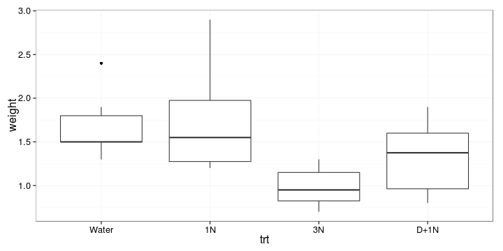


>- Мне не нравится дисперсия в группе "1удобр", проверим ее на графике остатков позже

---

Cвязь дисперсий и средних (проверка гомогенности дисперсий)
========================================================


```r
# Данные взяли в кратком описании
ggplot(tomato_summary, aes(x = mean, y = variance)) + geom_point()
```

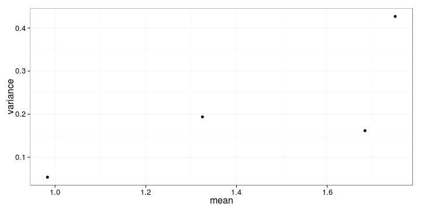


>- Есть подозрительная группа с большим средним и большой дисперсией, это, скорее всего та же самая "1удобр"

---

Дисперсионный анализ
========================================================

```r
tomato_aov <- aov(weight ~ trt, data=tomato)
# summary(tomato_aov)
# Данные для анализа остатков
tomato_diag <- fortify(tomato_aov)
head(tomato_diag)
```

```
##   weight   trt  .hat .sigma .cooksd .fitted .resid .stdresid
## 1    1.5 Water 0.167  0.467 0.00965    1.68 -0.183    -0.439
## 2    1.9 Water 0.167  0.466 0.01348    1.68  0.217     0.519
## 3    1.3 Water 0.167  0.459 0.04218    1.68 -0.383    -0.918
## 4    1.5 Water 0.167  0.467 0.00965    1.68 -0.183    -0.439
## 5    2.4 Water 0.167  0.433 0.14743    1.68  0.717     1.717
## 6    1.5 Water 0.167  0.467 0.00965    1.68 -0.183    -0.439
```

---

Теперь можно проверить условия применимости на графиках остатков
========================================================


```r
ggplot(tomato_diag, aes(x = .fitted, y = .stdresid)) + geom_point(aes(size = .cooksd)) + geom_hline(yintercept = 0)
```

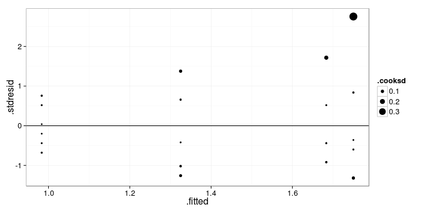

>- Один подозрительный томат с самым большим средним - большой остаток

---

# Квантильный график
========================================================

```r
ggplot(tomato_diag) + geom_point(stat = "qq", aes(sample = .stdresid)) + 
  geom_abline(yintercept = 0, slope = sd(tomato_diag$.stdresid))
```

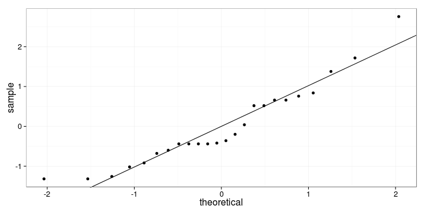


---

Таблица дисперсионного анализа
========================================================

```r
anova(tomato_aov)
```

```
## Analysis of Variance Table
## 
## Response: weight
##           Df Sum Sq Mean Sq F value Pr(>F)  
## trt        3   2.26   0.754    3.61  0.031 *
## Residuals 20   4.18   0.209                 
## ---
## Signif. codes:  0 '***' 0.001 '**' 0.01 '*' 0.05 '.' 0.1 ' ' 1
```

<br />
>- Дисперсионный анализ показал, что внесение добавок в почву влияет на рост корневой системы томатов ($F _{3, 20} = 3.61$, $p < 0.05$).

--- .segue

Post hoc тесты
========================================================
## Как же проверить какие именно группы отличаются?

---

Post-hoc тесты
========================================================

- `glht()` - "general linear hypotheses testing"
- `linfct` - гипотеза для тестирования
- `mcp()` - функция, чтобы задать множественные сравнения (обычные пост-хоки)
- `trt` = "Tukey" - тест Тьюки по фактору `trt`


```r
library(multcomp)
tomato_pht <- glht(tomato_aov, linfct = mcp(trt = "Tukey"))
```


---

Результаты попарных сравнений (тест Тьюки)
========================================================

```r
summary(tomato_pht)
```

```
## 
## 	 Simultaneous Tests for General Linear Hypotheses
## 
## Multiple Comparisons of Means: Tukey Contrasts
## 
## 
## Fit: aov(formula = weight ~ trt, data = tomato)
## 
## Linear Hypotheses:
##                   Estimate Std. Error t value Pr(>|t|)  
## 1N - Water == 0     0.0667     0.2640    0.25    0.994  
## 3N - Water == 0    -0.7000     0.2640   -2.65    0.067 .
## D+1N - Water == 0  -0.3583     0.2640   -1.36    0.539  
## 3N - 1N == 0       -0.7667     0.2640   -2.90    0.040 *
## D+1N - 1N == 0     -0.4250     0.2640   -1.61    0.396  
## D+1N - 3N == 0      0.3417     0.2640    1.29    0.577  
## ---
## Signif. codes:  0 '***' 0.001 '**' 0.01 '*' 0.05 '.' 0.1 ' ' 1
## (Adjusted p values reported -- single-step method)
```


>- Результаты теста Тьюки показали, что рост корневой системы в группе, где помимо удобрений использовали гербицид, не отличался от других групп. При этом достоверные различия были найдены только между группами, где вносили удобрения в разной концентрации (тест Тьюки, $p < 0.05$). 

---

График результатов пост-хок теста.
========================================================

Буквенные обозначения берем из результатов пост-хок теста. Достоверно различающиеся группы - разными буквами.


```r
tomato_p_anova <- tomato_p_means + 
  geom_text(aes(y = 0.5, label = c("AB", "A", "B", "AB")), colour = "white", size = 10)
tomato_p_anova
```

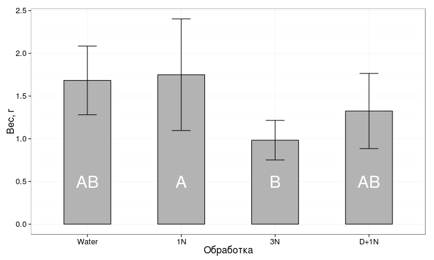


--- .segue

Готовим результаты к представлению
========================================================

---

Приводим график в печатный вид
========================================================

```r
tomato_p_anova +
  scale_y_continuous(expand = c(0,0), limit = c(0, 3)) + 
  scale_x_discrete(labels = c("вода", "1 удобр.", "3 удобр.", "герб.+удобр."))
```

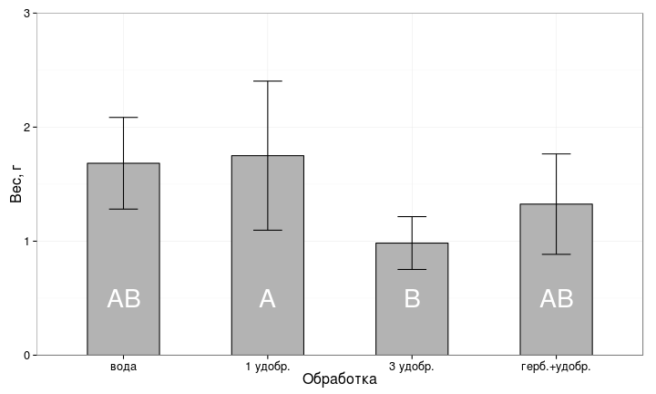

<br />
>- вот теперь можно сохранить

---

Сохраняем таблицу дисперсионного анализа в файл
========================================================

```r
# Исходная таблица
medley_res <- anova(medley_aov)
# в xls или xlsx с помощью XLConnect
writeWorksheetToFile(data = medley_res, file = "medley_res.xls", sheet = "anova_table")
# в буфер обмена (без доп. настроек только Windows)
write.table(file = "clipboard", x = medley_res, sep = "\t")
```


---

Take home messages
========================================================

>- При множественных попарных сравнениях увеличивается вероятность ошибки первого рода. Поправка Бонферрони - способ точно рассчитать, насколько нужно снизить уровень значимости для каждого из сравнений
- При помощи дисперсионного анализа можно проверить гипотезу о равенстве средних значений
- Условия применимости простой линейной регрессии должны выполняться, чтобы
тестировать гипотезы
  - Случайность и независимость групп и наблюдений внутри групп
  - Нормальное распределение вариант в группах
  - Гомогенность дисперсий в группах
- Post hoc тесты - это попарные сравнения после дисперсионного анализа, которые позволяют сказать, какие именно средние различаются

---

Дополнительные ресурсы
========================================================

- Quinn, Keough, 2002, pp. 173-207
- Logan, 2010, pp. 254 - 282
- [Open Intro to Statistics](http://www.openintro.org/stat/), pp.236-246 
- Sokal, Rohlf, 1995, pp. 179-260
- Zar, 2010, pp. 189-207
