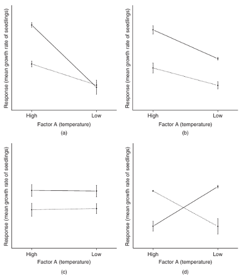

Многофакторный дисперсионный анализ
========================================================

- Линейная модель многофактроного дисперсионного анализа
- Фиксированные и случайные факторы (I и II модель)
- Дисперсионный анализ сбалансированных данных с фиксированными факторами
- Анализ несбалансированных данных. Типы сумм квадратов (I, II, III).

```{r setup, include = FALSE, cache = FALSE}
#----------------------------------------------------------------
# RUN THE FRAGMENT BETWEEN LINES BEFORE COMPILING MARKDOWN
# to configure markdown parsing
options(markdown.extensions = 
          c("no_intra_emphasis",# skip markdown embedded in words
            "tables",           # create HTML tables
            "fenced_code",      # treat text as verbatim when surrounded with begin and ending lines with three ~ or ' characters.
            "autolink",         # create HTML links from urls and email addresses.
            "strikethrough",    # create strikethroughs by surrounding text with ~~.
            "lax_spacing",      # allow HTML tags inside paragraphs without being surrounded by newlines.
            "space_headers",    # add a space between header hashes and the header itself.
            "latex_math"))      # transforms all math equations into syntactically correct MathJax equations.
#--------------------------------------------------------------
# output options
options(width = 80, # set the maximum number of columns on a line
        scipen = 6, # fixed notation of floating point numbers, unless it is more than scipen digits wider, else - exponential notation
        digits = 3) # the number of digits to print when printing numeric values

# to render cyrillics in plots use cairo pdf
options(device = function(file, width = 6, height = 6, ...) {
  cairo_pdf(tempfile(), width = width, height = height, ...)
  })

# chunk default options
opts_chunk$set(fig.align='center',  # default figure alignment
               tidy = FALSE,        # save manual code formatting
               fig.width = 10,      # default figure width
               fig.height = 6)      # default figure height

# this allows for code formatting inline
knit_hooks$set(inline = function(x) {
   if (is.numeric(x)) return(knitr:::format_sci(x, 'latex'))
   x = as.character(x)
   h = knitr:::hilight_source(x, 'latex', list(prompt = FALSE, 
                                               size='normalsize', 
                                               highlight = FALSE))
   h = gsub("([_#$%&])", "\\\\\\1", h)
   h = gsub('(["\'])', '\\1{}', h)
   gsub('^\\\\begin\\{alltt\\}\\s*|\\\\end\\{alltt\\}\\s*$', '', h)})
```

--- .learning

Вы сможете
========================================================
- Проводить многофакторный дисперсионный анализ с учетом взаимодействия факторов
- Отличать фиксированные и случайные факторы и выбирать подходящую модель дисперсионного анализа
- Выяснять, сбалансированы ли данные и выбирать подходящий тип сумм квадратов
- Интерпретировать результаты дисперсионного анализа с учетом взаимодействия факторов 

---

# Линейные модели для факторных дисперсионных анализов

- Два фактора A и B, двухфакторное взаимодействие

$y _{ijk} = μ + α _i + β _j + (αβ) _{ij} + ε _{ijk}$

<br /><br />

- Три фактора A, B и C, двухфакторные взаимодействия, трехфакторное взаимодействия

$y _{ijkl} = μ + α _i + β _j + γ _k + (αβ) _{ij} + (αγ) _{ik} + (βγ) _{jk} + (αβγ) _{ijk} + ε _{ijkl}$

--- &twocol

# Взаимодействие факторов

*** left

Эффект фактора B разный в зависимости от уровней фактора A и наоборот.


*** right



<div class = "footnote">Рисунок из Logan, 2010, fig.12.2</div>

--- &twocol .prompt

# На каких рисунках есть взаимодействие факторов?

*** left

Эффект фактора B разный в зависимости от уровней фактора A и наоборот.

>- b, c - нет взаимодействия 
- a, d - есть взаимодействие


*** right


<div class = "footnote">Рисунок из Logan, 2010, fig.12.2</div>

--- &twocol

# Взаимодействие факторов может маскировать главные эффекты

*** left

- Если есть значимое взаимодействие
  - пост хок тесты только по нему.
  - главные эффекты обсуждать не имеет смысла  
  (они могут быть замаскированы взаимодействием)

*** right


<div class = "footnote">Рисунок из Quinn, Keough, 2002, fig.9.3</div>

--- .segue

# Две модели дисперсионного анализа

## Фиксированные и случайные факторы

--- .prompt

# Вспомните, что такое фиксированные и случайные факторы

Какого типа эти факторы?

- Несколько произвольно выбранных градаций плотности моллюсков в полевом эксперименте, где плотностью манипулировали.

- Фактор размер червяка (маленький, средний, большой) в выборке червей.

- Деление губы Чупа на зоны с разной степенью распреснения.

<br />

>- Может ли один и тот же фактор рассматриваться как случайный или фиксированный?

>- Приведите примеры, как тип фактора будет зависеть от проверяемых гипотез

---

# Гипотезы в разных моделях многофакторного дисперсионного анализа

Тип фактора | Фиксированные факторы |  Случайные факторы
----------- |--------------------- | -------------
Модель дисп.анализа | I-модель | II-модель
Гипотезы | средние равны | нет увеличения дисперсии связанного с фактором
Для А | $$H _{0(A)}: μ _1 = μ _2 = · · · = μ _i = μ$$ | $$H _{0(A)}:  σ _α^2 = 0$$
Для B | $$H _{0(B)}: μ _1 = μ _2 = · · · = μ _i = μ$$ | $$H _{0(B)}: σ _β^2 = 0$$
Для AB | $$H _{0(AB)}: μ _{ij} = μ _i + μ _j − μ$$ | $$H _{0(AB)}: σ _{αβ}^2 = 0$$

---

# Рассчет F-критерия для I и II моделей дисперсионного анализа

Факторы | A и B фиксированные |  A и B случайные | A фиксированный, B случайный
-------- |--------- | -------- | -------
A  | $$F = MS _a \over MS _e$$ | $$F = MS _a \over MS _{ab}$$ | $$F = MS _a \over MS _e$$
B  | $$F = MS _b \over MS _e$$ | $$F = MS _b \over MS _{ab}$$ | $$F = MS _b \over MS _ab$$
AB | $$F = MS _{ab} \over MS _e$$ | $$F = MS _{ab} \over MS _e$$ | $$F = MS _{ab} \over MS _e$$

--- .segue

# Внимание: сегодня - только про фиксированные факторы

--- .segue

# Дисперсионный анализ для фиксированных факторов

--- &twocol

# Пример: Возраст и память

Почему пожилые не так хорошо запоминают? Может быть не так тщательно перерабатывают информацию? (Eysenck, 1974)

*** left

Факторы:
- `Age` - Возраст:
  - `Younger` - 50 молодых
  - `Older` - 50 пожилых (55-65 лет)
- `Process` - тип активности:
  - `Counting` - посчитать число букв
  - `Rhyming` - придумать рифму к слову
  - `Adjective` - придумать прилагательное
  - `Imagery` - представить образ
  - `Intentional` - запомнить слово

Зависимая переменная - `Words` - сколько вспомнили слов

<div class = "footnote">http://www.statsci.org/data/general/eysenck.html</div>

*** right

```{r message = FALSE}
library(ggplot2)
theme_set(theme_bw(base_size = 18))
update_geom_defaults("point", list(shape = 19)) 
```
```{r eval = FALSE}
memory <- read.delim(file="./data/eysenck.csv")
head(memory, 10)
```

```{r message = FALSE, echo=FALSE}
memory <- read.delim(file="./../data/eysenck.csv")
head(memory, 10)
```

---

# Меняем порядок уровней для красоты

```{r}
str(memory)
levels(memory$Age)
# Хотим, чтобы молодые шли первыми - меняем порядок уровней
memory$Age <- relevel(memory$Age, ref="Younger")
```

---

#   Посмотрим на боксплот

```{r fig.height = 5}
#   Этот график нам пригодится для представления результатов
ggplot(data = memory, aes(x = Age, y = Words)) + geom_boxplot(aes(fill = Process))
# некрасивый порядок уровней memory$Process
# переставляем в порядке следования средних значений memory$Words
memory$Process <- reorder(memory$Process, memory$Words, FUN=mean)
```

---

# Боксплот с правильным порядком уровней
```{r}
mem_p <- ggplot(data = memory, aes(x = Age, y = Words)) + 
  geom_boxplot(aes(fill = Process))
mem_p
```

---

# Описательная статистика по группам

- Какого типа здесь факторы?
- Сбалансированный ли дизайн?

```{r message = FALSE}
library(reshape)
# __Статистика по столбцам и по группам__ одновременно (n, средние, дисперсии, стандартные отклонения)
memory_summary <- ddply(memory, .variables = c("Age", "Process"), 
                        summarise, 
                        .n = sum(!is.na(Words)),
                        .mean = mean(Words), 
                        .var = var(Words),
                        .sd = sd(Words))
memory_summary # краткое описание данных
```

--- 

# Проверяем  условия применимости дисперсионного анализа

- Нормальное ли распределение?
- Есть ли гомогенность дисперсий?

```{r}
mem_p
```

---

# Cвязь дисперсий и средних

- Есть ли гомогенность дисперсий?

```{r}
# Данные взяли в кратком описании
ggplot(memory_summary, aes(x = .mean, y = .var)) + geom_point()
```

---

# Задаем модель со взаимодействием
`Age:Process` - взаимодействие обозначается `:`

```{r}
memory_aov <- aov(Words ~ Age + Process + Age:Process, data = memory)
```

<br /><br />
- То же самое - `Age*Process` - вместо всех факторов

```{r}
memory_aov <- aov(Words ~ Age*Process, data = memory)
```

---

# Данные для графиков остатков

```{r}
memory_diag <- fortify(memory_aov)
head(memory_diag, 3)
```

---

# Графики остатков

- Есть ли гомогенность дисперсий?
- Не видно ли трендов в остатках?

```{r fig.height = 5}
ggplot(memory_diag, aes(x = .fitted, y = .stdresid)) + 
  geom_point(aes(size = .cooksd), position = position_jitter(width = .2)) + 
  geom_hline(yintercept = 0)
```

---

# Квантильный график

- Нормальное ли у остатков распределение?

```{r}
ggplot(memory_diag) + geom_point(stat = "qq", aes(sample = .stdresid)) + 
  geom_abline(yintercept = 0, slope = sd(memory_diag$.stdresid))
```

---

# Результаты дисперсионного анализа

```{r}
anova(memory_aov)
```

---

# Пост хок тест

Взаимодействие достоверно, можно другое не тестировать

```{r}
TukeyHSD(memory_aov, which=c("Age:Process"))
```

---

# Графики для результатов

# Боксплот 
```{r}
mem_p # боксплот у нас уже есть
```

---

# Столбчатый график
```{r}
mem_barp <- ggplot(data = memory_summary, aes(x = Age, y = .mean, ymin = .mean - .sd, ymax = .mean + .sd, fill = Process)) + 
  geom_bar(stat = "identity", position = "dodge") + 
  geom_errorbar(width = 0.3, position = position_dodge(width = 0.9))
mem_barp
```
---

# Линии с точками
```{r}
mem_linep <- ggplot(data = memory_summary, aes(x = Age, y = .mean, ymin = .mean - .sd, ymax = .mean + .sd, colour = Process, group = Process)) + 
  geom_point(size = 3, position = position_dodge(width = 0.9)) +
  geom_line(position = position_dodge(width = 0.9)) +
  geom_errorbar(width = 0.3, position = position_dodge(width = 0.9)) 
mem_linep
```

--- .prompt

# Какой график лучше выбрать?

```{r message = FALSE, fig.width = 14, fig.height = 6}
library(gridExtra)
grid.arrange(mem_p, mem_barp, mem_linep, ncol = 3)
```
>- Должен быть максимум данных в минимуме чернил 

---

# Максимум данных в минимуме чернил (Tufte, 1983)

```{r tidy = TRUE, message=FALSE}
mem_linep <- mem_linep + labs(x = "Возраст",  y = "Число запомненных слов") + scale_x_discrete(labels = c("Молодые", "Пожилые")) + 
  scale_colour_brewer(name = "Процесс", palette = "Dark2", 
                      labels = c("Счет", "Рифма", "Прилагательное",
                                 "Образ", "Запоминание")) + 
  theme(legend.key = element_blank())
mem_linep
```

--- .segue

# Сложности с разной численностью групп

## Несбалансированные данные

---

# Проблемы несбалансированных дизайнов

>- Оценки средних в разных группах с разным уровнем точности (Underwood 1997)
- ANOVA менее устойчив к отклонениям от условий применимости (особенно от гомогенности дисперсий) при разных размерах групп (Quinn Keough 2002, section 8.3)
- Сложно рассчитывать компоненты дисперсии (Quinn Keough 2002, section 8.2)
- Проблемы с рассчетом мощности. Если $\sigma _{\epsilon}^2 > 0$ и размеры выборок разные, то $MS _{groups} \over MS _{residuals}$ не следует F-распределению (Searle et al. 1992).

<br /><br /><br />
>- Для фикс. эффектов неравные размеры не проблема - только если значения p близкие к $\alpha$

>- Мораль: старайтесь _планировать_ группы равной численности!

---

# Суммы квадратов в несбалансированных дизайнах

- SSe и SSab также как в сбалансированных
- SSa, SSb - по-разному, суммы квадратов:
  - I тип (Type I SS)
  - II тип (Type II SS)
  - III тип (Type III SS)

---

# Типы сумм квадратов

Типы сумм квадратов | I тип | II тип | III тип
------- | ------- | -------- | -------
Название | Последовательная | Без учета взаимодействий высоких порядков | Иерархическая
Величина эффекта зависит от выборки в группе | Да | Да | Нет
Результат зависит от порядка включения факторов в модель | Да | Да | Нет
Команда R | `aov()` | `Anova()` (пакет `car`) |  `Anova()` (пакет `car`) 
<br />
>- Для сбалансированных дизайнов - результаты одинаковы

>- Для несбалансированных дизайнов рекомендуют __суммы квадратов III типа__ (Maxwell & Delaney 1990, Milliken, Johnson 1984, Searle 1993, Yandell 1997)

--- .segue

# Дисперсионный анализ для несбалансированных данных

---

# Данные для демонстрации


```{r}
umemory <- memory
# Случайные целые числа
sample.int(10, 3) # 3 случайных из 10

# Заменим 5 случайных NA
set.seed(2590) # чтобы на разных системах совп. случайные числа
umemory$Words[sample.int(100, 5)] <- NA
```

--- .prompt

# Сделайте краткое описание данных

- В каких группах численность меньше 10?

```{r eval = FALSE}
# создайте датафрейм umemory_summary
ddply()
summarise()
sum(!is.na())
mean()
var()
sd()

umemory_summary <-
```

---

# Описательная статистика

- Внимание! У нас есть `NA`, нужно добавить `na.rm = TRUE`

```{r echo = FALSE}
umemory_summary <- ddply(umemory, 
                         .variables = c("Age", "Process"), 
                         summarise, 
                         .n = sum(!is.na(Words)),
                         .mean = mean(Words, na.rm = TRUE), 
                         .var = var(Words, na.rm = TRUE),
                         .sd = sd(Words, na.rm = TRUE))
umemory_summary # краткое описание данных
```

---

# Красивый график из прошлого примера с другим датафреймом

`%+%` - заменяет датафрейм в `ggplot()`

```{r}
mem_linep %+% umemory_summary
```

--- &twocol

# Сравните результаты с использованием SS II и SS III

```{r message = FALSE}
library(car)
umem_aov <- aov(Words ~ Age + Process + Age*Process, data = umemory)
```

*** left

```{r}
Anova(umem_aov, type=2)
```

*** right

```{r}
Anova(umem_aov, type=3)
```

---

Take home messages
========================================================

>- В зависимости от типа факторов (фиксированные или случайные) по разному формулируются гипотезы и рассчитывается F-критерий.
- Если значимо взаимодействие факторов, то лучше воздержаться от интерпретации их индивидуальных эффектов
- Если численности групп равны - получаются одинаковые результаты с использованием I, II, III типы сумм квадратов
- В случае, если численности групп неравны (несбалансированные данные) по разному тестируется значимость факторов (I, II, III типы сумм квадратов)

---

Дополнительные ресурсы
========================================================

- Quinn, Keough, 2002, pp. 221-250
- Logan, 2010, pp. 313-359
- Sokal, Rohlf, 1995, pp. 321-362
- Zar, 2010, pp. 246-266
