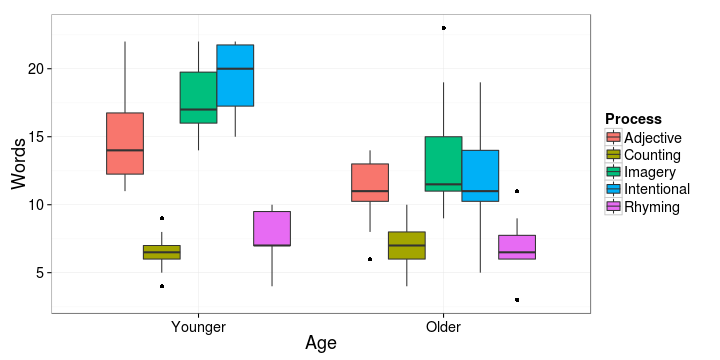
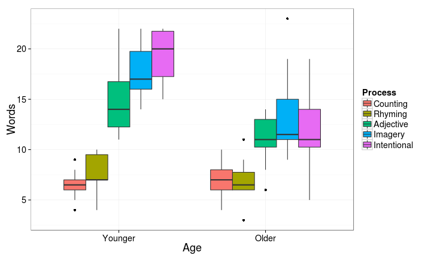
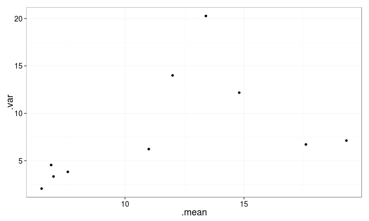
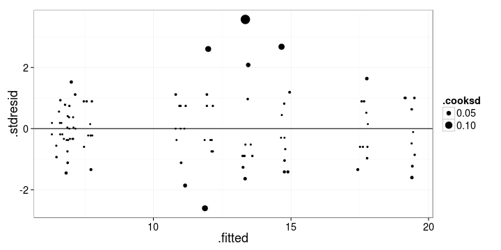
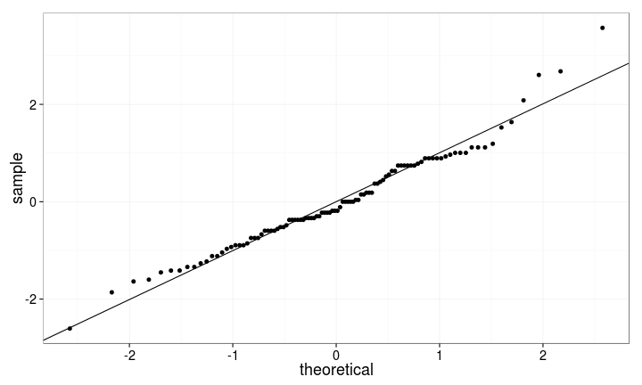
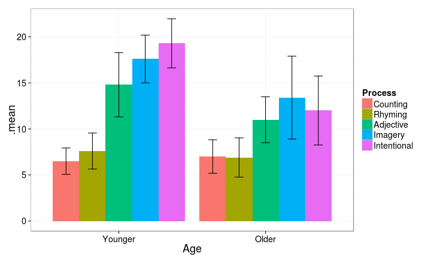
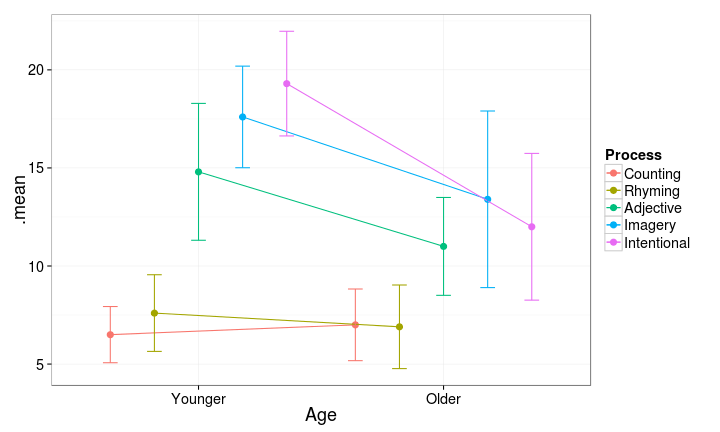
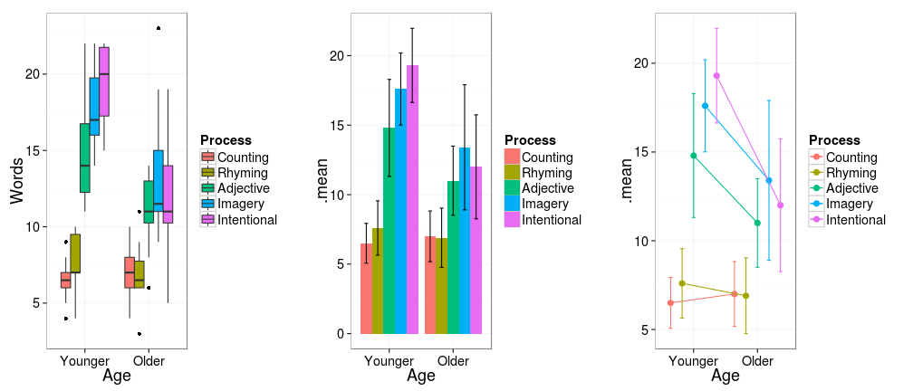
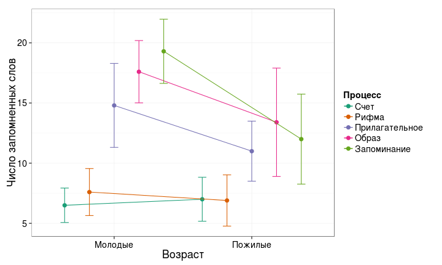
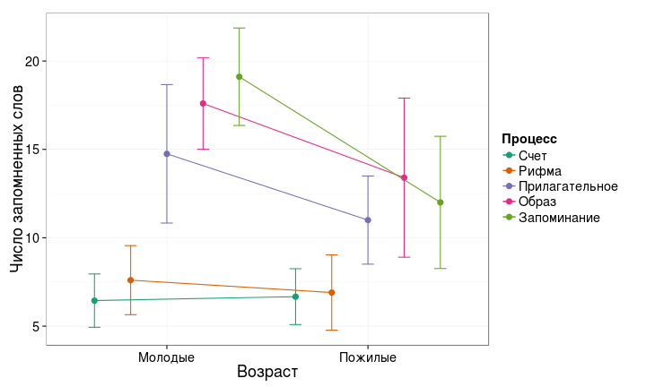

Многофакторный дисперсионный анализ
========================================================

- Линейная модель многофактроного дисперсионного анализа
- Фиксированные и случайные факторы (I и II модель)
- Дисперсионный анализ сбалансированных данных с фиксированными факторами
- Анализ несбалансированных данных. Типы сумм квадратов (I, II, III).


--- .learning

Вы сможете
========================================================
- Проводить многофакторный дисперсионный анализ с учетом взаимодействия факторов
- Отличать фиксированные и случайные факторы и выбирать подходящую модель дисперсионного анализа
- Выяснять, сбалансированы ли данные и выбирать подходящий тип сумм квадратов
- Интерпретировать результаты дисперсионного анализа с учетом взаимодействия факторов 

---

# Линейные модели для факторных дисперсионных анализов

- Два фактора A и B, двухфакторное взаимодействие

$y _{ijk} = μ + α _i + β _j + (αβ) _{ij} + ε _{ijk}$

<br /><br />

- Три фактора A, B и C, двухфакторные взаимодействия, трехфакторное взаимодействия

$y _{ijkl} = μ + α _i + β _j + γ _k + (αβ) _{ij} + (αγ) _{ik} + (βγ) _{jk} + (αβγ) _{ijk} + ε _{ijkl}$

--- &twocol

# Взаимодействие факторов

*** left

Эффект фактора B разный в зависимости от уровней фактора A и наоборот.


*** right


<div class = "footnote">Рисунок из Logan, 2010, fig.12.2</div>

--- &twocol .prompt

# На каких рисунках есть взаимодействие факторов?

*** left

Эффект фактора B разный в зависимости от уровней фактора A и наоборот.

>- b, c - нет взаимодействия 
- a, d - есть взаимодействие


*** right


<div class = "footnote">Рисунок из Logan, 2010, fig.12.2</div>

--- &twocol

# Взаимодействие факторов может маскировать главные эффекты

*** left

- Если есть значимое взаимодействие
  - пост хок тесты только по нему.
  - главные эффекты обсуждать не имеет смысла  
  (они могут быть замаскированы взаимодействием)

*** right


<div class = "footnote">Рисунок из Quinn, Keough, 2002, fig.9.3</div>

--- .segue

# Две модели дисперсионного анализа

## Фиксированные и случайные факторы

--- .prompt

# Вспомните, что такое фиксированные и случайные факторы

Какого типа эти факторы?

- Несколько произвольно выбранных градаций плотности моллюсков в полевом эксперименте, где плотностью манипулировали.

- Фактор размер червяка (маленький, средний, большой) в выборке червей.

- Деление губы Чупа на зоны с разной степенью распреснения.

<br />

>- Может ли один и тот же фактор рассматриваться как случайный или фиксированный?

>- Приведите примеры, как тип фактора будет зависеть от проверяемых гипотез

---

# Гипотезы в разных моделях многофакторного дисперсионного анализа

Тип фактора | Фиксированные факторы |  Случайные факторы
----------- |--------------------- | -------------
Модель дисп.анализа | I-модель | II-модель
Гипотезы | средние равны | нет увеличения дисперсии связанного с фактором
Для А | $$H _{0(A)}: μ _1 = μ _2 = · · · = μ _i = μ$$ | $$H _{0(A)}:  σ _α^2 = 0$$
Для B | $$H _{0(B)}: μ _1 = μ _2 = · · · = μ _i = μ$$ | $$H _{0(B)}: σ _β^2 = 0$$
Для AB | $$H _{0(AB)}: μ _{ij} = μ _i + μ _j − μ$$ | $$H _{0(AB)}: σ _{αβ}^2 = 0$$

---

# Рассчет F-критерия для I и II моделей дисперсионного анализа

Факторы | A и B фиксированные |  A и B случайные | A фиксированный, B случайный
-------- |--------- | -------- | -------
A  | $$F = MS _a \over MS _e$$ | $$F = MS _a \over MS _{ab}$$ | $$F = MS _a \over MS _e$$
B  | $$F = MS _b \over MS _e$$ | $$F = MS _b \over MS _{ab}$$ | $$F = MS _b \over MS _ab$$
AB | $$F = MS _{ab} \over MS _e$$ | $$F = MS _{ab} \over MS _e$$ | $$F = MS _{ab} \over MS _e$$

--- .segue

# Внимание: сегодня - только про фиксированные факторы

--- .segue

# Дисперсионный анализ для фиксированных факторов

--- &twocol

# Пример: Возраст и память

Почему пожилые не так хорошо запоминают? Может быть не так тщательно перерабатывают информацию? (Eysenck, 1974)

*** left

Факторы:
- `Age` - Возраст:
  - `Younger` - 50 молодых
  - `Older` - 50 пожилых (55-65 лет)
- `Process` - тип активности:
  - `Counting` - посчитать число букв
  - `Rhyming` - придумать рифму к слову
  - `Adjective` - придумать прилагательное
  - `Imagery` - представить образ
  - `Intentional` - запомнить слово

Зависимая переменная - `Words` - сколько вспомнили слов

<div class = "footnote">http://www.statsci.org/data/general/eysenck.html</div>

*** right


```r
library(ggplot2)
theme_set(theme_bw(base_size = 18))
update_geom_defaults("point", list(shape = 19)) 
```


```r
memory <- read.delim(file="./data/eysenck.csv")
head(memory, 10)
```


```
##        Age  Process Words
## 1  Younger Counting     8
## 2  Younger Counting     6
## 3  Younger Counting     4
## 4  Younger Counting     6
## 5  Younger Counting     7
## 6  Younger Counting     6
## 7  Younger Counting     5
## 8  Younger Counting     7
## 9  Younger Counting     9
## 10 Younger Counting     7
```


---

# Меняем порядок уровней для красоты


```r
str(memory)
```

```
## 'data.frame':	100 obs. of  3 variables:
##  $ Age    : Factor w/ 2 levels "Older","Younger": 2 2 2 2 2 2 2 2 2 2 ...
##  $ Process: Factor w/ 5 levels "Adjective","Counting",..: 2 2 2 2 2 2 2 2 2 2 ...
##  $ Words  : num  8 6 4 6 7 6 5 7 9 7 ...
```

```r
levels(memory$Age)
```

```
## [1] "Older"   "Younger"
```

```r
# Хотим, чтобы молодые шли первыми - меняем порядок уровней
memory$Age <- relevel(memory$Age, ref="Younger")
```


---

#   Посмотрим на боксплот


```r
#   Этот график нам пригодится для представления результатов
ggplot(data = memory, aes(x = Age, y = Words)) + geom_boxplot(aes(fill = Process))
```



```r
# некрасивый порядок уровней memory$Process
# переставляем в порядке следования средних значений memory$Words
memory$Process <- reorder(memory$Process, memory$Words, FUN=mean)
```


---

# Боксплот с правильным порядком уровней

```r
mem_p <- ggplot(data = memory, aes(x = Age, y = Words)) + 
  geom_boxplot(aes(fill = Process))
mem_p
```


---

# Описательная статистика по группам

- Какого типа здесь факторы?
- Сбалансированный ли дизайн?


```r
library(reshape)
# __Статистика по столбцам и по группам__ одновременно (n, средние, дисперсии, стандартные отклонения)
memory_summary <- ddply(memory, .variables = c("Age", "Process"), 
                        summarise, 
                        .n = sum(!is.na(Words)),
                        .mean = mean(Words), 
                        .var = var(Words),
                        .sd = sd(Words))
memory_summary # краткое описание данных
```

```
##        Age     Process .n .mean  .var  .sd
## 1  Younger    Counting 10   6.5  2.06 1.43
## 2  Younger     Rhyming 10   7.6  3.82 1.96
## 3  Younger   Adjective 10  14.8 12.18 3.49
## 4  Younger     Imagery 10  17.6  6.71 2.59
## 5  Younger Intentional 10  19.3  7.12 2.67
## 6    Older    Counting 10   7.0  3.33 1.83
## 7    Older     Rhyming 10   6.9  4.54 2.13
## 8    Older   Adjective 10  11.0  6.22 2.49
## 9    Older     Imagery 10  13.4 20.27 4.50
## 10   Older Intentional 10  12.0 14.00 3.74
```


--- 

# Проверяем  условия применимости дисперсионного анализа

- Нормальное ли распределение?
- Есть ли гомогенность дисперсий?


```r
mem_p
```




---

# Cвязь дисперсий и средних

- Есть ли гомогенность дисперсий?


```r
# Данные взяли в кратком описании
ggplot(memory_summary, aes(x = .mean, y = .var)) + geom_point()
```




---

# Задаем модель со взаимодействием
`Age:Process` - взаимодействие обозначается `:`


```r
memory_aov <- aov(Words ~ Age + Process + Age:Process, data = memory)
```


<br /><br />
- То же самое - `Age*Process` - вместо всех факторов


```r
memory_aov <- aov(Words ~ Age*Process, data = memory)
```


---

# Данные для графиков остатков


```r
memory_diag <- fortify(memory_aov)
head(memory_diag, 3)
```

```
##   Words     Age  Process .hat .sigma  .cooksd .fitted .resid .stdresid
## 1     8 Younger Counting  0.1   2.84 0.003461     6.5    1.5     0.558
## 2     6 Younger Counting  0.1   2.85 0.000385     6.5   -0.5    -0.186
## 3     4 Younger Counting  0.1   2.84 0.009614     6.5   -2.5    -0.930
```


---

# Графики остатков

- Есть ли гомогенность дисперсий?
- Не видно ли трендов в остатках?


```r
ggplot(memory_diag, aes(x = .fitted, y = .stdresid)) + 
  geom_point(aes(size = .cooksd), position = position_jitter(width = .2)) + 
  geom_hline(yintercept = 0)
```




---

# Квантильный график

- Нормальное ли у остатков распределение?


```r
ggplot(memory_diag) + geom_point(stat = "qq", aes(sample = .stdresid)) + 
  geom_abline(yintercept = 0, slope = sd(memory_diag$.stdresid))
```




---

# Результаты дисперсионного анализа


```r
anova(memory_aov)
```

```
## Analysis of Variance Table
## 
## Response: Words
##             Df Sum Sq Mean Sq F value    Pr(>F)    
## Age          1    240     240   29.94 0.0000004 ***
## Process      4   1515     379   47.19   < 2e-16 ***
## Age:Process  4    190      48    5.93   0.00028 ***
## Residuals   90    722       8                      
## ---
## Signif. codes:  0 '***' 0.001 '**' 0.01 '*' 0.05 '.' 0.1 ' ' 1
```


---

# Пост хок тест

Взаимодействие достоверно, можно другое не тестировать


```r
TukeyHSD(memory_aov, which=c("Age:Process"))
```

```
##   Tukey multiple comparisons of means
##     95% family-wise confidence level
## 
## Fit: aov(formula = Words ~ Age * Process, data = memory)
## 
## $`Age:Process`
##                                       diff      lwr     upr p adj
## Older:Counting-Younger:Counting        0.5  -3.6105  4.6105 1.000
## Younger:Rhyming-Younger:Counting       1.1  -3.0105  5.2105 0.997
## Older:Rhyming-Younger:Counting         0.4  -3.7105  4.5105 1.000
## Younger:Adjective-Younger:Counting     8.3   4.1895 12.4105 0.000
## Older:Adjective-Younger:Counting       4.5   0.3895  8.6105 0.021
## Younger:Imagery-Younger:Counting      11.1   6.9895 15.2105 0.000
## Older:Imagery-Younger:Counting         6.9   2.7895 11.0105 0.000
## Younger:Intentional-Younger:Counting  12.8   8.6895 16.9105 0.000
## Older:Intentional-Younger:Counting     5.5   1.3895  9.6105 0.001
## Younger:Rhyming-Older:Counting         0.6  -3.5105  4.7105 1.000
## Older:Rhyming-Older:Counting          -0.1  -4.2105  4.0105 1.000
## Younger:Adjective-Older:Counting       7.8   3.6895 11.9105 0.000
## Older:Adjective-Older:Counting         4.0  -0.1105  8.1105 0.063
## Younger:Imagery-Older:Counting        10.6   6.4895 14.7105 0.000
## Older:Imagery-Older:Counting           6.4   2.2895 10.5105 0.000
## Younger:Intentional-Older:Counting    12.3   8.1895 16.4105 0.000
## Older:Intentional-Older:Counting       5.0   0.8895  9.1105 0.006
## Older:Rhyming-Younger:Rhyming         -0.7  -4.8105  3.4105 1.000
## Younger:Adjective-Younger:Rhyming      7.2   3.0895 11.3105 0.000
## Older:Adjective-Younger:Rhyming        3.4  -0.7105  7.5105 0.196
## Younger:Imagery-Younger:Rhyming       10.0   5.8895 14.1105 0.000
## Older:Imagery-Younger:Rhyming          5.8   1.6895  9.9105 0.001
## Younger:Intentional-Younger:Rhyming   11.7   7.5895 15.8105 0.000
## Older:Intentional-Younger:Rhyming      4.4   0.2895  8.5105 0.026
## Younger:Adjective-Older:Rhyming        7.9   3.7895 12.0105 0.000
## Older:Adjective-Older:Rhyming          4.1  -0.0105  8.2105 0.051
## Younger:Imagery-Older:Rhyming         10.7   6.5895 14.8105 0.000
## Older:Imagery-Older:Rhyming            6.5   2.3895 10.6105 0.000
## Younger:Intentional-Older:Rhyming     12.4   8.2895 16.5105 0.000
## Older:Intentional-Older:Rhyming        5.1   0.9895  9.2105 0.004
## Older:Adjective-Younger:Adjective     -3.8  -7.9105  0.3105 0.095
## Younger:Imagery-Younger:Adjective      2.8  -1.3105  6.9105 0.458
## Older:Imagery-Younger:Adjective       -1.4  -5.5105  2.7105 0.983
## Younger:Intentional-Younger:Adjective  4.5   0.3895  8.6105 0.021
## Older:Intentional-Younger:Adjective   -2.8  -6.9105  1.3105 0.458
## Younger:Imagery-Older:Adjective        6.6   2.4895 10.7105 0.000
## Older:Imagery-Older:Adjective          2.4  -1.7105  6.5105 0.673
## Younger:Intentional-Older:Adjective    8.3   4.1895 12.4105 0.000
## Older:Intentional-Older:Adjective      1.0  -3.1105  5.1105 0.999
## Older:Imagery-Younger:Imagery         -4.2  -8.3105 -0.0895 0.041
## Younger:Intentional-Younger:Imagery    1.7  -2.4105  5.8105 0.941
## Older:Intentional-Younger:Imagery     -5.6  -9.7105 -1.4895 0.001
## Younger:Intentional-Older:Imagery      5.9   1.7895 10.0105 0.000
## Older:Intentional-Older:Imagery       -1.4  -5.5105  2.7105 0.983
## Older:Intentional-Younger:Intentional -7.3 -11.4105 -3.1895 0.000
```


---

# Графики для результатов

# Боксплот 

```r
mem_p # боксплот у нас уже есть
```


---

# Столбчатый график

```r
mem_barp <- ggplot(data = memory_summary, aes(x = Age, y = .mean, ymin = .mean - .sd, ymax = .mean + .sd, fill = Process)) + 
  geom_bar(stat = "identity", position = "dodge") + 
  geom_errorbar(width = 0.3, position = position_dodge(width = 0.9))
mem_barp
```



---

# Линии с точками

```r
mem_linep <- ggplot(data = memory_summary, aes(x = Age, y = .mean, ymin = .mean - .sd, ymax = .mean + .sd, colour = Process, group = Process)) + 
  geom_point(size = 3, position = position_dodge(width = 0.9)) +
  geom_line(position = position_dodge(width = 0.9)) +
  geom_errorbar(width = 0.3, position = position_dodge(width = 0.9)) 
mem_linep
```




--- .prompt

# Какой график лучше выбрать?


```r
library(gridExtra)
grid.arrange(mem_p, mem_barp, mem_linep, ncol = 3)
```



>- Должен быть максимум данных в минимуме чернил 

---

# Максимум данных в минимуме чернил (Tufte, 1983)


```r
mem_linep <- mem_linep + labs(x = "Возраст", y = "Число запомненных слов") + 
    scale_x_discrete(labels = c("Молодые", "Пожилые")) + scale_colour_brewer(name = "Процесс", 
    palette = "Dark2", labels = c("Счет", "Рифма", "Прилагательное", 
        "Образ", "Запоминание")) + theme(legend.key = element_blank())
mem_linep
```




--- .segue

# Сложности с разной численностью групп

## Несбалансированные данные

---

# Проблемы несбалансированных дизайнов

>- Оценки средних в разных группах с разным уровнем точности (Underwood 1997)
- ANOVA менее устойчив к отклонениям от условий применимости (особенно от гомогенности дисперсий) при разных размерах групп (Quinn Keough 2002, section 8.3)
- Сложно рассчитывать компоненты дисперсии (Quinn Keough 2002, section 8.2)
- Проблемы с рассчетом мощности. Если $\sigma _{\epsilon}^2 > 0$ и размеры выборок разные, то $MS _{groups} \over MS _{residuals}$ не следует F-распределению (Searle et al. 1992).

<br /><br /><br />
>- Для фикс. эффектов неравные размеры не проблема - только если значения p близкие к $\alpha$

>- Мораль: старайтесь _планировать_ группы равной численности!

---

# Суммы квадратов в несбалансированных дизайнах

- SSe и SSab также как в сбалансированных
- SSa, SSb - по-разному, суммы квадратов:
  - I тип (Type I SS)
  - II тип (Type II SS)
  - III тип (Type III SS)

---

# Типы сумм квадратов

Типы сумм квадратов | I тип | II тип | III тип
------- | ------- | -------- | -------
Название | Последовательная | Без учета взаимодействий высоких порядков | Иерархическая
Величина эффекта зависит от выборки в группе | Да | Да | Нет
Результат зависит от порядка включения факторов в модель | Да | Да | Нет
Команда R | `aov()` | `Anova()` (пакет `car`) |  `Anova()` (пакет `car`) 
<br />
>- Для сбалансированных дизайнов - результаты одинаковы

>- Для несбалансированных дизайнов рекомендуют __суммы квадратов III типа__ (Maxwell & Delaney 1990, Milliken, Johnson 1984, Searle 1993, Yandell 1997)

--- .segue

# Дисперсионный анализ для несбалансированных данных

---

# Данные для демонстрации


```r
umemory <- memory
# Случайные целые числа
sample.int(10, 3) # 3 случайных из 10
```

```
## [1] 7 2 3
```

```r

# Заменим 5 случайных NA
set.seed(2590) # чтобы на разных системах совп. случайные числа
umemory$Words[sample.int(100, 5)] <- NA
```


--- .prompt

# Сделайте краткое описание данных

- В каких группах численность меньше 10?


```r
# создайте датафрейм umemory_summary
ddply()
summarise()
sum(!is.na())
mean()
var()
sd()

umemory_summary <-
```


---

# Описательная статистика

- Внимание! У нас есть `NA`, нужно добавить `na.rm = TRUE`


```
##        Age     Process .n .mean  .var  .sd
## 1  Younger    Counting  9  6.44  2.28 1.51
## 2  Younger     Rhyming 10  7.60  3.82 1.96
## 3  Younger   Adjective  8 14.75 15.36 3.92
## 4  Younger     Imagery 10 17.60  6.71 2.59
## 5  Younger Intentional  9 19.11  7.61 2.76
## 6    Older    Counting  9  6.67  2.50 1.58
## 7    Older     Rhyming 10  6.90  4.54 2.13
## 8    Older   Adjective 10 11.00  6.22 2.49
## 9    Older     Imagery 10 13.40 20.27 4.50
## 10   Older Intentional 10 12.00 14.00 3.74
```


---

# Красивый график из прошлого примера с другим датафреймом

`%+%` - заменяет датафрейм в `ggplot()`


```r
mem_linep %+% umemory_summary
```




--- &twocol

# Сравните результаты с использованием SS II и SS III


```r
library(car)
umem_aov <- aov(Words ~ Age + Process + Age*Process, data = umemory)
```


*** left


```r
Anova(umem_aov, type=2)
```

```
## Anova Table (Type II tests)
## 
## Response: Words
##             Sum Sq Df F value   Pr(>F)    
## Age            230  1   27.70 0.000001 ***
## Process       1449  4   43.58  < 2e-16 ***
## Age:Process    163  4    4.89   0.0013 ** 
## Residuals      707 85                     
## ---
## Signif. codes:  0 '***' 0.001 '**' 0.01 '*' 0.05 '.' 0.1 ' ' 1
```


*** right


```r
Anova(umem_aov, type=3)
```

```
## Anova Table (Type III tests)
## 
## Response: Words
##             Sum Sq Df F value       Pr(>F)    
## (Intercept)    374  1   44.96 0.0000000021 ***
## Age              0  1    0.03       0.8705    
## Process       1251  4   37.60      < 2e-16 ***
## Age:Process    163  4    4.89       0.0013 ** 
## Residuals      707 85                         
## ---
## Signif. codes:  0 '***' 0.001 '**' 0.01 '*' 0.05 '.' 0.1 ' ' 1
```


---

Take home messages
========================================================

>- В зависимости от типа факторов (фиксированные или случайные) по разному формулируются гипотезы и рассчитывается F-критерий.
- Если значимо взаимодействие факторов, то лучше воздержаться от интерпретации их индивидуальных эффектов
- Если численности групп равны - получаются одинаковые результаты с использованием I, II, III типы сумм квадратов
- В случае, если численности групп неравны (несбалансированные данные) по разному тестируется значимость факторов (I, II, III типы сумм квадратов)

---

Дополнительные ресурсы
========================================================

- Quinn, Keough, 2002, pp. 221-250
- Logan, 2010, pp. 313-359
- Sokal, Rohlf, 1995, pp. 321-362
- Zar, 2010, pp. 246-266
