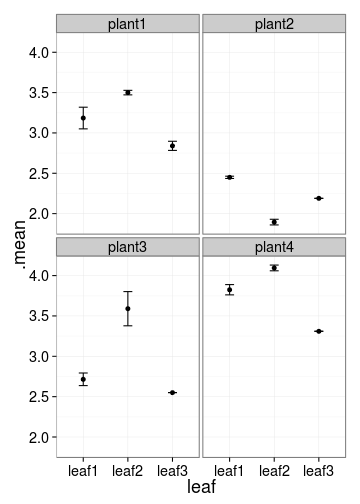
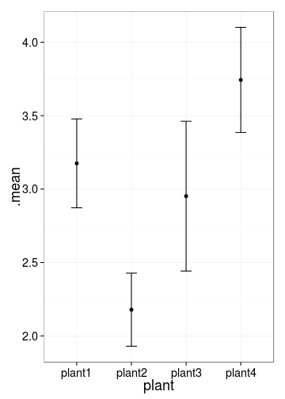
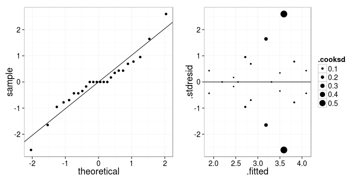
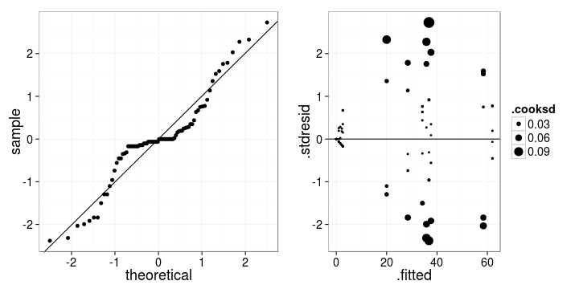
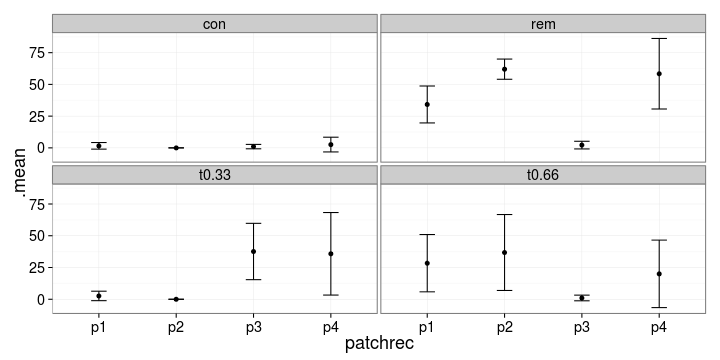

Дисперсионный анализ
========================================================

- Анализ моделей со вложенными факторами (иерархический дисперсионный анализ)
- Компоненты дисперсии для случайных факторов


--- .learning

Вы сможете
========================================================

- Отличать случаи, когда нужен дисперсионный анализ со вложенными факторами
- Проводить иерархический дисперсионный анализ
- Рассчитывать компоненты дисперсии для случайных факторов

--- &twocol

# Исходные данные для иерархического дисперсионного анализа

*** left

выглядят примерно так

Объект | Часть объекта |
------ | ------- |
1 | A |
1 | B |
1 | C |
2 | A |
2 | B |
2 | C |
3 | A |
3 | B |
3 | C |
И т.д. | 

*** right

В данном случае

Верхний фактор в иерархии - Объект

Вложенный фактор - Часть объекта

Одноименные уровни вложенного фактора несопоставимы между разными объектами!

т.е. A для 1-го объекта не то же самое, что A для второго. Иными словами, ответ на действие вложенного фактора будет разным для разных уровней вышестоящего фактора.

--- &twocol .prompt

# Подберите правильный дизайн дисперсионного анализа

- Какие из этих данных подходят для иерархического дисперсионного анализа?

- Какие из факторов фиксированные, а какие случайные?

*** left

Объект | Часть объекта |
------ | ------- |
1 | A |
1 | B |
1 | C |
2 | A |
2 | B |
2 | C |
3 | A |
3 | B |
3 | C |
И т.д. | 

*** right

>- Средний размер кукушиных яиц в гнездах одних и тех же 3 видов птиц в 4 лесах
>- Число личинок, осевших на 3 вида субстратов в 7 аквариумах (все три субстрата в каждом)
>- Уровень экспрессии генов у дрозофил в зависимости от температуры содержания (4 режима содержания по 3 популяции в каждом)

--- &twocol

# Пример: Кальций в листьях турнепса

*** left

Содержание кальция в листьях турнепса

- 4 растения
  - 3 листа с каждого растения (по две пробы с каждого листа)

```r
library(XLConnect)
turn <- readWorksheetFromFile(file="./data/turnips.xlsx", 
                              sheet = 1)
head(turn)
```


```
##    plant  leaf   ca
## 1 plant1 leaf1 3.28
## 2 plant1 leaf1 3.09
## 3 plant1 leaf2 3.52
## 4 plant1 leaf2 3.48
## 5 plant1 leaf3 2.88
## 6 plant1 leaf3 2.80
```


*** right




<div class = "footnote">Снедекор, 1961, с.252</div>

--- &twocol

# Особенности иерархического дисперсионного анализа

*** left

- Минимум два фактора А и В
- Несколько (случайным образом выбранных) градаций фактора В (листья) внутри каждого из уровней
фактора А (растения)
- Часто больше одного уровня в иерархии
- Оценка взаимодействия главного фактора и вложенного невозможна

*** right


--- &twocol

# Главный эффект

*** left

- Эффект фактора А - изменчивость между средними по фактору А  
(различия содержания кальция между растениями)

*** right




--- &twocol

# Эффект вложенного фактора

*** left

- Эффект фактора В на каждом из уровней фактора А - различия средних по фактору В на каждом из уровней фактора А  
(различия содержания кальция между листьями на одном растении)

*** right


---

# Структура изменчивости

Общая = по фактору А + по вложенному фактору + случайная

$$SS _t = SS _A + SS _{B|A} + SS _e$$

- $SS _A$ – различия между средними по фактору А и общим средним
- $SS _{B|A}$ – различия между средними по фактору В и средним на данном уровне А
- $SS _e$ – различия между повторными измерениями в ячейках и общим средним

---

# Как считать F-критерий в иерархическом дисперсионном анализе

Источник изменчивости | SS | df | MS | F |
----- | ----- | ----- | ----- | ----- |
$А$ | $SS _A$ | $a - 1$ | $MS _A$ | $MS _A/MS _{B \vert A}$ |
$В \vert А$ | $SS _{B \vert A}$ | $a(b – 1)$ | $MS _{B \vert A}$ | $MS _{B \vert A}/MS _e$ |
Случайная | $SS _e$ | $ab(n – 1)$ | $MS _e$ |  |
Общая | $SS _t$

<br />
- Дисперсия каждого фактора оценивается по отношению к
дисперсии нижележащего в иерархии
- Вложенный фактор чаще всего случайный, как здесь - смешанная модель

---

# Почему F считается именно так, становится понятно, если посмотреть, что именно оценивают MS

Источник<br />изменчивости | SS | df | MS | F | Ожидаемый<br />средний квадрат
----- | ----- | ----- | ----- | ----- | -----
$A$ | $SS _A$ | $a - 1$ | $MS _A$ | $MS _A/MS _{B \vert A}$ | $$\sigma^2 + n \sigma^2 _{B \vert A} + nb\sigma^2 _A$$ 
$B \vert A$ | $SS _{B \vert A}$ | $a(b – 1)$ | $MS _{B \vert A}$ | $MS _{B \vert A}/MS _e$ | $$\sigma^2 + n\sigma^2 _{B \vert A}$$
Случайная | $SS _e$ | $ab(n – 1)$ | $MS _e$ |  | $$\sigma^2$$
Общая | $SS _t$

--- .prompt

# У нас сбалансированный дисперсионный комплекс?


```r
table(turn$plant, turn$leaf, useNA = "no")
```

```
##         
##          leaf1 leaf2 leaf3
##   plant1     2     2     2
##   plant2     2     2     2
##   plant3     2     2     2
##   plant4     2     2     2
```


*** pnotes

Да, сбалансированный


```r
table(turn$plant, turn$leaf, useNA = "no")
```

```
##         
##          leaf1 leaf2 leaf3
##   plant1     2     2     2
##   plant2     2     2     2
##   plant3     2     2     2
##   plant4     2     2     2
```


Внимание, мы собираемся использовать функцию gad() из пакета GAD

Для нее важно, чтобы вложенные факторы были закодированы одинаково на всех уровнях

---

# Дисперсионный анализ со вложенными факторами для сбалансированных данных

## Сначала задаем типы факторов: фиксированные или случайные

```r
# install.packages("GAD")
library(GAD) # Дисперсионный анализ по Underwood, 1997
# задаем фиксированные и случайные факторы
turn$plant <- as.fixed(turn$plant)
turn$leaf <- as.random(turn$leaf)
```


---

# Подбираем подель дисперсионного анализа с помощью lm()

Вложенный фактор обозначается так:

`вложенный %in% главный`


```r
# модель дисперсионного анализа
model <- lm(ca ~ plant + leaf %in% plant, data = turn)
```


---

# Таблица результатов иерархического дисперсионного анализа


```r
model_gad <- gad(model)
options(digits = 3, scipen = 6) # для форматирования чисел в таблице
model_gad
```

```
## Analysis of Variance Table
## 
## Response: ca
##            Df Sum Sq Mean Sq F value      Pr(>F)    
## plant       3   7.56   2.520    7.67      0.0097 ** 
## plant:leaf  8   2.63   0.329   49.41 0.000000051 ***
## Residual   12   0.08   0.007                        
## ---
## Signif. codes:  0 '***' 0.001 '**' 0.01 '*' 0.05 '.' 0.1 ' ' 1
```


---

# Данные для проверки условий применимости


```r
model_diag <- fortify(model) # fortify() из ggplot2
head(model_diag)
```

```
##     ca  plant  leaf .hat .sigma .cooksd .fitted .resid .stdresid
## 1 3.28 plant1 leaf1  0.5 0.0750  0.2260    3.18  0.095     1.647
## 2 3.09 plant1 leaf1  0.5 0.0750  0.2260    3.18 -0.095    -1.647
## 3 3.52 plant1 leaf2  0.5 0.0848  0.0100    3.50  0.020     0.347
## 4 3.48 plant1 leaf2  0.5 0.0848  0.0100    3.50 -0.020    -0.347
## 5 2.88 plant1 leaf3  0.5 0.0835  0.0401    2.84  0.040     0.693
## 6 2.80 plant1 leaf3  0.5 0.0835  0.0401    2.84 -0.040    -0.693
```


--- 

# Проверим условия применимости


```r
# Квантильный график - нормальное распределение остатков
p1 <- ggplot(model_diag) + geom_point(stat = "qq", aes(sample = .stdresid)) + 
  geom_abline(yintercept = 0, slope = sd(model_diag$.stdresid))
# График стандартизованных остатков - гомогенность дисперсий остатков 
# Расстояние Кука - наличие "выбросов"
p2 <- ggplot(model_diag, aes(x = .fitted, y = .stdresid)) + 
  geom_point(aes(size = .cooksd)) + geom_hline(yintercept = 0)
library(gridExtra)
grid.arrange(p1, p2, ncol = 2)
```




---

# Компоненты дисперсии

- рассчитываются для случайных факторов
- дисперсия между средними во всех возможных группах
- аналоги силы влияния фиксированных факторов

$$s^2 _A = \frac {MS _A - MS _B}{nb}$$
$$s^2 _{B|A} = \frac {MS _B - MS _e}{n}$$
$$s^2 = MS _e$$

Если найти общую, можно будет выразить компоненты дисперсии в процентах
$$s^2 _{t} = s^2 _A + s^2 _{B|A} + s^2$$

--- &twocol

# Посчитаем компоненты дисперсии

*** left

$$s^2 _A = \frac {MS _A - MS _B}{nb}$$
$$s^2 _{B|A} = \frac {MS _B - MS _e}{n}$$
$$s^2 = MS _e$$
$$s^2 _{t} = s^2 _A + s^2 _{B|A} + s^2$$


```r
table(turn$plant, turn$leaf, useNA = "no")
```

```
##         
##          leaf1 leaf2 leaf3
##   plant1     2     2     2
##   plant2     2     2     2
##   plant3     2     2     2
##   plant4     2     2     2
```


*** right


```r
# Средние квадраты
MSa <-model_gad$'Mean Sq'[1]
MSba <- model_gad$'Mean Sq'[2]
MSe <- model_gad$'Mean Sq'[3]
b <- 3 # число групп по фактору B (листьев на растении)
n <- 2 # объем группы (измерений на листе)
VC <- data.frame (VCa = (MSa - MSba)/(n*b),
                  VCba = (MSba - MSe)/n,
                  VCe = MSe)
VC # компоненты дисперсии
```

```
##     VCa  VCba     VCe
## 1 0.365 0.161 0.00665
```

```r
VC/sum(VC)*100 # в процентах
```

```
##    VCa VCba  VCe
## 1 68.5 30.2 1.25
```


---

# Осторожно: интерпретация компонент дисперсии для случайных и фиксированных факторов разная!

- Для случайных факторов - дисперсия между средними во всех возможных группах
- Для фиксированных факторов - дисперсия между средними в группах


```r
VC[1]/sum(VC)*100 # в процентах
```

```
##    VCa
## 1 68.5
```


Для сравнения доля объясненной изменчивости для фикс. фактора (эта-квадрат и частный эта-квадрат)


```r
(etasq_a <- model_gad$'Sum Sq'[1]/sum(model_gad$'Sum Sq'))
```

```
## [1] 0.736
```

```r
(p_etasq_a <- model_gad$'Sum Sq'[1]/(model_gad$'Sum Sq'[1] + model_gad$'Sum Sq'[3]))
```

```
## [1] 0.99
```


---

# Пример: Морские ежи и водоросли

Влияет ли плотность морских ежей на обилие нитчаток в сублиторали? (Andrew, Underwood, 1993)

- Обилие ежей - 4 уровня (нет, 33%, 66%, 100%)
- Площадка - 4 штуки (площадь 3-4 $м^2$; по 5 проб на площадке)


```r
andr <- readWorksheetFromFile(file = "./data/andrew.xlsx", sheet = 1)
head(andr)
```


```
##   treat patch patchrec quad algae
## 1   con     1       p1    1     0
## 2   con     1       p1    2     0
## 3   con     1       p1    3     0
## 4   con     1       p1    4     6
## 5   con     1       p1    5     2
## 6   con     2       p2    1     0
```


<div class = "footnote">Данные из Quinn, Keough, 2002, p.209</div>

---

# Подготавливаем данные


```r
str(andr)
```

```
## 'data.frame':	80 obs. of  5 variables:
##  $ treat   : chr  "con" "con" "con" "con" ...
##  $ patch   : num  1 1 1 1 1 2 2 2 2 2 ...
##  $ patchrec: chr  "p1" "p1" "p1" "p1" ...
##  $ quad    : num  1 2 3 4 5 1 2 3 4 5 ...
##  $ algae   : num  0 0 0 6 2 0 0 0 0 0 ...
```

```r
andr$patchrec <- factor(andr$patchrec)
andr$treat <- factor(andr$treat)
str(andr)
```

```
## 'data.frame':	80 obs. of  5 variables:
##  $ treat   : Factor w/ 4 levels "con","rem","t0.33",..: 1 1 1 1 1 1 1 1 1 1 ...
##  $ patch   : num  1 1 1 1 1 2 2 2 2 2 ...
##  $ patchrec: Factor w/ 4 levels "p1","p2","p3",..: 1 1 1 1 1 2 2 2 2 2 ...
##  $ quad    : num  1 2 3 4 5 1 2 3 4 5 ...
##  $ algae   : num  0 0 0 6 2 0 0 0 0 0 ...
```


--- .prompt

# Сбалансированный ли у нас дисперсионный комплекс?

*** pnotes

Да


```r
table(andr$treat, andr$patchrec, useNA = "no")
```

```
##        
##         p1 p2 p3 p4
##   con    5  5  5  5
##   rem    5  5  5  5
##   t0.33  5  5  5  5
##   t0.66  5  5  5  5
```


--- .prompt

# Проведите дисперсионный анализ

*** pnotes


```r
andr$treat <- as.fixed(andr$treat)
andr$patchrec <- as.random(andr$patchrec)
model <- lm(algae ~ treat + patchrec %in% treat, data = andr)
model_ganova <- gad(model)
model_ganova
```

```
## Analysis of Variance Table
## 
## Response: algae
##                Df Sum Sq Mean Sq F value     Pr(>F)    
## treat           3  14429    4810    2.72      0.091 .  
## treat:patchrec 12  21242    1770    5.93 0.00000083 ***
## Residual       64  19110     299                       
## ---
## Signif. codes:  0 '***' 0.001 '**' 0.01 '*' 0.05 '.' 0.1 ' ' 1
```


--- .prompt

# Проведите диагностику дисперсионного анализа

Проверьте условия применимости дисперсионного анализа
- нормальное распределение остатков
- гомогенность дисперсий остатков

Проверьте наличие "выбросов"

*** pnotes


```r
model_diag <- fortify(model) # fortify() из ggplot2
# Квантильный график - нормальное распределение остатков
p1 <- ggplot(model_diag) + geom_point(stat = "qq", aes(sample = .stdresid)) + 
  geom_abline(yintercept = 0, slope = sd(model_diag$.stdresid))
# График стандартизованных остатков - гомогенность дисперсий остатков 
# Расстояние Кука - наличие "выбросов"
p2 <- ggplot(model_diag, aes(x = .fitted, y = .stdresid)) + 
  geom_point(aes(size = .cooksd)) + geom_hline(yintercept = 0)
library(gridExtra)
grid.arrange(p1, p2, ncol = 2)
```




--- .prompt

# Посчитайте компоненты дисперсии в процентах

$$s^2 _A = \frac {MS _A - MS _B}{nb}$$
$$s^2 _{B|A} = \frac {MS _B - MS _e}{n}$$
$$s^2 = MS _e$$

*** pnotes


```r
# Посчитаем компоненты дисперсии в сбалансированном случае
MSa <-model_ganova$'Mean Sq'[1]
MSba <- model_ganova$'Mean Sq'[2]
MSe <- model_ganova$'Mean Sq'[3]
n <- 5 # квадратов на площадке
b <- 4 # площадок в тритменте
VC <- data.frame (VCa = (MSa - MSba)/(n*b),
                  VCba = (MSba - MSe)/n,
                  VCe = MSe)
VC/sum(VC)*100 # компоненты дисперсии в процентах
```

```
##    VCa VCba  VCe
## 1 20.4 39.5 40.1
```


--- .prompt

# Постройте график средних значений

*** pnotes


```r
library(plyr)
andr_summary <- ddply(andr, c("treat", "patchrec"), summarise, 
      .mean = mean(algae),
      .sd = sd(algae))
ggplot(data = andr_summary, aes(x = patchrec, y = .mean)) + 
  geom_point() + 
  geom_errorbar(aes(ymin = .mean - .sd, ymax = .mean + .sd), width = 0.2) + 
  facet_wrap(~ treat, ncol = 2)
```




---

# А если объемы выборок неравны?

- Лучше использовать оценки максимального правдоподобия (пакеты `nlme`, `lme4`)

- Для тестирования гипотез - G-тест (likelihood-ratio test - сравнение полной и уменьшенной моделей)

- Использование традиционного подхода невозможно - нельзя построить F-распределение для нулевой гипотезы

---

Take home messages
========================================================

>- Иерархический дисперсионный анализ нужен, когда одноименные уровни вложенного фактора несопоставимы между разными объектами

>- Значимость факторов проверяется по отношению к нижележащему в иерархии

>- Компоненты дисперсии рассчитываются для случайных факторов (__не только__ в иерархическом дисперсионном анализе)
  - дисперсия между средними во всех возможных группах
  - аналоги силы влияния фиксированных факторов

---

Дополнительные ресурсы
========================================================

- Quinn, Keough, 2002 
- Logan, 2010
- Sokal, Rohlf, 1995
- Zar, 2010

